# Architecture

Project-level reference for how the FTGO services fit together. For a single service's own API/events/domain model, see that service's own `README.md`.

## Hexagonal layout

Every service follows the same package structure (ports and adapters):

```
src/main/java/com/sanjay/ftgo/<service>/
├── api/            ← inbound adapters (REST controllers)
├── config/         ← PersistenceConfig (see "Shared outbox module" below)
├── domain/         ← aggregates, domain services, event/command records, ports (interfaces)
└── infrastructure/ ← outbound adapters (Kafka producers/consumers, saga listeners)
```

`OutboxEvent`/`ProcessedEvent` (JPA entities), their repositories, the `OutboxPublisher` poller, and `KafkaProducerConfig` no longer live under each service's own `domain/`/`infrastructure/` — they moved to a shared `ftgo-common` module (see below). What remains under each service's own `domain/`/`infrastructure/` is business-specific: saga event/command records, saga listeners, and domain services.

Each service owns its own MySQL schema — no shared database, no cross-service joins. Services communicate only via REST (for synchronous read lookups, e.g. order→restaurant) or Kafka (for everything else).

## Shared outbox module (`ftgo-common`)

`OutboxEvent`, `ProcessedEvent`, their JPA repositories, `OutboxPublisher`, and `KafkaProducerConfig` were originally copy-pasted verbatim into each of the four saga services (order/kitchen/consumer/accounting). As of 2026-07-18 they live in one place: the `ftgo-common` Gradle module, package `com.sanjay.ftgo.common.outbox`.

`ftgo-common` is a plain library, not a fifth runnable service — its `build.gradle` disables `bootJar` and enables the plain `jar` task, and exposes `spring-boot-starter-data-jpa`/`spring-kafka` via the `api` configuration so consumers get transitive compile-time visibility of `JpaRepository`/`KafkaTemplate` types. Each of the four saga services depends on it via `implementation project(':ftgo-common')`.

Because `com.sanjay.ftgo.common.outbox` sits outside every service's own base package, Spring Boot's default scanning (which only covers the `@SpringBootApplication` class's own package tree) doesn't pick it up automatically. Two separate mechanisms handle this, for two separate reasons:

- **Entities/repositories** (`OutboxEvent`, `ProcessedEvent`, their `JpaRepository`s): each service adds a small `<service>.config.PersistenceConfig` class carrying `@EntityScan`/`@EnableJpaRepositories`, pointed at both the service's own domain package and `com.sanjay.ftgo.common.outbox`. It's a separate `@Configuration` class rather than annotations directly on the `@SpringBootApplication` class because `@WebMvcTest` slice tests filter out `@Configuration`-discovered beans, but not annotations placed directly on the primary configuration class itself — order-service's `OrderControllerTest` broke when `@EntityScan`/`@EnableJpaRepositories` were tried directly on `FtgoOrderServiceApplication`, because that placement bypasses the slice filter and pulls in JPA repository beans a `@WebMvcTest` context has no `entityManagerFactory` for.
- **`@Component`/`@Configuration` beans** (`OutboxPublisher`, `KafkaProducerConfig`): `@EntityScan`/`@EnableJpaRepositories` do nothing for these — they only register entities/repositories. These beans are instead registered automatically via `ftgo-common`'s own Spring Boot auto-configuration (`OutboxAutoConfiguration`, listed in `ftgo-common/src/main/resources/META-INF/spring/org.springframework.boot.autoconfigure.AutoConfiguration.imports`), which any service picks up the moment it depends on `ftgo-common` — no per-service annotation needed at all. This wasn't the original design: the first version required each service's `PersistenceConfig` to carry its own explicit `@ComponentScan(basePackages = "com.sanjay.ftgo.common.outbox")`, which is forgettable — an earlier pass over this module shipped without it, and orders silently stuck in `APPROVAL_PENDING` forever with no startup error, since nothing else in a service directly required those beans to exist. Docker end-to-end verification caught it (no unit test boots a full Spring context with the shared module wired in). Moving the registration into `ftgo-common`'s own auto-configuration makes that failure mode structurally impossible for any future consumer of the module.

The saga wire-format records (`SagaReply`, `OrderCreatedEvent`, `ConsumerVerificationEvent`, `KitchenEvent`, `AccountingEvent`, `VerifyConsumerCommand`, `KitchenCommand`, `AuthorizeCardCommand`) deliberately stayed per-service, copy-pasted into every producer/consumer — they carry business meaning specific to who produces/consumes them, unlike the generic outbox/dedup plumbing above.

## The transactional outbox pattern (shared by all 4 saga services)

order-service, kitchen-service, consumer-service, and accounting-service all publish events via the same hand-rolled pattern (not Eventuate Tram — kept hand-rolled deliberately so the mechanics stay visible), implemented once in `ftgo-common` and used by all four:

1. A business write and an `OutboxEvent` row are saved in one local database transaction (e.g. `Order` + `OutboxEvent{eventType=OrderCreated}`).
2. A `@Scheduled` `OutboxPublisher` polls for unsent rows every ~2s, publishes each to Kafka, and marks it sent — all on the row's own `topic` column (see below), not a hardcoded constant.
3. Every consumer dedupes via a `processed_events` ledger — checks `existsById(eventId)`, inserts, *then* acts, all in one transaction — so Kafka's at-least-once delivery can never double-process a message.

This combination means a service crash at any point (before/during/after publish, before/during/after consumption) always resolves to "eventually delivered exactly-once from the consumer's point of view," without a distributed transaction anywhere.

**Why `OutboxEvent` has a `topic` column**: originally (Ch.3) each service's `OutboxPublisher` hardcoded one topic constant, since each service only ever published to one topic. Ch.4's orchestration pass generalized this — order-service's orchestrator needs to fan out to three different command topics from one outbox table — so `topic` became a per-row column, read by the publisher instead of hardcoded. This changed nothing observable for existing choreography publishers, which just now pass their topic literal explicitly instead of implicitly.

## Kafka topic catalog

| Topic | Producer | Consumers | Style |
|---|---|---|---|
| `order.events` | order-service | consumer-service, kitchen-service | choreography |
| `consumer.events` | consumer-service | order-service, kitchen-service, accounting-service | choreography |
| `kitchen.events` | kitchen-service | order-service, accounting-service | choreography |
| `accounting.events` | accounting-service | order-service, kitchen-service | choreography |
| `consumer.commands` | order-service | consumer-service | orchestration |
| `kitchen.commands` | order-service | kitchen-service | orchestration |
| `accounting.commands` | order-service | accounting-service | orchestration |
| `saga.replies` | consumer-service, kitchen-service, accounting-service | order-service | orchestration |

Choreography topics carry domain events (things that already happened: `OrderCreated`, `TicketCreated`, ...). Orchestration topics carry either commands (imperatives: `VerifyConsumerCommand`, `KitchenCommand{commandType=CreateTicket}`, ...) or replies (a single shared `SagaReply{participant, eventType, sagaType, ...}` shape, discriminated by `participant` then `sagaType` — see "Multi-saga routing" below).

None of these 8 topics grew new members as Cancel Order and Revise Order were added — each carries more `eventType`/`commandType` values on the *same* topics (`order.events` also carries `OrderCancelled`/`OrderRevisionProposed`/etc., `kitchen.commands` also carries `CancelTicket`/`ReviseTicket`/`UndoReviseTicket`, and so on), rather than dedicated topics per saga.

## The `SAGA_MODE` switch

Every saga-participating service reads `SAGA_MODE` (env var, default `choreography`, alternate `orchestration`). Every choreography `@KafkaListener` is gated `@ConditionalOnProperty(saga.mode=choreography, matchIfMissing=true)`; every orchestration listener is gated the opposite way with no default. Exactly one set is ever live per running instance — the two paths cannot both fire for the same deployment. Set it in `compose.yml`'s environment, e.g.:

```bash
SAGA_MODE=orchestration docker compose up -d --build
```

## Create Order saga — choreography

No central coordinator. Each service reacts to events published by others and publishes its own in turn. `order-service` listens **directly** to all three possible failure events, so rejecting the order never depends on a chain of other services' compensations completing first.

### Happy path

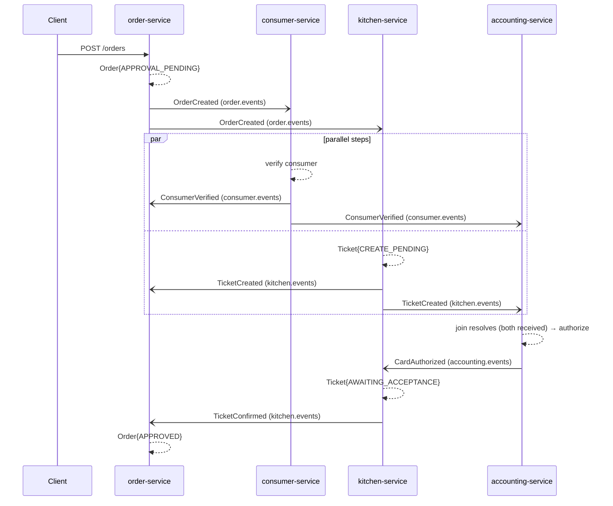
```mermaid
sequenceDiagram
    participant C as Client
    participant O as order-service
    participant Con as consumer-service
    participant K as kitchen-service
    participant A as accounting-service

    C->>O: POST /orders
    O-->>O: Order{APPROVAL_PENDING}
    O-)Con: OrderCreated (order.events)
    O-)K: OrderCreated (order.events)
    par parallel steps
        Con-->>Con: verify consumer
        Con-)O: ConsumerVerified (consumer.events)
        Con-)A: ConsumerVerified (consumer.events)
    and
        K-->>K: Ticket{CREATE_PENDING}
        K-)O: TicketCreated (kitchen.events)
        K-)A: TicketCreated (kitchen.events)
    end
    A-->>A: join resolves (both received) → authorize
    A-)K: CardAuthorized (accounting.events)
    K-->>K: Ticket{AWAITING_ACCEPTANCE}
    K-)O: TicketConfirmed (kitchen.events)
    O-->>O: Order{APPROVED}
```

### Case A — consumer verification fails

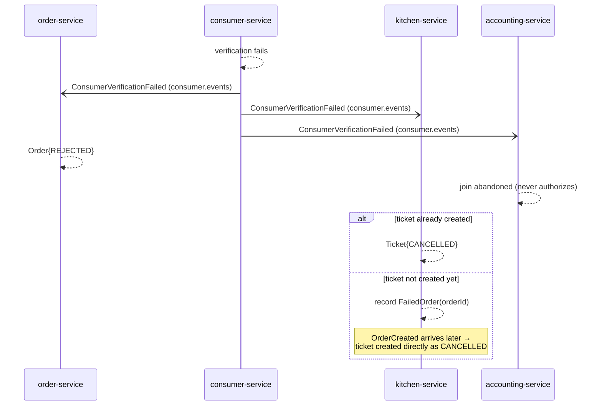
```mermaid
sequenceDiagram
    participant O as order-service
    participant Con as consumer-service
    participant K as kitchen-service
    participant A as accounting-service

    Con-->>Con: verification fails
    Con-)O: ConsumerVerificationFailed (consumer.events)
    Con-)K: ConsumerVerificationFailed (consumer.events)
    Con-)A: ConsumerVerificationFailed (consumer.events)
    O-->>O: Order{REJECTED}
    A-->>A: join abandoned (never authorizes)
    alt ticket already created
        K-->>K: Ticket{CANCELLED}
    else ticket not created yet
        K-->>K: record FailedOrder(orderId)
        Note over K: OrderCreated arrives later →<br/>ticket created directly as CANCELLED
    end
```

### Case B — kitchen capacity exceeded

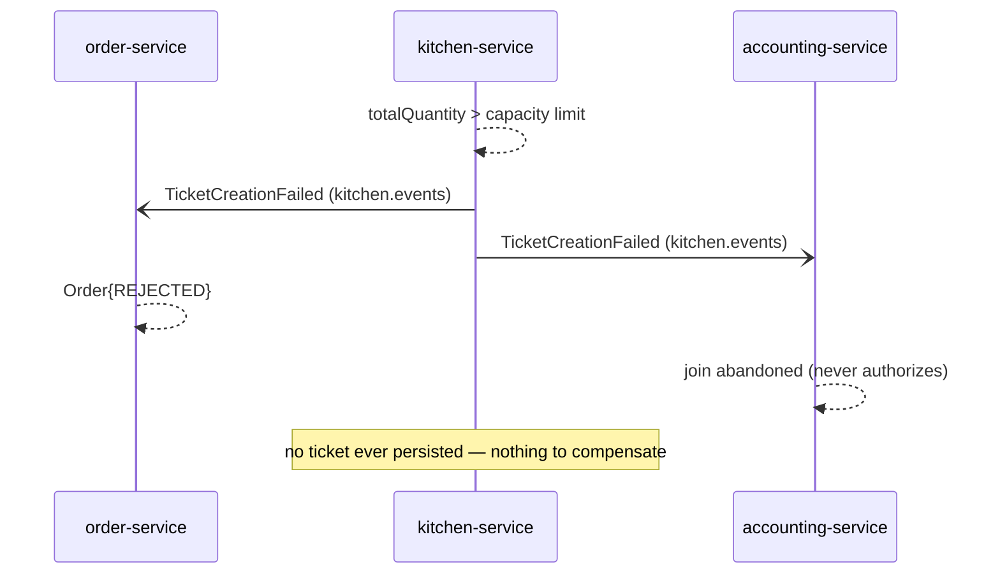
```mermaid
sequenceDiagram
    participant O as order-service
    participant K as kitchen-service
    participant A as accounting-service

    K-->>K: totalQuantity > capacity limit
    K-)O: TicketCreationFailed (kitchen.events)
    K-)A: TicketCreationFailed (kitchen.events)
    O-->>O: Order{REJECTED}
    A-->>A: join abandoned (never authorizes)
    Note over K: no ticket ever persisted — nothing to compensate
```

### Case C — card authorization declined

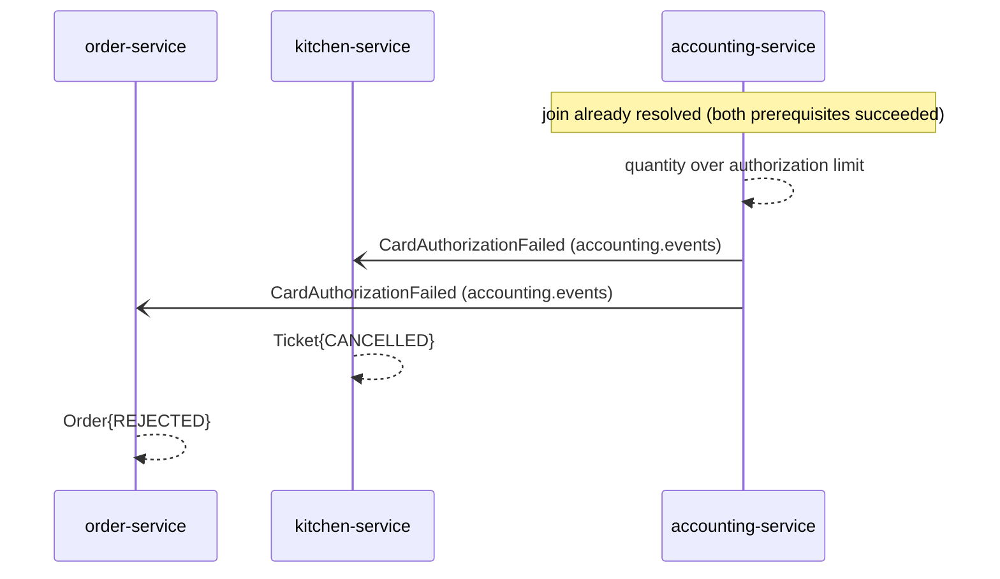
```mermaid
sequenceDiagram
    participant O as order-service
    participant K as kitchen-service
    participant A as accounting-service

    Note over A: join already resolved (both prerequisites succeeded)
    A-->>A: quantity over authorization limit
    A-)K: CardAuthorizationFailed (accounting.events)
    A-)O: CardAuthorizationFailed (accounting.events)
    K-->>K: Ticket{CANCELLED}
    O-->>O: Order{REJECTED}
```

## Create Order saga — orchestration

A central `CreateOrderSagaOrchestrator` in order-service sends explicit commands and reacts to replies on a shared `saga.replies` topic. Progress is persisted in `CreateOrderSagaInstance` (with `@Version` optimistic locking — two Kafka consumer threads can race on the same order's saga state, same reasoning as choreography's `SagaJoinState`).

### Happy path

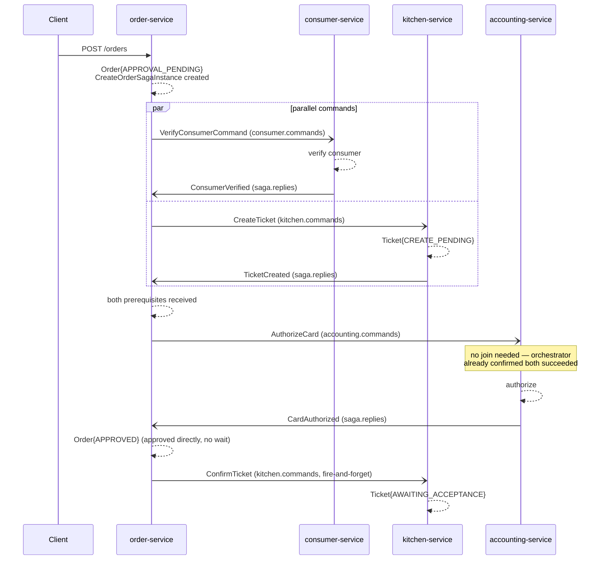
```mermaid
sequenceDiagram
    participant C as Client
    participant O as order-service
    participant Con as consumer-service
    participant K as kitchen-service
    participant A as accounting-service

    C->>O: POST /orders
    O-->>O: Order{APPROVAL_PENDING}<br/>CreateOrderSagaInstance created
    par parallel commands
        O-)Con: VerifyConsumerCommand (consumer.commands)
        Con-->>Con: verify consumer
        Con-)O: ConsumerVerified (saga.replies)
    and
        O-)K: CreateTicket (kitchen.commands)
        K-->>K: Ticket{CREATE_PENDING}
        K-)O: TicketCreated (saga.replies)
    end
    O-->>O: both prerequisites received
    O-)A: AuthorizeCard (accounting.commands)
    Note over A: no join needed — orchestrator<br/>already confirmed both succeeded
    A-->>A: authorize
    A-)O: CardAuthorized (saga.replies)
    O-->>O: Order{APPROVED}  (approved directly, no wait)
    O-)K: ConfirmTicket (kitchen.commands, fire-and-forget)
    K-->>K: Ticket{AWAITING_ACCEPTANCE}
```

Note the direct-approve step: order-service marks `APPROVED` immediately on `CardAuthorized`, then sends `ConfirmTicket` — it does not wait for a reply. In choreography, order-service had to wait for kitchen's `TicketConfirmed` echo as an indirect signal that accounting had already succeeded; here the orchestrator already knows that directly. There is a brief window where `Order=APPROVED` while `Ticket` is still `CREATE_PENDING`, but the `ConfirmTicket` command is on the same Kafka partition (keyed by `orderId`) as the earlier `CreateTicket`, so ordering is guaranteed and the ticket always converges to `AWAITING_ACCEPTANCE`.

### Case A — consumer verification fails

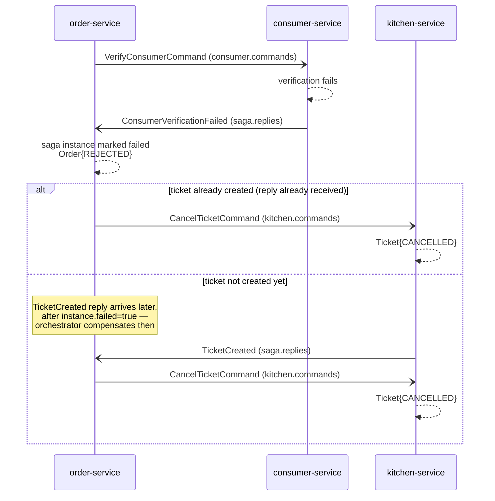
```mermaid
sequenceDiagram
    participant O as order-service
    participant Con as consumer-service
    participant K as kitchen-service

    O-)Con: VerifyConsumerCommand (consumer.commands)
    Con-->>Con: verification fails
    Con-)O: ConsumerVerificationFailed (saga.replies)
    O-->>O: saga instance marked failed<br/>Order{REJECTED}
    alt ticket already created (reply already received)
        O-)K: CancelTicketCommand (kitchen.commands)
        K-->>K: Ticket{CANCELLED}
    else ticket not created yet
        Note over O: TicketCreated reply arrives later,<br/>after instance.failed=true —<br/>orchestrator compensates then
        K-)O: TicketCreated (saga.replies)
        O-)K: CancelTicketCommand (kitchen.commands)
        K-->>K: Ticket{CANCELLED}
    end
```

### Case B — kitchen capacity exceeded

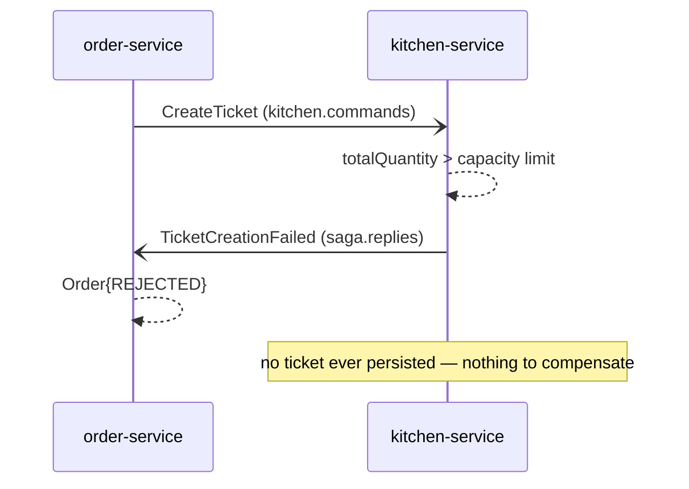
```mermaid
sequenceDiagram
    participant O as order-service
    participant K as kitchen-service

    O-)K: CreateTicket (kitchen.commands)
    K-->>K: totalQuantity > capacity limit
    K-)O: TicketCreationFailed (saga.replies)
    O-->>O: Order{REJECTED}
    Note over K: no ticket ever persisted — nothing to compensate
```

### Case C — card authorization declined

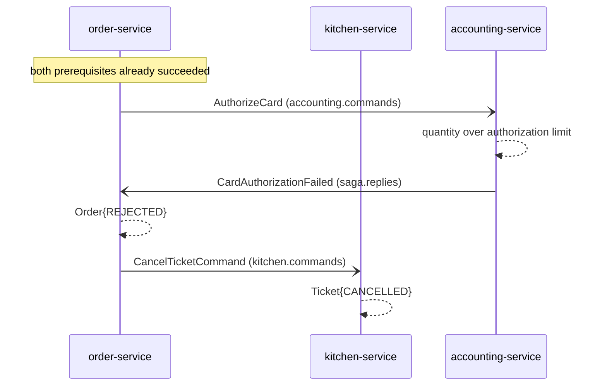
```mermaid
sequenceDiagram
    participant O as order-service
    participant K as kitchen-service
    participant A as accounting-service

    Note over O: both prerequisites already succeeded
    O-)A: AuthorizeCard (accounting.commands)
    A-->>A: quantity over authorization limit
    A-)O: CardAuthorizationFailed (saga.replies)
    O-->>O: Order{REJECTED}
    O-)K: CancelTicketCommand (kitchen.commands)
    K-->>K: Ticket{CANCELLED}
```

## Multi-saga routing (`sagaType`)

Three independent sagas (Create Order, Cancel Order, Revise Order) all run through order-service, and in orchestration mode all three share the same `kitchen.commands`/`accounting.commands`/`saga.replies` topics rather than getting dedicated ones each. `SagaReply`, `KitchenCommand`, and `AccountingCommand` each carry a `sagaType` field (`"CreateOrder"` / `"CancelOrder"` / `"ReviseOrder"`) so:

- order-service's one shared `OrchestratorReplyListener` (on `saga.replies`) routes each reply to the correct one of the three orchestrators (`CreateOrderSagaOrchestrator`, `CancelOrderSagaOrchestrator`, `ReviseOrderSagaOrchestrator`) before that orchestrator's own `handleReply` is ever called — no orchestrator has to guess which saga a message belongs to.
- A command type shared by more than one saga stays unambiguous. `KitchenCommand{commandType=CancelTicket}` is sent by both Create Order's compensation path (`CreateOrderSagaOrchestrator.sendCancelTicket`) and Cancel Order's primary flow (`CancelOrderSagaOrchestrator.start`) — the same `TicketService.handleCancelTicketCommand` handles both, and echoes the inbound `sagaType` back into its reply unchanged, since it cannot infer which saga's request it's servicing from `commandType` alone.

`CancelOrderSagaOrchestrator` and `ReviseOrderSagaOrchestrator` are both deliberately stateless (no persisted saga-instance table, unlike `CreateOrderSagaOrchestrator`'s `CreateOrderSagaInstance`) — both are strict linear pipelines with no parallel replies to join, so `Order`'s own `status` (and, for Revise, its `lineItems`/`pendingRevisedLineItems`) is sufficient saga state on its own.

## Cancel Order saga — choreography

`Order.cancel()` is only legal from `APPROVED`, meaning the `Ticket` has already been confirmed and may be anywhere from `AWAITING_ACCEPTANCE` through `PICKED_UP` — cancellation isn't guaranteed to succeed. The saga asks kitchen first; accounting's authorization reversal only happens if kitchen confirms the ticket cancellable.

### Happy path

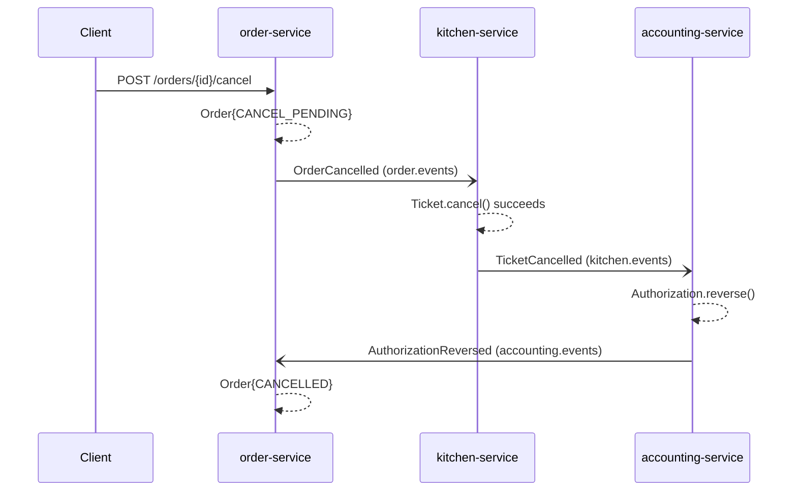
```mermaid
sequenceDiagram
    participant C as Client
    participant O as order-service
    participant K as kitchen-service
    participant A as accounting-service

    C->>O: POST /orders/{id}/cancel
    O-->>O: Order{CANCEL_PENDING}
    O-)K: OrderCancelled (order.events)
    K-->>K: Ticket.cancel() succeeds
    K-)A: TicketCancelled (kitchen.events)
    A-->>A: Authorization.reverse()
    A-)O: AuthorizationReversed (accounting.events)
    O-->>O: Order{CANCELLED}
```

### Rejection — ticket already too far along

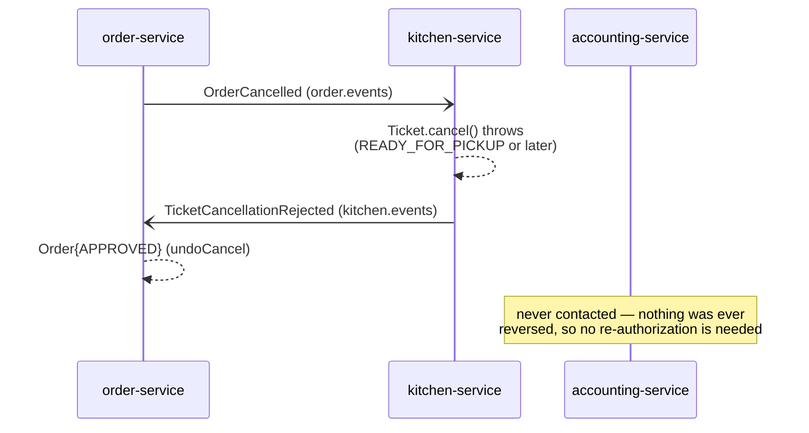
```mermaid
sequenceDiagram
    participant O as order-service
    participant K as kitchen-service
    participant A as accounting-service

    O-)K: OrderCancelled (order.events)
    K-->>K: Ticket.cancel() throws<br/>(READY_FOR_PICKUP or later)
    K-)O: TicketCancellationRejected (kitchen.events)
    O-->>O: Order{APPROVED} (undoCancel)
    Note over A: never contacted — nothing was ever<br/>reversed, so no re-authorization is needed
```

## Cancel Order saga — orchestration

Stateless `CancelOrderSagaOrchestrator`, driven purely by `saga.replies` (`sagaType=CancelOrder`), using `Order`'s own status as the implicit saga state.

### Happy path

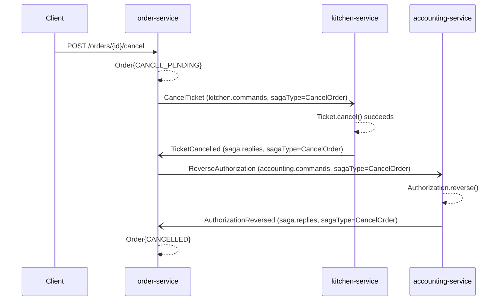
```mermaid
sequenceDiagram
    participant C as Client
    participant O as order-service
    participant K as kitchen-service
    participant A as accounting-service

    C->>O: POST /orders/{id}/cancel
    O-->>O: Order{CANCEL_PENDING}
    O-)K: CancelTicket (kitchen.commands, sagaType=CancelOrder)
    K-->>K: Ticket.cancel() succeeds
    K-)O: TicketCancelled (saga.replies, sagaType=CancelOrder)
    O-)A: ReverseAuthorization (accounting.commands, sagaType=CancelOrder)
    A-->>A: Authorization.reverse()
    A-)O: AuthorizationReversed (saga.replies, sagaType=CancelOrder)
    O-->>O: Order{CANCELLED}
```

### Rejection — ticket already too far along

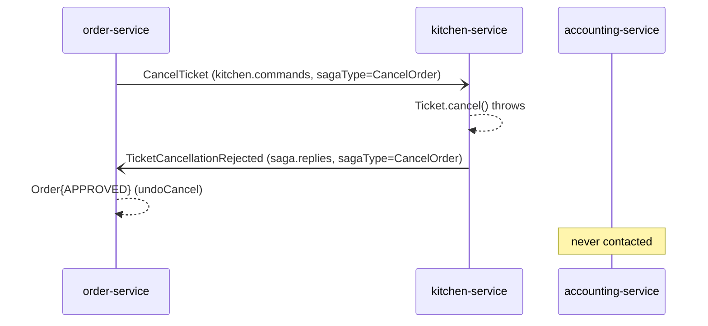
```mermaid
sequenceDiagram
    participant O as order-service
    participant K as kitchen-service
    participant A as accounting-service

    O-)K: CancelTicket (kitchen.commands, sagaType=CancelOrder)
    K-->>K: Ticket.cancel() throws
    K-)O: TicketCancellationRejected (saga.replies, sagaType=CancelOrder)
    O-->>O: Order{APPROVED} (undoCancel)
    Note over A: never contacted
```

## Revise Order saga — choreography

Same sequential, kitchen-gates-accounting shape as Cancel Order, but with a genuinely new wrinkle: kitchen *provisionally applies* the revised quantity before accounting is ever asked, since `Authorization.reviseAuthorization()` (unlike `reverse()`) is a real guarded threshold check that accounting can decline. That makes a real compensation path necessary — something Cancel Order never needed, because `reverse()` is unconditional.

### Happy path

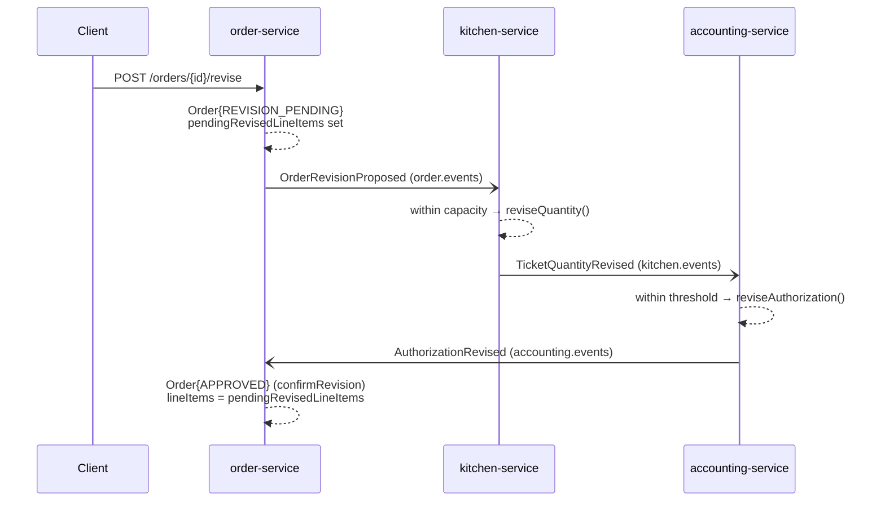
```mermaid
sequenceDiagram
    participant C as Client
    participant O as order-service
    participant K as kitchen-service
    participant A as accounting-service

    C->>O: POST /orders/{id}/revise
    O-->>O: Order{REVISION_PENDING}<br/>pendingRevisedLineItems set
    O-)K: OrderRevisionProposed (order.events)
    K-->>K: within capacity → reviseQuantity()
    K-)A: TicketQuantityRevised (kitchen.events)
    A-->>A: within threshold → reviseAuthorization()
    A-)O: AuthorizationRevised (accounting.events)
    O-->>O: Order{APPROVED} (confirmRevision)<br/>lineItems = pendingRevisedLineItems
```

### Case A — kitchen rejects outright (over capacity)

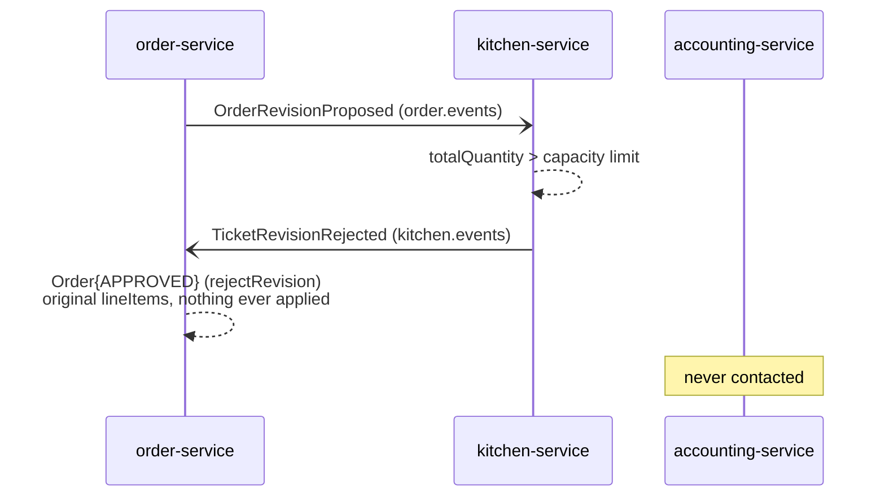
```mermaid
sequenceDiagram
    participant O as order-service
    participant K as kitchen-service
    participant A as accounting-service

    O-)K: OrderRevisionProposed (order.events)
    K-->>K: totalQuantity > capacity limit
    K-)O: TicketRevisionRejected (kitchen.events)
    O-->>O: Order{APPROVED} (rejectRevision)<br/>original lineItems, nothing ever applied
    Note over A: never contacted
```

### Case B — kitchen confirms, accounting declines (real compensation)

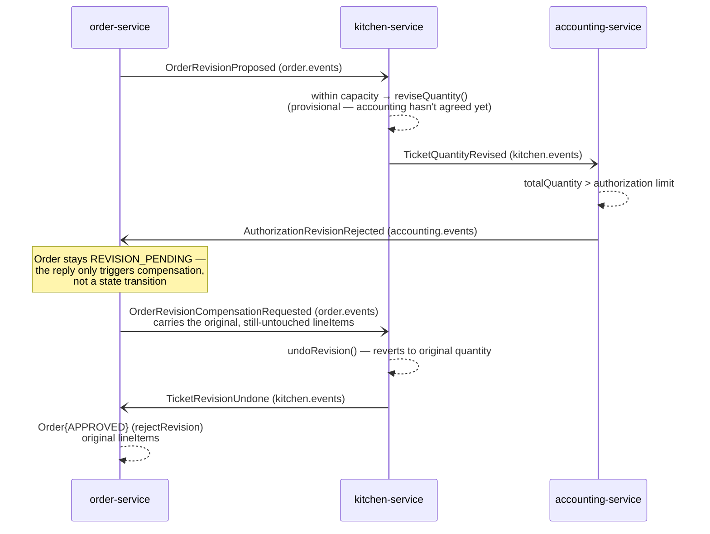
```mermaid
sequenceDiagram
    participant O as order-service
    participant K as kitchen-service
    participant A as accounting-service

    O-)K: OrderRevisionProposed (order.events)
    K-->>K: within capacity → reviseQuantity()<br/>(provisional — accounting hasn't agreed yet)
    K-)A: TicketQuantityRevised (kitchen.events)
    A-->>A: totalQuantity > authorization limit
    A-)O: AuthorizationRevisionRejected (accounting.events)
    Note over O: Order stays REVISION_PENDING —<br/>the reply only triggers compensation,<br/>not a state transition
    O-)K: OrderRevisionCompensationRequested (order.events)<br/>carries the original, still-untouched lineItems
    K-->>K: undoRevision() — reverts to original quantity
    K-)O: TicketRevisionUndone (kitchen.events)
    O-->>O: Order{APPROVED} (rejectRevision)<br/>original lineItems
```

`"OrderRevisionCompensationRequested"` is deliberately a distinct wire event from the terminal `"OrderRevisionRejected"` (Case A's outcome) — conflating them would make kitchen try to undo a revision that was rejected outright, with nothing ever applied to undo.

## Revise Order saga — orchestration

Stateless `ReviseOrderSagaOrchestrator`, driven by `saga.replies` (`sagaType=ReviseOrder`). Being stateless, it recomputes both the pending revised quantity and the original quantity by reloading `Order` fresh rather than caching them across the round trip — `Order.getPendingRevisedLineItems()` for the forward step, `Order.getLineItems()` (still untouched pre-revision) for the compensation step.

### Happy path

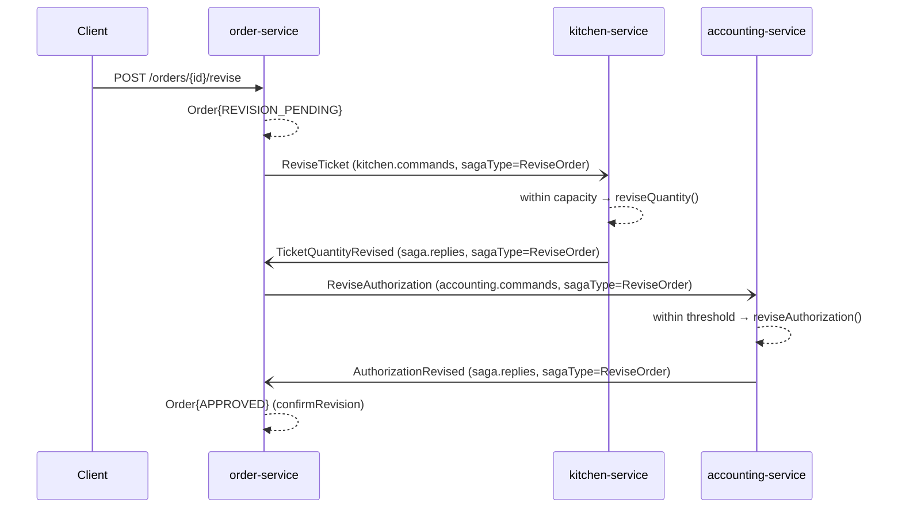
```mermaid
sequenceDiagram
    participant C as Client
    participant O as order-service
    participant K as kitchen-service
    participant A as accounting-service

    C->>O: POST /orders/{id}/revise
    O-->>O: Order{REVISION_PENDING}
    O-)K: ReviseTicket (kitchen.commands, sagaType=ReviseOrder)
    K-->>K: within capacity → reviseQuantity()
    K-)O: TicketQuantityRevised (saga.replies, sagaType=ReviseOrder)
    O-)A: ReviseAuthorization (accounting.commands, sagaType=ReviseOrder)
    A-->>A: within threshold → reviseAuthorization()
    A-)O: AuthorizationRevised (saga.replies, sagaType=ReviseOrder)
    O-->>O: Order{APPROVED} (confirmRevision)
```

### Case A — kitchen rejects outright (over capacity)

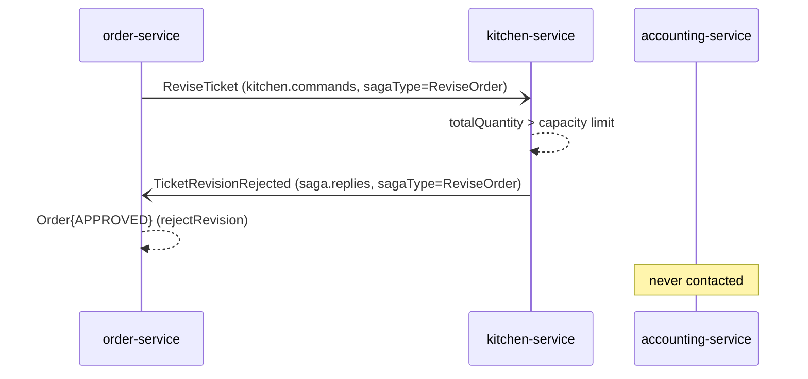
```mermaid
sequenceDiagram
    participant O as order-service
    participant K as kitchen-service
    participant A as accounting-service

    O-)K: ReviseTicket (kitchen.commands, sagaType=ReviseOrder)
    K-->>K: totalQuantity > capacity limit
    K-)O: TicketRevisionRejected (saga.replies, sagaType=ReviseOrder)
    O-->>O: Order{APPROVED} (rejectRevision)
    Note over A: never contacted
```

### Case B — kitchen confirms, accounting declines (real compensation)

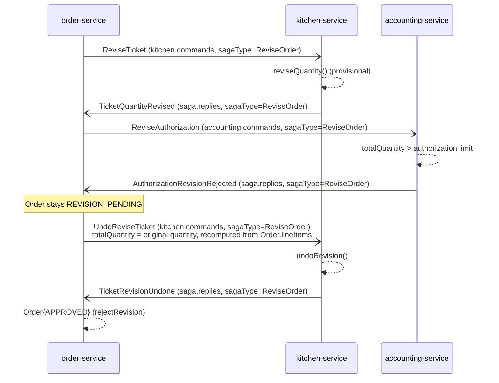
```mermaid
sequenceDiagram
    participant O as order-service
    participant K as kitchen-service
    participant A as accounting-service

    O-)K: ReviseTicket (kitchen.commands, sagaType=ReviseOrder)
    K-->>K: reviseQuantity() (provisional)
    K-)O: TicketQuantityRevised (saga.replies, sagaType=ReviseOrder)
    O-)A: ReviseAuthorization (accounting.commands, sagaType=ReviseOrder)
    A-->>A: totalQuantity > authorization limit
    A-)O: AuthorizationRevisionRejected (saga.replies, sagaType=ReviseOrder)
    Note over O: Order stays REVISION_PENDING
    O-)K: UndoReviseTicket (kitchen.commands, sagaType=ReviseOrder)<br/>totalQuantity = original quantity, recomputed from Order.lineItems
    K-->>K: undoRevision()
    K-)O: TicketRevisionUndone (saga.replies, sagaType=ReviseOrder)
    O-->>O: Order{APPROVED} (rejectRevision)
```

## Choreography vs. orchestration — what actually differs (Create Order saga)

| | Choreography | Orchestration |
|---|---|---|
| Coordination | Implicit — each service reacts to peers' events | Explicit — one orchestrator drives every step |
| accounting-service join | Needed (`SagaJoinState`, waits for 2 events in either order) | **Not needed at all** — orchestrator already waited |
| kitchen-service race table | Needed (`FailedOrder`, absorbs a timing race) | **Not needed** — orchestrator absorbs the race centrally |
| Order approval trigger | Waits for kitchen's `TicketConfirmed` echo | Approves directly on `CardAuthorized`, no wait |
| New Kafka topics | 0 (reuses existing domain-event topics) | 4 (3 command topics + 1 shared reply topic) |
| Saga state persistence | Distributed across each service's own local state (`SagaJoinState`, `FailedOrder`) | Centralized in one `CreateOrderSagaInstance` per order |
| Final observable outcome | Identical `Order`/`Ticket`/`Authorization` end states for all 4 scenarios | Identical `Order`/`Ticket`/`Authorization` end states for all 4 scenarios |

Both styles reach the exact same end states for the happy path and all three compensation cases — verified by running the identical manual test scenarios against both. The difference is entirely in *how* that consistency is achieved: distributed reactive logic vs. centralized explicit coordination.

Cancel Order and Revise Order are simpler on this axis: both are strict linear pipelines (kitchen replies, then conditionally accounting replies) rather than a parallel join, so **neither ever needed a `SagaJoinState`/`FailedOrder`-style local state table in either saga mode**, and their orchestrators (`CancelOrderSagaOrchestrator`, `ReviseOrderSagaOrchestrator`) are stateless — no `*SagaInstance` table either. The choreography/orchestration contrast for those two sagas is almost entirely about *how a step is triggered* (reacting to a domain event vs. receiving an explicit command), not about coordination complexity, since there's no join to centralize away.

## Event sourcing — `Order` aggregate (Ch.6)

`order-service` gained a second persistence path for `Order`: instead of a mutable `orders` row updated in place, `Order`'s full history is stored as an append-only sequence of events (`order_events`), and current state is derived by replaying them. Selected per-deployment via `PERSISTENCE_MODE` (env var, default `jpa`, alternate `event-sourcing`):

```bash
PERSISTENCE_MODE=event-sourcing docker compose up -d --build
```

### The `OrderTransitions` facade

Every call site that used to depend on `OrderRepository` directly (`OrderController`, `OrderService`, all three choreography saga services, all three orchestration saga orchestrators) now depends on `OrderTransitions` instead — an interface with two implementations selected by `@ConditionalOnProperty(persistence.mode=...)`:

- **`JpaOrderTransitions`** — the pre-Ch.6 path: loads/saves a mutable `Order` row via `OrderRepository`, publishes via `OrderDomainEventPublisher` onto the outbox.
- **`EventSourcedOrderTransitions`** — backed by `OrderEventStore`/`OrderAggregate`.

`OrderTransitions` has two contracts, by method: `create`/`findById`/`cancel`/`revise` throw on invalid state (`OrderNotFoundException`, `UnsupportedStateTransitionException`); `approve`/`reject`/`noteCancelled`/`undoCancel`/`confirmRevision`/`rejectRevision`/`requestRevisionCompensation` **silently no-op** on invalid state or a missing order — this mirrors what a saga reply handler already needs (a duplicate or late reply for an order that moved on shouldn't crash the listener), and both implementations honor it identically.

A parallel `SagaCommandPublisher` facade does the same for orchestration-mode outbound saga commands (`OutboxSagaCommandPublisher` / `EventSourcedSagaCommandPublisher`), so the three orchestrators need zero `PERSISTENCE_MODE`-specific code of their own.

### The event store (`OrderEventStore`/`OrderAggregate`)

Hand-rolled, not Eventuate — `OrderAggregate` implements the book's `process(Command)`/`apply(Event)` split: `process()` validates a command against current state and returns the `List<OrderDomainEvent>` that *should* happen (no mutation); `apply()` unconditionally mutates state given an event that *already* happened. The same `apply()` is used both for the event just decided and for every historical event during replay — this is what makes replay possible at all.

```mermaid
sequenceDiagram
    participant C as Caller
    participant T as EventSourcedOrderTransitions
    participant S as OrderEventStore
    participant DB as order_events / order_snapshots / order_aggregate_version

    C->>T: cancel(orderId, eventId)
    T->>S: update(orderId, agg -> agg.process(CancelOrderCommand))
    S->>DB: load version row (optimistic-lock check target)
    S->>DB: load snapshot (if any) + event tail since it
    S-->>S: replay: aggregate = fromSnapshot ?: new; tail.forEach(apply)
    S->>S: events = aggregate.process(command)
    S->>S: events.forEach(aggregate::apply)
    S->>DB: append new event row(s)
    S->>DB: save version row (Hibernate dirty-check flush, not merge — @Version conflict throws here)
    opt every 5th event for this order
        S->>DB: write/update snapshot
    end
    S-->>T: updated OrderAggregate
```

**Snapshots** (`OrderSnapshot`/`OrderSnapshotData`) are a pure performance optimization — every 5 events, `OrderEventStore` writes a snapshot of the aggregate's full state plus a pointer to the last event it includes, so replay only has to fold the tail of events since the snapshot rather than the full history. `Order`'s lifecycle is short enough that this is never load-bearing in this codebase; it was implemented anyway to exercise the mechanism, not because it was needed.

**Optimistic locking** uses a dedicated `order_aggregate_version` table (`OrderAggregateVersion`, one row per order, a `@Version`-annotated Hibernate entity) rather than deriving a version number from `COUNT(*)` on `order_events` — this keeps "how many events exist" and "what version an update is conditioned on" as independently reasoned-about concerns, and mirrors the JPA path's own `@Version` column on `orders` closely enough that the two paths' concurrency behavior is genuinely comparable. `OrderEventStore.update()` loads the version row via its repository and mutates it in place (never detaches it), so Hibernate's own dirty-checking flush performs the optimistic-lock check — using `merge()` on a detached copy instead was tried first and silently defeated the check (see `docs/superpowers/plans/2026-07-22-order-event-sourcing.md`, Task 4, for the two-round bug hunt that surfaced this).

### CDC reuse and the wire-only pseudo-event gotcha

Choreography-mode publishing doesn't introduce a new Kafka pipeline — it extends the existing Ch.3 Debezium/Kafka Connect outbox connector's `table.include.list` to also cover `order_events` (alongside `outbox_events`), and `order_events`'s columns (`event_id`/`event_type`/`order_id`/`payload`) are deliberately named to match `outbox_events`' so one connector config routes both tables to `order.events` unchanged.

This creates a sharp edge: `order_events` now serves two purposes at once — the event-sourcing durability log (every row must be replayable back into `OrderAggregate.apply()`) and a CDC transport (every row that matters for Kafka delivery). Those two sets of rows aren't quite the same. The Revise Order saga's accounting-decline compensation path needs to notify kitchen-service of an in-flight compensation (`OrderRevisionCompensationRequested`) — in JPA mode this is a wire-only signal published straight to the outbox, never touching `Order`'s own state. Event-sourcing mode's first implementation wrote the equivalent row into `order_events` (so CDC would still carry it), but `OrderEventStore.replay()` treated *every* row in `order_events` as a real domain event and crashed trying to feed `OrderRevisionCompensationRequested` into `OrderAggregate.apply()` on the next replay of that order — a bug only Docker end-to-end testing surfaced (see Task 25 in the plan; no unit test exercised a real replay after a compensation request). Fixed with a `replayable` boolean column on `OrderEventEntity` (`true` for every real domain event, `false` only for this one pseudo-event), and `OrderEventStore.replay()`'s two event queries now filter on it. The lesson generalizes: any table doing double duty as both an event-sourcing replay log and a CDC transport needs an explicit way to say "this row is for Kafka only, never feed it back into the aggregate."

### Orchestration-mode saga commands: the pseudo-event mechanism

The book's actual mechanism for orchestration-mode commands under event sourcing is a `SagaCommandEvent`-style pseudo-event, not "publish in the same transaction as the aggregate update" — chosen deliberately here to see the real mechanism rather than the shortcut. `EventSourcedSagaCommandPublisher.publish(...)` writes a row to a **separate** table, `order_saga_command_requests` (`OrderSagaCommandRequest`), rather than into `order_events` itself:

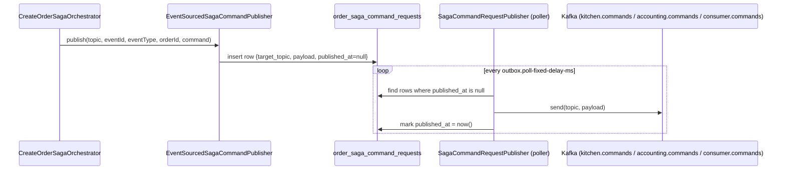
```mermaid
sequenceDiagram
    participant Orch as CreateOrderSagaOrchestrator
    participant Pub as EventSourcedSagaCommandPublisher
    participant DB as order_saga_command_requests
    participant Poll as SagaCommandRequestPublisher (poller)
    participant K as Kafka (kitchen.commands / accounting.commands / consumer.commands)

    Orch->>Pub: publish(topic, eventId, eventType, orderId, command)
    Pub->>DB: insert row {target_topic, payload, published_at=null}
    loop every outbox.poll-fixed-delay-ms
        Poll->>DB: find rows where published_at is null
        Poll->>K: send(topic, payload)
        Poll->>DB: mark published_at = now()
    end
```

This table is kept separate from `order_events` on purpose: the same CDC connector that now watches `order_events` unconditionally routes every row there to `order.events`, and saga commands are meant for `kitchen.commands`/`accounting.commands`/`consumer.commands` instead — mixing them into one table would either leak saga commands onto `order.events` or require per-row topic filtering in the connector config, which Debezium's Outbox Event Router SMT doesn't support per-row. `order_saga_command_requests` is polled independently by its own `SagaCommandRequestPublisher`, sending before marking published — an at-least-once send, matching every other outbox-style publisher in this codebase.
