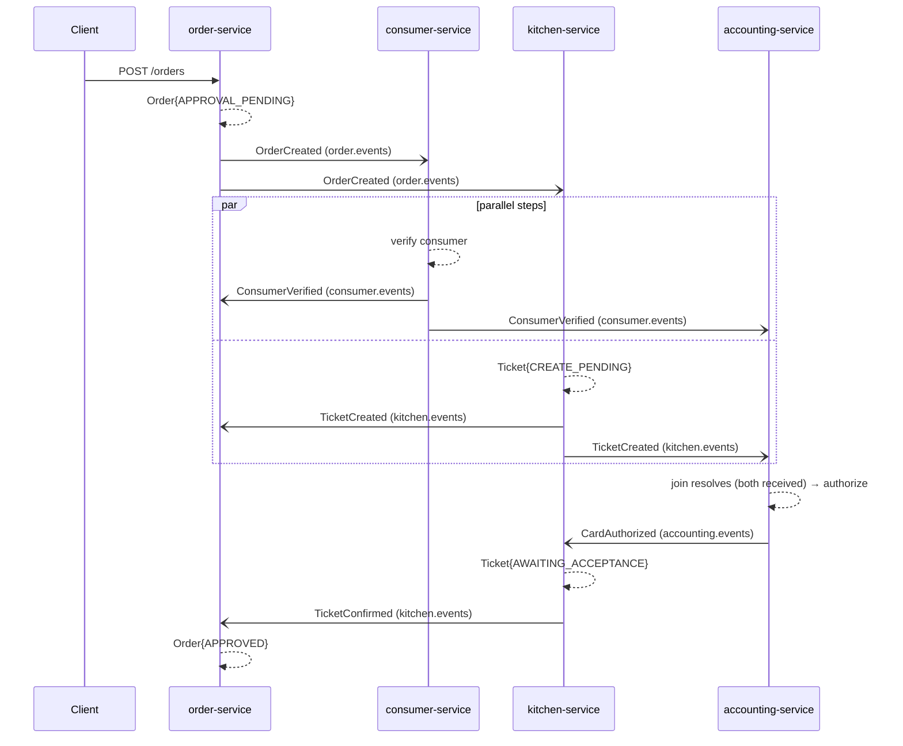
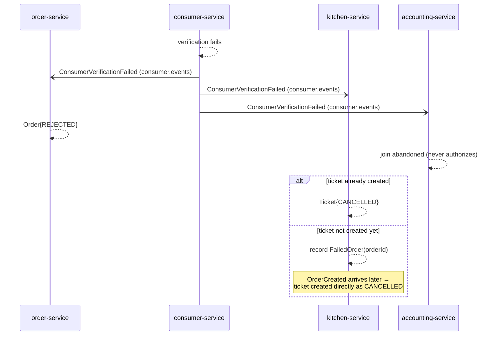
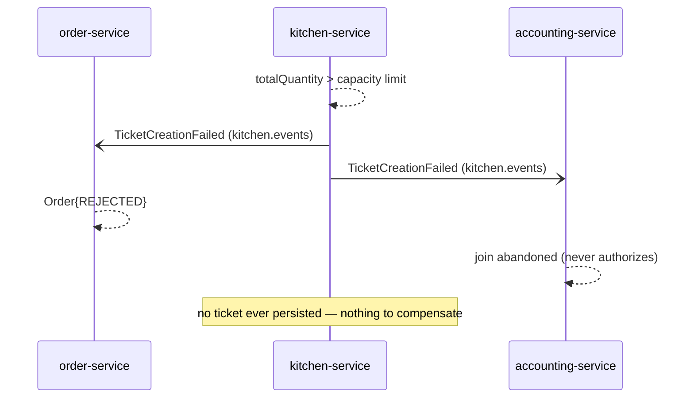
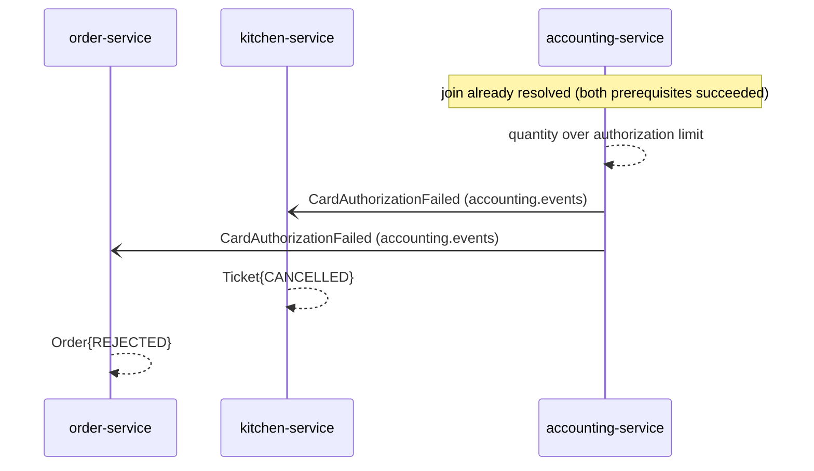
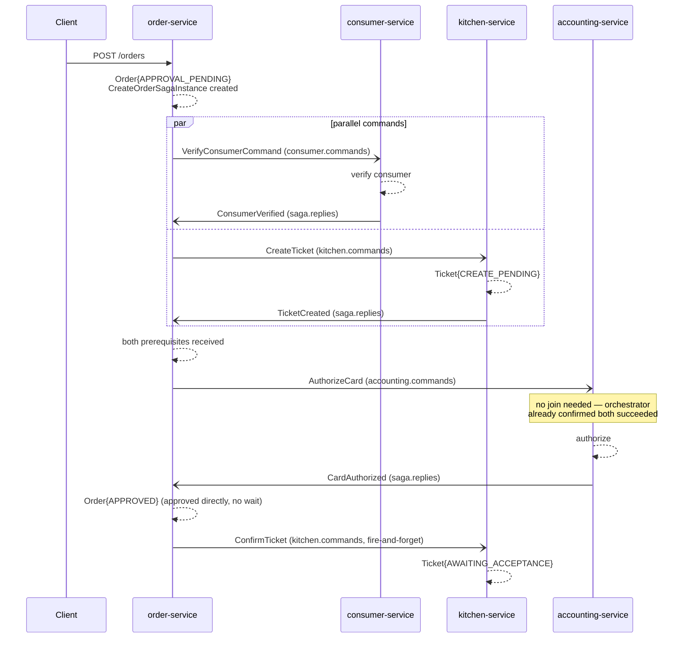
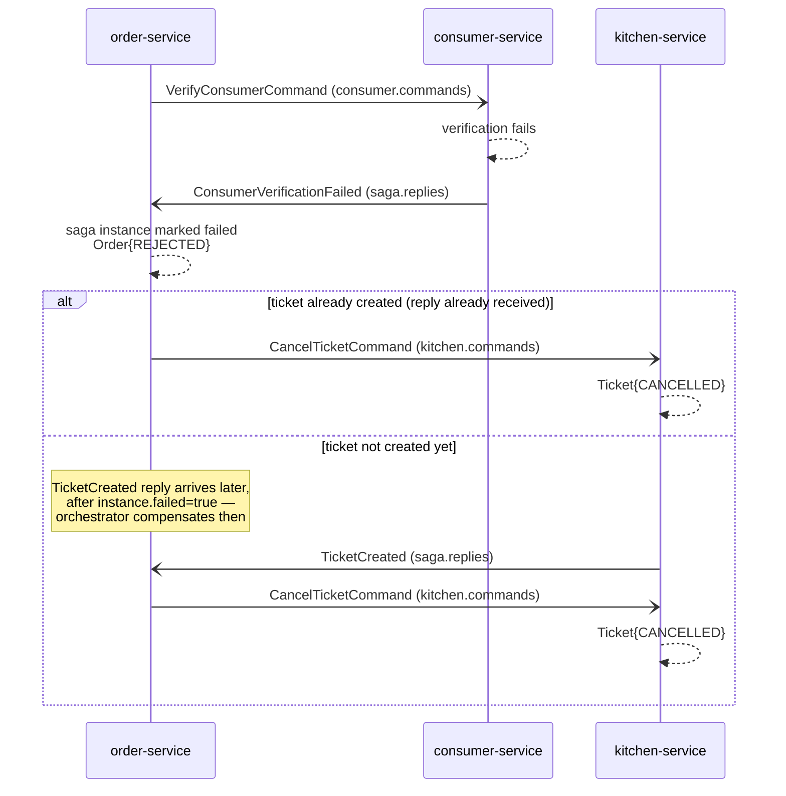
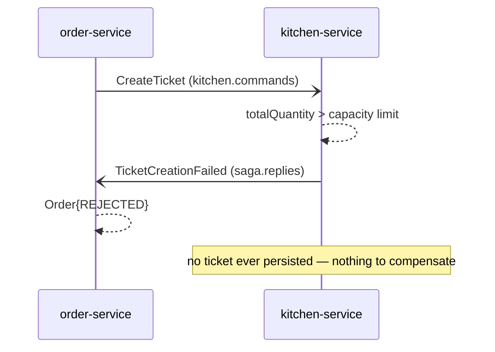
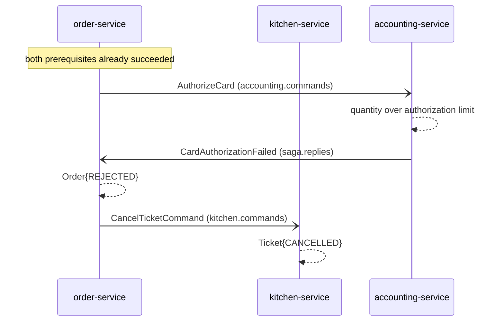

# Architecture

Project-level reference for how the FTGO services fit together. For a single service's own API/events/domain model, see that service's own `README.md`.

## Hexagonal layout

Every service follows the same package structure (ports and adapters):

```
src/main/java/com/sanjay/ftgo/<service>/
├── api/            ← inbound adapters (REST controllers)
├── config/         ← PersistenceConfig (see "Shared outbox module" below)
├── domain/         ← aggregates, domain services, event/command records, ports (interfaces)
└── infrastructure/ ← outbound adapters (Kafka producers/consumers, saga listeners)
```

`OutboxEvent`/`ProcessedEvent` (JPA entities), their repositories, the `OutboxPublisher` poller, and `KafkaProducerConfig` no longer live under each service's own `domain/`/`infrastructure/` — they moved to a shared `ftgo-common` module (see below). What remains under each service's own `domain/`/`infrastructure/` is business-specific: saga event/command records, saga listeners, and domain services.

Each service owns its own MySQL schema — no shared database, no cross-service joins. Services communicate only via REST (for synchronous read lookups, e.g. order→restaurant) or Kafka (for everything else).

## Shared outbox module (`ftgo-common`)

`OutboxEvent`, `ProcessedEvent`, their JPA repositories, `OutboxPublisher`, and `KafkaProducerConfig` were originally copy-pasted verbatim into each of the four saga services (order/kitchen/consumer/accounting). As of 2026-07-18 they live in one place: the `ftgo-common` Gradle module, package `com.sanjay.ftgo.common.outbox`.

`ftgo-common` is a plain library, not a fifth runnable service — its `build.gradle` disables `bootJar` and enables the plain `jar` task, and exposes `spring-boot-starter-data-jpa`/`spring-kafka` via the `api` configuration so consumers get transitive compile-time visibility of `JpaRepository`/`KafkaTemplate` types. Each of the four saga services depends on it via `implementation project(':ftgo-common')`.

Because `com.sanjay.ftgo.common.outbox` sits outside every service's own base package, Spring Boot's default scanning (which only covers the `@SpringBootApplication` class's own package tree) doesn't pick it up automatically. Each service adds a small `<service>.config.PersistenceConfig` class carrying `@EntityScan`, `@EnableJpaRepositories`, and `@ComponentScan`, all pointed at both the service's own domain package and `com.sanjay.ftgo.common.outbox`. Two deliberate design points behind that:

- **Why a separate class, not annotations on the `@SpringBootApplication` class directly**: `@WebMvcTest` slice tests filter out `@Configuration`-discovered beans, but not annotations placed directly on the primary configuration class itself — order-service's `OrderControllerTest` broke when `@EntityScan`/`@EnableJpaRepositories` were tried directly on `FtgoOrderServiceApplication`, because that placement bypasses the slice filter and pulls in JPA repository beans a `@WebMvcTest` context has no `entityManagerFactory` for.
- **Why `@ComponentScan` in addition to `@EntityScan`/`@EnableJpaRepositories`**: the latter two only register entities/repositories — they do nothing for `@Component`/`@Configuration` beans. `OutboxPublisher` and `KafkaProducerConfig` need an explicit `@ComponentScan` of `com.sanjay.ftgo.common.outbox` or they're silently never registered — with no startup error, since nothing else in a service directly requires those beans to exist. Without it, the `@Scheduled` poller simply never runs and orders stay stuck in `APPROVAL_PENDING` forever. This was caught via Docker end-to-end verification, not by any unit test, since no per-service test boots the full Spring context with the shared module wired in.

The saga wire-format records (`SagaReply`, `OrderCreatedEvent`, `ConsumerVerificationEvent`, `KitchenEvent`, `AccountingEvent`, `VerifyConsumerCommand`, `KitchenCommand`, `AuthorizeCardCommand`) deliberately stayed per-service, copy-pasted into every producer/consumer — they carry business meaning specific to who produces/consumes them, unlike the generic outbox/dedup plumbing above.

## The transactional outbox pattern (shared by all 4 saga services)

order-service, kitchen-service, consumer-service, and accounting-service all publish events via the same hand-rolled pattern (not Eventuate Tram — kept hand-rolled deliberately so the mechanics stay visible), implemented once in `ftgo-common` and used by all four:

1. A business write and an `OutboxEvent` row are saved in one local database transaction (e.g. `Order` + `OutboxEvent{eventType=OrderCreated}`).
2. A `@Scheduled` `OutboxPublisher` polls for unsent rows every ~2s, publishes each to Kafka, and marks it sent — all on the row's own `topic` column (see below), not a hardcoded constant.
3. Every consumer dedupes via a `processed_events` ledger — checks `existsById(eventId)`, inserts, *then* acts, all in one transaction — so Kafka's at-least-once delivery can never double-process a message.

This combination means a service crash at any point (before/during/after publish, before/during/after consumption) always resolves to "eventually delivered exactly-once from the consumer's point of view," without a distributed transaction anywhere.

**Why `OutboxEvent` has a `topic` column**: originally (Ch.3) each service's `OutboxPublisher` hardcoded one topic constant, since each service only ever published to one topic. Ch.4's orchestration pass generalized this — order-service's orchestrator needs to fan out to three different command topics from one outbox table — so `topic` became a per-row column, read by the publisher instead of hardcoded. This changed nothing observable for existing choreography publishers, which just now pass their topic literal explicitly instead of implicitly.

## Kafka topic catalog

| Topic | Producer | Consumers | Style |
|---|---|---|---|
| `order.events` | order-service | consumer-service, kitchen-service | choreography |
| `consumer.events` | consumer-service | order-service, kitchen-service, accounting-service | choreography |
| `kitchen.events` | kitchen-service | order-service, accounting-service | choreography |
| `accounting.events` | accounting-service | order-service, kitchen-service | choreography |
| `consumer.commands` | order-service | consumer-service | orchestration |
| `kitchen.commands` | order-service | kitchen-service | orchestration |
| `accounting.commands` | order-service | accounting-service | orchestration |
| `saga.replies` | consumer-service, kitchen-service, accounting-service | order-service | orchestration |

Choreography topics carry domain events (things that already happened: `OrderCreated`, `TicketCreated`, ...). Orchestration topics carry either commands (imperatives: `VerifyConsumerCommand`, `KitchenCommand{commandType=CreateTicket}`, ...) or replies (a single shared `SagaReply{participant, eventType, ...}` shape, discriminated by the `participant` field).

## The `SAGA_MODE` switch

Every saga-participating service reads `SAGA_MODE` (env var, default `choreography`, alternate `orchestration`). Every choreography `@KafkaListener` is gated `@ConditionalOnProperty(saga.mode=choreography, matchIfMissing=true)`; every orchestration listener is gated the opposite way with no default. Exactly one set is ever live per running instance — the two paths cannot both fire for the same deployment. Set it in `compose.yml`'s environment, e.g.:

```bash
SAGA_MODE=orchestration docker compose up -d --build
```

## Create Order saga — choreography

No central coordinator. Each service reacts to events published by others and publishes its own in turn. `order-service` listens **directly** to all three possible failure events, so rejecting the order never depends on a chain of other services' compensations completing first.

### Happy path



### Case A — consumer verification fails



### Case B — kitchen capacity exceeded



### Case C — card authorization declined



## Create Order saga — orchestration

A central `CreateOrderSagaOrchestrator` in order-service sends explicit commands and reacts to replies on a shared `saga.replies` topic. Progress is persisted in `CreateOrderSagaInstance` (with `@Version` optimistic locking — two Kafka consumer threads can race on the same order's saga state, same reasoning as choreography's `SagaJoinState`).

### Happy path



Note the direct-approve step: order-service marks `APPROVED` immediately on `CardAuthorized`, then sends `ConfirmTicket` — it does not wait for a reply. In choreography, order-service had to wait for kitchen's `TicketConfirmed` echo as an indirect signal that accounting had already succeeded; here the orchestrator already knows that directly. There is a brief window where `Order=APPROVED` while `Ticket` is still `CREATE_PENDING`, but the `ConfirmTicket` command is on the same Kafka partition (keyed by `orderId`) as the earlier `CreateTicket`, so ordering is guaranteed and the ticket always converges to `AWAITING_ACCEPTANCE`.

### Case A — consumer verification fails



### Case B — kitchen capacity exceeded



### Case C — card authorization declined



## Choreography vs. orchestration — what actually differs

| | Choreography | Orchestration |
|---|---|---|
| Coordination | Implicit — each service reacts to peers' events | Explicit — one orchestrator drives every step |
| accounting-service join | Needed (`SagaJoinState`, waits for 2 events in either order) | **Not needed at all** — orchestrator already waited |
| kitchen-service race table | Needed (`FailedOrder`, absorbs a timing race) | **Not needed** — orchestrator absorbs the race centrally |
| Order approval trigger | Waits for kitchen's `TicketConfirmed` echo | Approves directly on `CardAuthorized`, no wait |
| New Kafka topics | 0 (reuses existing domain-event topics) | 4 (3 command topics + 1 shared reply topic) |
| Saga state persistence | Distributed across each service's own local state (`SagaJoinState`, `FailedOrder`) | Centralized in one `CreateOrderSagaInstance` per order |
| Final observable outcome | Identical `Order`/`Ticket`/`Authorization` end states for all 4 scenarios | Identical `Order`/`Ticket`/`Authorization` end states for all 4 scenarios |

Both styles reach the exact same end states for the happy path and all three compensation cases — verified by running the identical manual test scenarios against both. The difference is entirely in *how* that consistency is achieved: distributed reactive logic vs. centralized explicit coordination.
