# Architecture

Project-level reference for how the FTGO services fit together. For a single service's own API/events/domain model, see that service's own `README.md`.

## Hexagonal layout

Every service follows the same package structure (ports and adapters):

```
src/main/java/com/sanjay/ftgo/<service>/
├── api/            ← inbound adapters (REST controllers)
├── config/         ← PersistenceConfig (see "Shared outbox module" below)
├── domain/         ← aggregates, domain services, event/command records, ports (interfaces)
└── infrastructure/ ← outbound adapters (Kafka producers/consumers, saga listeners)
```

`OutboxEvent`/`ProcessedEvent` (JPA entities), their repositories, the `OutboxPublisher` poller, and `KafkaProducerConfig` no longer live under each service's own `domain/`/`infrastructure/` — they moved to a shared `ftgo-common` module (see below). What remains under each service's own `domain/`/`infrastructure/` is business-specific: saga event/command records, saga listeners, and domain services.

Each service owns its own MySQL schema — no shared database, no cross-service joins. Services communicate only via REST (for synchronous read lookups, e.g. order→restaurant) or Kafka (for everything else).

## Shared outbox module (`ftgo-common`)

`OutboxEvent`, `ProcessedEvent`, their JPA repositories, `OutboxPublisher`, and `KafkaProducerConfig` were originally copy-pasted verbatim into each of the four saga services (order/kitchen/consumer/accounting). As of 2026-07-18 they live in one place: the `ftgo-common` Gradle module, package `com.sanjay.ftgo.common.outbox`.

`ftgo-common` is a plain library, not a fifth runnable service — its `build.gradle` disables `bootJar` and enables the plain `jar` task, and exposes `spring-boot-starter-data-jpa`/`spring-kafka` via the `api` configuration so consumers get transitive compile-time visibility of `JpaRepository`/`KafkaTemplate` types. Each of the four saga services depends on it via `implementation project(':ftgo-common')`.

Because `com.sanjay.ftgo.common.outbox` sits outside every service's own base package, Spring Boot's default scanning (which only covers the `@SpringBootApplication` class's own package tree) doesn't pick it up automatically. Two separate mechanisms handle this, for two separate reasons:

- **Entities/repositories** (`OutboxEvent`, `ProcessedEvent`, their `JpaRepository`s): each service adds a small `<service>.config.PersistenceConfig` class carrying `@EntityScan`/`@EnableJpaRepositories`, pointed at both the service's own domain package and `com.sanjay.ftgo.common.outbox`. It's a separate `@Configuration` class rather than annotations directly on the `@SpringBootApplication` class because `@WebMvcTest` slice tests filter out `@Configuration`-discovered beans, but not annotations placed directly on the primary configuration class itself — order-service's `OrderControllerTest` broke when `@EntityScan`/`@EnableJpaRepositories` were tried directly on `FtgoOrderServiceApplication`, because that placement bypasses the slice filter and pulls in JPA repository beans a `@WebMvcTest` context has no `entityManagerFactory` for.
- **`@Component`/`@Configuration` beans** (`OutboxPublisher`, `KafkaProducerConfig`): `@EntityScan`/`@EnableJpaRepositories` do nothing for these — they only register entities/repositories. These beans are instead registered automatically via `ftgo-common`'s own Spring Boot auto-configuration (`OutboxAutoConfiguration`, listed in `ftgo-common/src/main/resources/META-INF/spring/org.springframework.boot.autoconfigure.AutoConfiguration.imports`), which any service picks up the moment it depends on `ftgo-common` — no per-service annotation needed at all. This wasn't the original design: the first version required each service's `PersistenceConfig` to carry its own explicit `@ComponentScan(basePackages = "com.sanjay.ftgo.common.outbox")`, which is forgettable — an earlier pass over this module shipped without it, and orders silently stuck in `APPROVAL_PENDING` forever with no startup error, since nothing else in a service directly required those beans to exist. Docker end-to-end verification caught it (no unit test boots a full Spring context with the shared module wired in). Moving the registration into `ftgo-common`'s own auto-configuration makes that failure mode structurally impossible for any future consumer of the module.

The saga wire-format records (`SagaReply`, `OrderCreatedEvent`, `ConsumerVerificationEvent`, `KitchenEvent`, `AccountingEvent`, `VerifyConsumerCommand`, `KitchenCommand`, `AuthorizeCardCommand`) deliberately stayed per-service, copy-pasted into every producer/consumer — they carry business meaning specific to who produces/consumes them, unlike the generic outbox/dedup plumbing above.

## The transactional outbox pattern (shared by all 4 saga services)

order-service, kitchen-service, consumer-service, and accounting-service all publish events via the same hand-rolled pattern (not Eventuate Tram — kept hand-rolled deliberately so the mechanics stay visible), implemented once in `ftgo-common` and used by all four:

1. A business write and an `OutboxEvent` row are saved in one local database transaction (e.g. `Order` + `OutboxEvent{eventType=OrderCreated}`).
2. A `@Scheduled` `OutboxPublisher` polls for unsent rows every ~2s, publishes each to Kafka, and marks it sent — all on the row's own `topic` column (see below), not a hardcoded constant.
3. Every consumer dedupes via a `processed_events` ledger — checks `existsById(eventId)`, inserts, *then* acts, all in one transaction — so Kafka's at-least-once delivery can never double-process a message.

This combination means a service crash at any point (before/during/after publish, before/during/after consumption) always resolves to "eventually delivered exactly-once from the consumer's point of view," without a distributed transaction anywhere.

**Why `OutboxEvent` has a `topic` column**: originally (Ch.3) each service's `OutboxPublisher` hardcoded one topic constant, since each service only ever published to one topic. Ch.4's orchestration pass generalized this — order-service's orchestrator needs to fan out to three different command topics from one outbox table — so `topic` became a per-row column, read by the publisher instead of hardcoded. This changed nothing observable for existing choreography publishers, which just now pass their topic literal explicitly instead of implicitly.

## Kafka topic catalog

| Topic | Producer | Consumers | Style |
|---|---|---|---|
| `order.events` | order-service | consumer-service, kitchen-service, delivery-service, order-history-service | choreography |
| `consumer.events` | consumer-service | order-service, kitchen-service, accounting-service, delivery-service | choreography |
| `kitchen.events` | kitchen-service | order-service, accounting-service, delivery-service, order-history-service | choreography |
| `accounting.events` | accounting-service | order-service, kitchen-service, order-history-service | choreography |
| `delivery.events` | delivery-service | order-service, kitchen-service, accounting-service, order-history-service | choreography |
| `consumer.commands` | order-service | consumer-service | orchestration |
| `kitchen.commands` | order-service | kitchen-service | orchestration |
| `accounting.commands` | order-service | accounting-service | orchestration |
| `delivery.commands` | order-service | delivery-service | orchestration |
| `saga.replies` | consumer-service, kitchen-service, accounting-service, delivery-service | order-service | orchestration |

Choreography topics carry domain events (things that already happened: `OrderCreated`, `TicketCreated`, ...). Orchestration topics carry either commands (imperatives: `VerifyConsumerCommand`, `KitchenCommand{commandType=CreateTicket}`, ...) or replies (a single shared `SagaReply{participant, eventType, sagaType, ...}` shape, discriminated by `participant` then `sagaType` — see "Multi-saga routing" below).

The original 8 topics from Ch.4 never grew new members as Cancel Order and Revise Order were added — each carries more `eventType`/`commandType` values on the *same* topics (`order.events` also carries `OrderCancelled`/`OrderRevisionProposed`/etc., `kitchen.commands` also carries `CancelTicket`/`ReviseTicket`/`UndoReviseTicket`, and so on), rather than dedicated topics per saga. Wiring delivery-service into the Create Order and Cancel Order sagas did add 2 genuinely new topics — `delivery.events` (choreography) and `delivery.commands` (orchestration) — one pair per producer, following the same one-topic-per-producing-service convention as every other saga participant, rather than a dedicated topic per saga.

Ch.7's CQRS sub-project (`order-history-service`, see below) added no new topics at all — it's a 4th/5th consumer added to the 4 choreography event topics that already existed, not a new producer. It's also the first consumer of these topics that is *not* a saga participant in either style — it never publishes a command, a reply, or a compensating event, so it needed no `SAGA_MODE` switch and shares Kafka consumer group `order-history-service` (a group of its own — joining an existing saga participant's group would split partition assignment and silently drop messages neither instance was meant to consume).

## The `SAGA_MODE` switch

Every saga-participating service reads `SAGA_MODE` (env var, default `choreography`, alternate `orchestration`). Every choreography `@KafkaListener` is gated `@ConditionalOnProperty(saga.mode=choreography, matchIfMissing=true)`; every orchestration listener is gated the opposite way with no default. Exactly one set is ever live per running instance — the two paths cannot both fire for the same deployment. Set it in `compose.yml`'s environment, e.g.:

```bash
SAGA_MODE=orchestration docker compose up -d --build
```

## Create Order saga — choreography

No central coordinator. Each service reacts to events published by others and publishes its own in turn. `order-service` listens **directly** to all failure events across all three legs, so rejecting the order never depends on a chain of other services' compensations completing first.

### Happy path

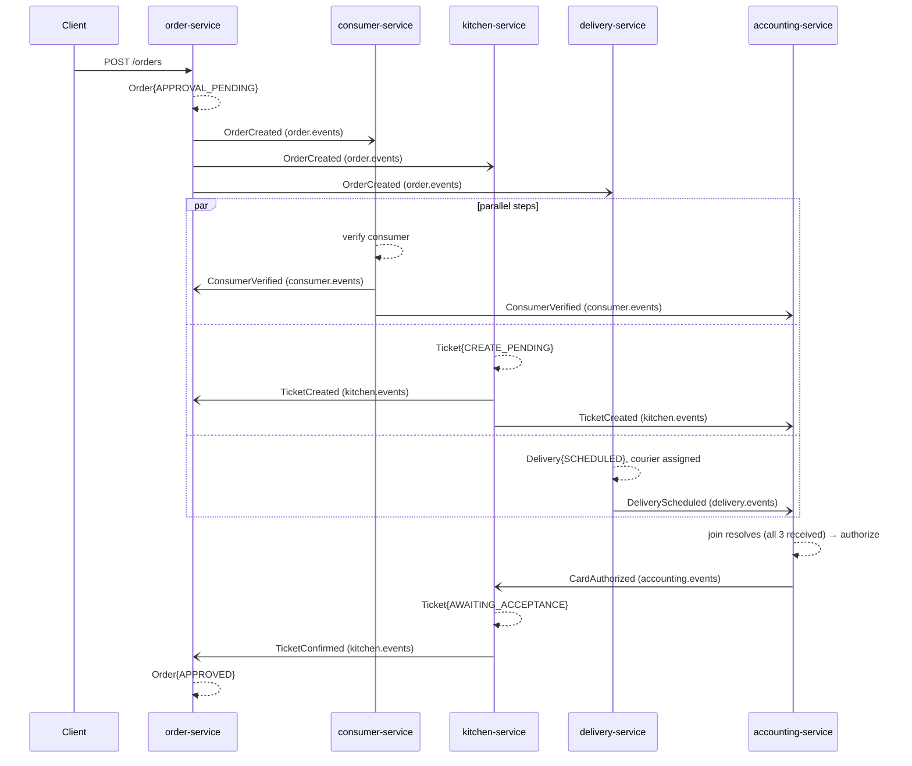
```mermaid
sequenceDiagram
    participant C as Client
    participant O as order-service
    participant Con as consumer-service
    participant K as kitchen-service
    participant D as delivery-service
    participant A as accounting-service

    C->>O: POST /orders
    O-->>O: Order{APPROVAL_PENDING}
    O-)Con: OrderCreated (order.events)
    O-)K: OrderCreated (order.events)
    O-)D: OrderCreated (order.events)
    par parallel steps
        Con-->>Con: verify consumer
        Con-)O: ConsumerVerified (consumer.events)
        Con-)A: ConsumerVerified (consumer.events)
    and
        K-->>K: Ticket{CREATE_PENDING}
        K-)O: TicketCreated (kitchen.events)
        K-)A: TicketCreated (kitchen.events)
    and
        D-->>D: Delivery{SCHEDULED}, courier assigned
        D-)A: DeliveryScheduled (delivery.events)
    end
    A-->>A: join resolves (all 3 received) → authorize
    A-)K: CardAuthorized (accounting.events)
    K-->>K: Ticket{AWAITING_ACCEPTANCE}
    K-)O: TicketConfirmed (kitchen.events)
    O-->>O: Order{APPROVED}
```

### Case A — consumer verification fails

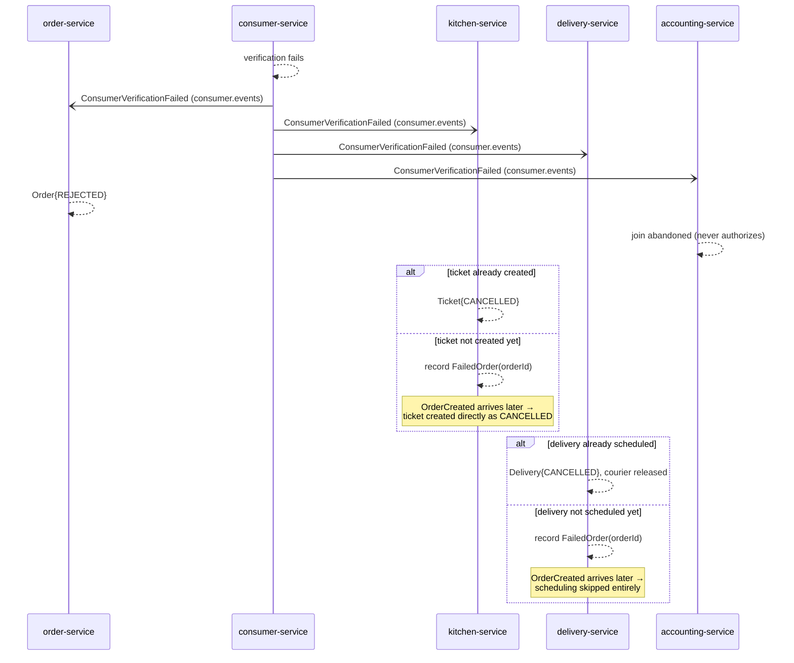
```mermaid
sequenceDiagram
    participant O as order-service
    participant Con as consumer-service
    participant K as kitchen-service
    participant D as delivery-service
    participant A as accounting-service

    Con-->>Con: verification fails
    Con-)O: ConsumerVerificationFailed (consumer.events)
    Con-)K: ConsumerVerificationFailed (consumer.events)
    Con-)D: ConsumerVerificationFailed (consumer.events)
    Con-)A: ConsumerVerificationFailed (consumer.events)
    O-->>O: Order{REJECTED}
    A-->>A: join abandoned (never authorizes)
    alt ticket already created
        K-->>K: Ticket{CANCELLED}
    else ticket not created yet
        K-->>K: record FailedOrder(orderId)
        Note over K: OrderCreated arrives later →<br/>ticket created directly as CANCELLED
    end
    alt delivery already scheduled
        D-->>D: Delivery{CANCELLED}, courier released
    else delivery not scheduled yet
        D-->>D: record FailedOrder(orderId)
        Note over D: OrderCreated arrives later →<br/>scheduling skipped entirely
    end
```

### Case B — kitchen capacity exceeded

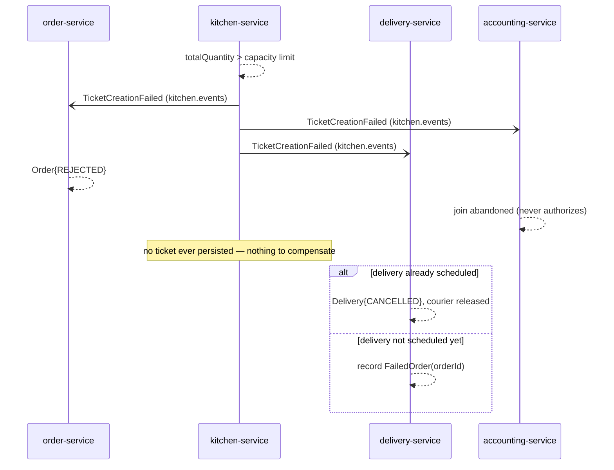
```mermaid
sequenceDiagram
    participant O as order-service
    participant K as kitchen-service
    participant D as delivery-service
    participant A as accounting-service

    K-->>K: totalQuantity > capacity limit
    K-)O: TicketCreationFailed (kitchen.events)
    K-)A: TicketCreationFailed (kitchen.events)
    K-)D: TicketCreationFailed (kitchen.events)
    O-->>O: Order{REJECTED}
    A-->>A: join abandoned (never authorizes)
    Note over K: no ticket ever persisted — nothing to compensate
    alt delivery already scheduled
        D-->>D: Delivery{CANCELLED}, courier released
    else delivery not scheduled yet
        D-->>D: record FailedOrder(orderId)
    end
```

### Case C — card authorization declined

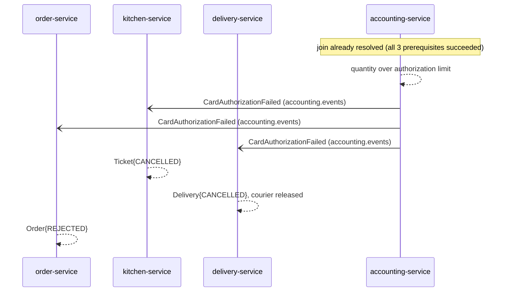
```mermaid
sequenceDiagram
    participant O as order-service
    participant K as kitchen-service
    participant D as delivery-service
    participant A as accounting-service

    Note over A: join already resolved (all 3 prerequisites succeeded)
    A-->>A: quantity over authorization limit
    A-)K: CardAuthorizationFailed (accounting.events)
    A-)O: CardAuthorizationFailed (accounting.events)
    A-)D: CardAuthorizationFailed (accounting.events)
    K-->>K: Ticket{CANCELLED}
    D-->>D: Delivery{CANCELLED}, courier released
    O-->>O: Order{REJECTED}
```

### Case D — no courier available

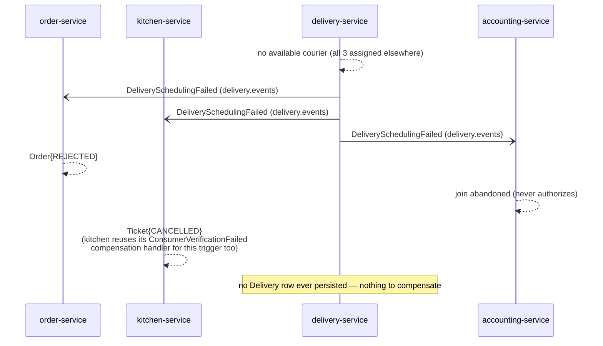
```mermaid
sequenceDiagram
    participant O as order-service
    participant K as kitchen-service
    participant D as delivery-service
    participant A as accounting-service

    D-->>D: no available courier (all 3 assigned elsewhere)
    D-)O: DeliverySchedulingFailed (delivery.events)
    D-)K: DeliverySchedulingFailed (delivery.events)
    D-)A: DeliverySchedulingFailed (delivery.events)
    O-->>O: Order{REJECTED}
    A-->>A: join abandoned (never authorizes)
    K-->>K: Ticket{CANCELLED}<br/>(kitchen reuses its ConsumerVerificationFailed<br/>compensation handler for this trigger too)
    Note over D: no Delivery row ever persisted — nothing to compensate
```

## Create Order saga — orchestration

A central `CreateOrderSagaOrchestrator` in order-service sends explicit commands and reacts to replies on a shared `saga.replies` topic. Progress is persisted in `CreateOrderSagaInstance` (with `@Version` optimistic locking — three Kafka consumer threads can race on the same order's saga state, same reasoning as choreography's `SagaJoinState`).

### Happy path

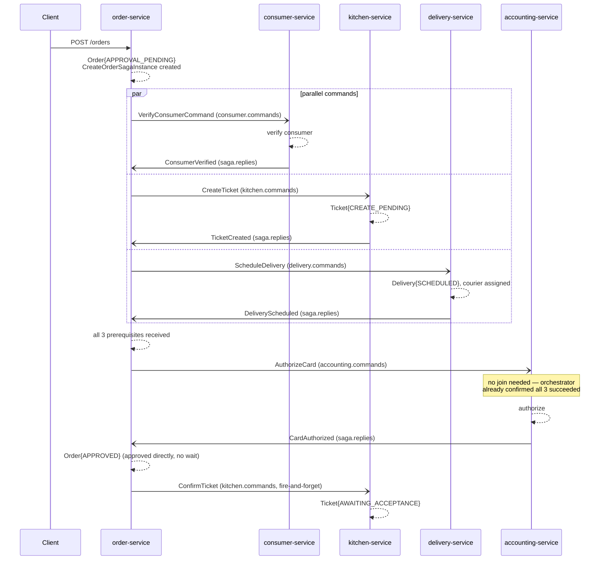
```mermaid
sequenceDiagram
    participant C as Client
    participant O as order-service
    participant Con as consumer-service
    participant K as kitchen-service
    participant D as delivery-service
    participant A as accounting-service

    C->>O: POST /orders
    O-->>O: Order{APPROVAL_PENDING}<br/>CreateOrderSagaInstance created
    par parallel commands
        O-)Con: VerifyConsumerCommand (consumer.commands)
        Con-->>Con: verify consumer
        Con-)O: ConsumerVerified (saga.replies)
    and
        O-)K: CreateTicket (kitchen.commands)
        K-->>K: Ticket{CREATE_PENDING}
        K-)O: TicketCreated (saga.replies)
    and
        O-)D: ScheduleDelivery (delivery.commands)
        D-->>D: Delivery{SCHEDULED}, courier assigned
        D-)O: DeliveryScheduled (saga.replies)
    end
    O-->>O: all 3 prerequisites received
    O-)A: AuthorizeCard (accounting.commands)
    Note over A: no join needed — orchestrator<br/>already confirmed all 3 succeeded
    A-->>A: authorize
    A-)O: CardAuthorized (saga.replies)
    O-->>O: Order{APPROVED}  (approved directly, no wait)
    O-)K: ConfirmTicket (kitchen.commands, fire-and-forget)
    K-->>K: Ticket{AWAITING_ACCEPTANCE}
```

Note the direct-approve step: order-service marks `APPROVED` immediately on `CardAuthorized`, then sends `ConfirmTicket` — it does not wait for a reply. In choreography, order-service had to wait for kitchen's `TicketConfirmed` echo as an indirect signal that accounting had already succeeded; here the orchestrator already knows that directly. There is a brief window where `Order=APPROVED` while `Ticket` is still `CREATE_PENDING`, but the `ConfirmTicket` command is on the same Kafka partition (keyed by `orderId`) as the earlier `CreateTicket`, so ordering is guaranteed and the ticket always converges to `AWAITING_ACCEPTANCE`.

### Case A — consumer verification fails

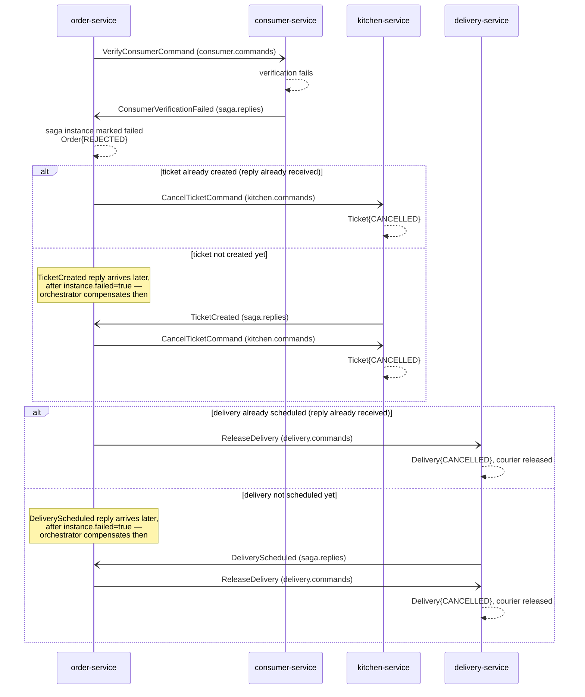
```mermaid
sequenceDiagram
    participant O as order-service
    participant Con as consumer-service
    participant K as kitchen-service
    participant D as delivery-service

    O-)Con: VerifyConsumerCommand (consumer.commands)
    Con-->>Con: verification fails
    Con-)O: ConsumerVerificationFailed (saga.replies)
    O-->>O: saga instance marked failed<br/>Order{REJECTED}
    alt ticket already created (reply already received)
        O-)K: CancelTicketCommand (kitchen.commands)
        K-->>K: Ticket{CANCELLED}
    else ticket not created yet
        Note over O: TicketCreated reply arrives later,<br/>after instance.failed=true —<br/>orchestrator compensates then
        K-)O: TicketCreated (saga.replies)
        O-)K: CancelTicketCommand (kitchen.commands)
        K-->>K: Ticket{CANCELLED}
    end
    alt delivery already scheduled (reply already received)
        O-)D: ReleaseDelivery (delivery.commands)
        D-->>D: Delivery{CANCELLED}, courier released
    else delivery not scheduled yet
        Note over O: DeliveryScheduled reply arrives later,<br/>after instance.failed=true —<br/>orchestrator compensates then
        D-)O: DeliveryScheduled (saga.replies)
        O-)D: ReleaseDelivery (delivery.commands)
        D-->>D: Delivery{CANCELLED}, courier released
    end
```

### Case B — kitchen capacity exceeded

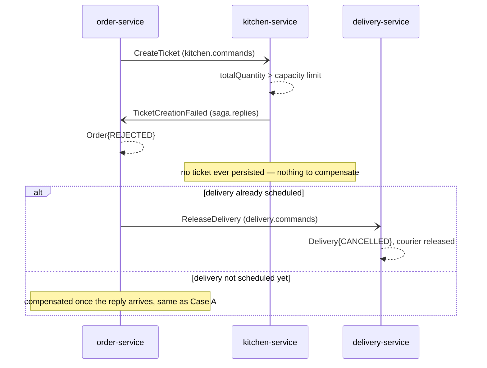
```mermaid
sequenceDiagram
    participant O as order-service
    participant K as kitchen-service
    participant D as delivery-service

    O-)K: CreateTicket (kitchen.commands)
    K-->>K: totalQuantity > capacity limit
    K-)O: TicketCreationFailed (saga.replies)
    O-->>O: Order{REJECTED}
    Note over K: no ticket ever persisted — nothing to compensate
    alt delivery already scheduled
        O-)D: ReleaseDelivery (delivery.commands)
        D-->>D: Delivery{CANCELLED}, courier released
    else delivery not scheduled yet
        Note over O: compensated once the reply arrives, same as Case A
    end
```

### Case C — card authorization declined

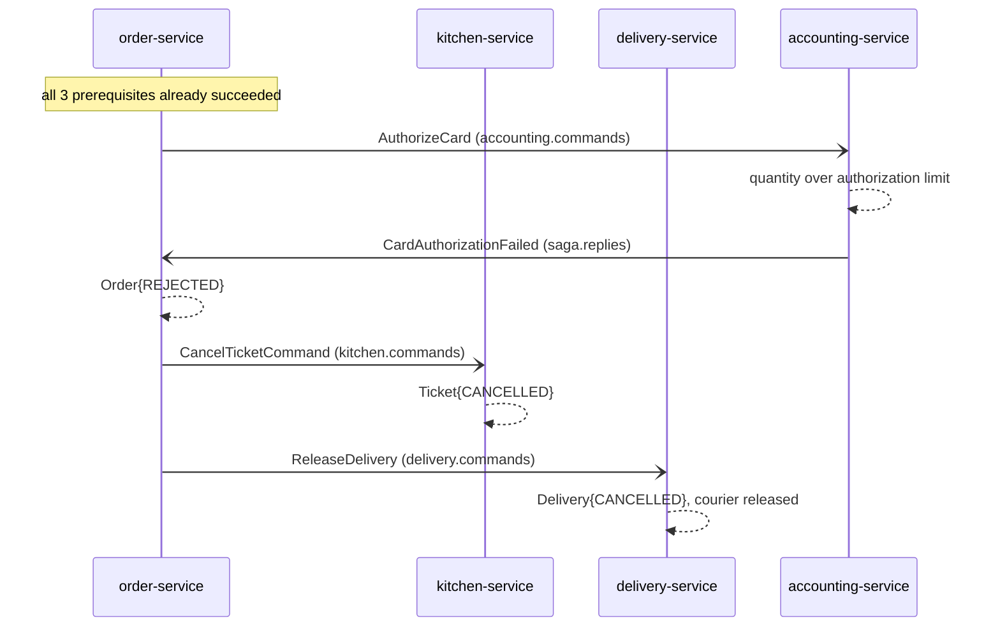
```mermaid
sequenceDiagram
    participant O as order-service
    participant K as kitchen-service
    participant D as delivery-service
    participant A as accounting-service

    Note over O: all 3 prerequisites already succeeded
    O-)A: AuthorizeCard (accounting.commands)
    A-->>A: quantity over authorization limit
    A-)O: CardAuthorizationFailed (saga.replies)
    O-->>O: Order{REJECTED}
    O-)K: CancelTicketCommand (kitchen.commands)
    K-->>K: Ticket{CANCELLED}
    O-)D: ReleaseDelivery (delivery.commands)
    D-->>D: Delivery{CANCELLED}, courier released
```

### Case D — no courier available

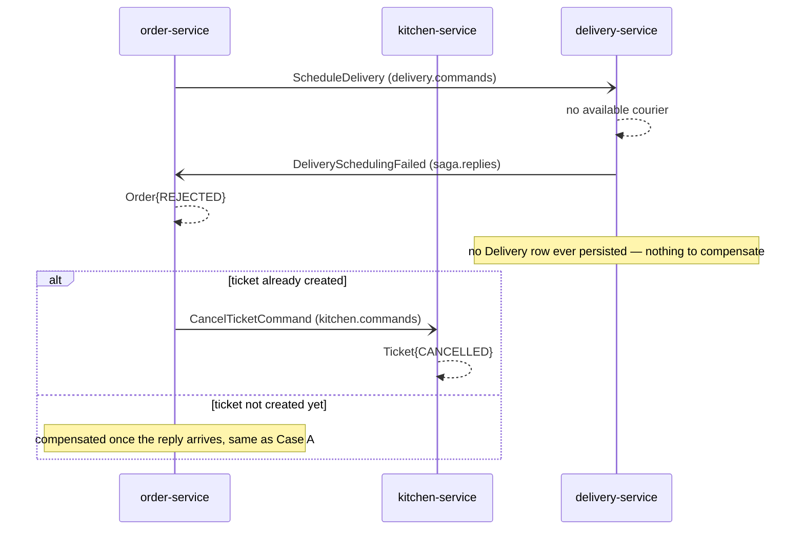
```mermaid
sequenceDiagram
    participant O as order-service
    participant K as kitchen-service
    participant D as delivery-service

    O-)D: ScheduleDelivery (delivery.commands)
    D-->>D: no available courier
    D-)O: DeliverySchedulingFailed (saga.replies)
    O-->>O: Order{REJECTED}
    Note over D: no Delivery row ever persisted — nothing to compensate
    alt ticket already created
        O-)K: CancelTicketCommand (kitchen.commands)
        K-->>K: Ticket{CANCELLED}
    else ticket not created yet
        Note over O: compensated once the reply arrives, same as Case A
    end
```

## Multi-saga routing (`sagaType`)

Three independent sagas (Create Order, Cancel Order, Revise Order) all run through order-service, and in orchestration mode all three share the same `kitchen.commands`/`delivery.commands`/`accounting.commands`/`saga.replies` topics rather than getting dedicated ones each. `SagaReply`, `KitchenCommand`, `DeliveryCommand`, and `AccountingCommand` each carry a `sagaType` field (`"CreateOrder"` / `"CancelOrder"` / `"ReviseOrder"`) so:

- order-service's one shared `OrchestratorReplyListener` (on `saga.replies`) routes each reply to the correct one of the three orchestrators (`CreateOrderSagaOrchestrator`, `CancelOrderSagaOrchestrator`, `ReviseOrderSagaOrchestrator`) before that orchestrator's own `handleReply` is ever called — no orchestrator has to guess which saga a message belongs to.
- A command type shared by more than one saga stays unambiguous. `KitchenCommand{commandType=CancelTicket}` is sent by both Create Order's compensation path (`CreateOrderSagaOrchestrator.sendCancelTicket`) and Cancel Order's primary flow (`CancelOrderSagaOrchestrator.start`) — the same `TicketService.handleCancelTicketCommand` handles both, and echoes the inbound `sagaType` back into its reply unchanged, since it cannot infer which saga's request it's servicing from `commandType` alone. `DeliveryCommand{commandType=ReleaseDelivery}` has the identical shape: sent by both Create Order's compensation path (`CreateOrderSagaOrchestrator.sendReleaseDelivery`) and Cancel Order's primary flow (`CancelOrderSagaOrchestrator.handleKitchenReply`), handled by one `DeliveryService.handleReleaseDeliveryCommand` that echoes `sagaType` back the same way.

`CancelOrderSagaOrchestrator` and `ReviseOrderSagaOrchestrator` are both deliberately stateless (no persisted saga-instance table, unlike `CreateOrderSagaOrchestrator`'s `CreateOrderSagaInstance`) — both are strict linear pipelines with no parallel replies to join, so `Order`'s own `status` (and, for Revise, its `lineItems`/`pendingRevisedLineItems`) is sufficient saga state on its own.

## Cancel Order saga — choreography

`Order.cancel()` is only legal from `APPROVED`, meaning the `Ticket` has already been confirmed and may be anywhere from `AWAITING_ACCEPTANCE` through `PICKED_UP` — cancellation isn't guaranteed to succeed. The saga asks kitchen first; delivery release and accounting's authorization reversal only happen if kitchen confirms the ticket cancellable. Delivery-service's step was inserted between kitchen and accounting (kitchen → delivery-release → accounting-reversal) rather than run in parallel with either, since it's a genuine sequential dependency, not a join — accounting now waits for `DeliveryCancelled` (not `TicketCancelled` directly) before reversing the authorization.

### Happy path

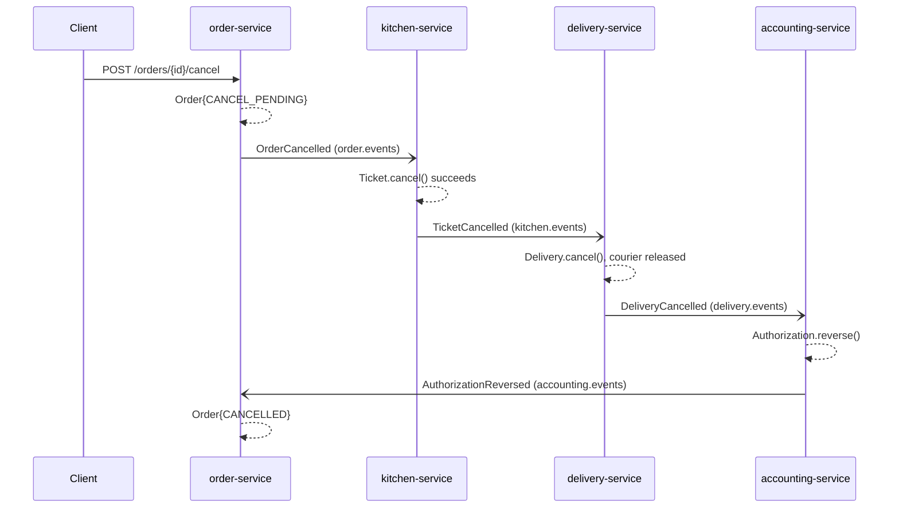
```mermaid
sequenceDiagram
    participant C as Client
    participant O as order-service
    participant K as kitchen-service
    participant D as delivery-service
    participant A as accounting-service

    C->>O: POST /orders/{id}/cancel
    O-->>O: Order{CANCEL_PENDING}
    O-)K: OrderCancelled (order.events)
    K-->>K: Ticket.cancel() succeeds
    K-)D: TicketCancelled (kitchen.events)
    D-->>D: Delivery.cancel(), courier released
    D-)A: DeliveryCancelled (delivery.events)
    A-->>A: Authorization.reverse()
    A-)O: AuthorizationReversed (accounting.events)
    O-->>O: Order{CANCELLED}
```

### Rejection — ticket already too far along

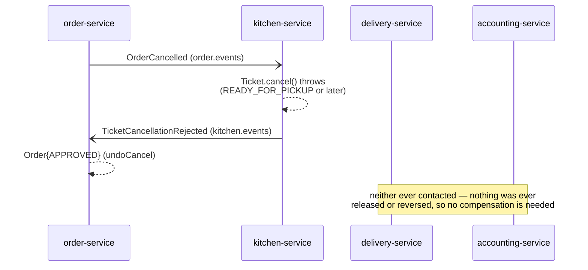
```mermaid
sequenceDiagram
    participant O as order-service
    participant K as kitchen-service
    participant D as delivery-service
    participant A as accounting-service

    O-)K: OrderCancelled (order.events)
    K-->>K: Ticket.cancel() throws<br/>(READY_FOR_PICKUP or later)
    K-)O: TicketCancellationRejected (kitchen.events)
    O-->>O: Order{APPROVED} (undoCancel)
    Note over D,A: neither ever contacted — nothing was ever<br/>released or reversed, so no compensation is needed
```

## Cancel Order saga — orchestration

Stateless `CancelOrderSagaOrchestrator`, driven purely by `saga.replies` (`sagaType=CancelOrder`), using `Order`'s own status as the implicit saga state. Same sequential 3-step chain as choreography — kitchen → delivery-release → accounting-reversal.

### Happy path

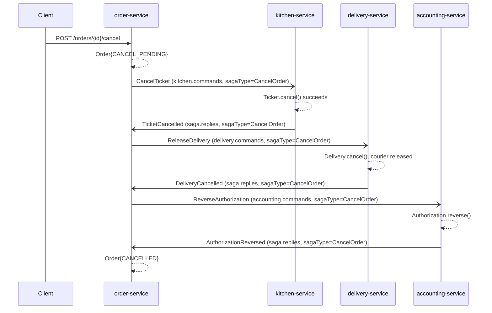
```mermaid
sequenceDiagram
    participant C as Client
    participant O as order-service
    participant K as kitchen-service
    participant D as delivery-service
    participant A as accounting-service

    C->>O: POST /orders/{id}/cancel
    O-->>O: Order{CANCEL_PENDING}
    O-)K: CancelTicket (kitchen.commands, sagaType=CancelOrder)
    K-->>K: Ticket.cancel() succeeds
    K-)O: TicketCancelled (saga.replies, sagaType=CancelOrder)
    O-)D: ReleaseDelivery (delivery.commands, sagaType=CancelOrder)
    D-->>D: Delivery.cancel(), courier released
    D-)O: DeliveryCancelled (saga.replies, sagaType=CancelOrder)
    O-)A: ReverseAuthorization (accounting.commands, sagaType=CancelOrder)
    A-->>A: Authorization.reverse()
    A-)O: AuthorizationReversed (saga.replies, sagaType=CancelOrder)
    O-->>O: Order{CANCELLED}
```

### Rejection — ticket already too far along

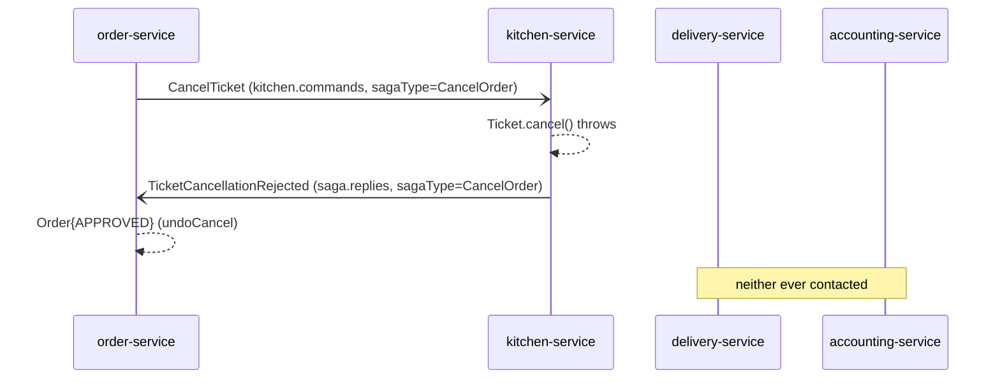
```mermaid
sequenceDiagram
    participant O as order-service
    participant K as kitchen-service
    participant D as delivery-service
    participant A as accounting-service

    O-)K: CancelTicket (kitchen.commands, sagaType=CancelOrder)
    K-->>K: Ticket.cancel() throws
    K-)O: TicketCancellationRejected (saga.replies, sagaType=CancelOrder)
    O-->>O: Order{APPROVED} (undoCancel)
    Note over D,A: neither ever contacted
```

## Revise Order saga — choreography

Same sequential, kitchen-gates-accounting shape as Cancel Order, but with a genuinely new wrinkle: kitchen *provisionally applies* the revised quantity before accounting is ever asked, since `Authorization.reviseAuthorization()` (unlike `reverse()`) is a real guarded threshold check that accounting can decline. That makes a real compensation path necessary — something Cancel Order never needed, because `reverse()` is unconditional.

### Happy path

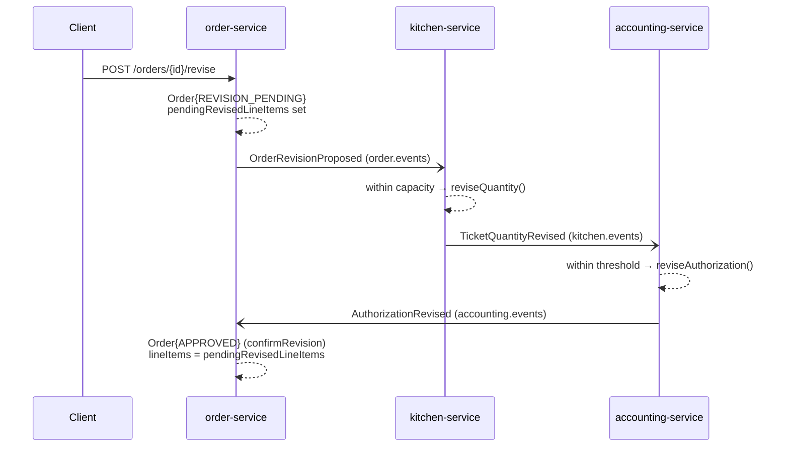
```mermaid
sequenceDiagram
    participant C as Client
    participant O as order-service
    participant K as kitchen-service
    participant A as accounting-service

    C->>O: POST /orders/{id}/revise
    O-->>O: Order{REVISION_PENDING}<br/>pendingRevisedLineItems set
    O-)K: OrderRevisionProposed (order.events)
    K-->>K: within capacity → reviseQuantity()
    K-)A: TicketQuantityRevised (kitchen.events)
    A-->>A: within threshold → reviseAuthorization()
    A-)O: AuthorizationRevised (accounting.events)
    O-->>O: Order{APPROVED} (confirmRevision)<br/>lineItems = pendingRevisedLineItems
```

### Case A — kitchen rejects outright (over capacity)

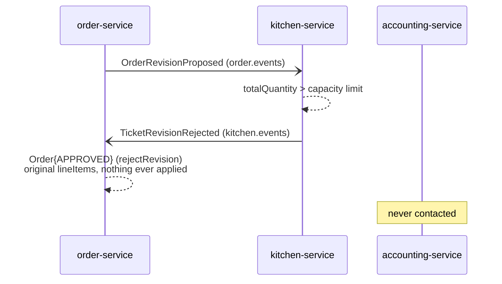
```mermaid
sequenceDiagram
    participant O as order-service
    participant K as kitchen-service
    participant A as accounting-service

    O-)K: OrderRevisionProposed (order.events)
    K-->>K: totalQuantity > capacity limit
    K-)O: TicketRevisionRejected (kitchen.events)
    O-->>O: Order{APPROVED} (rejectRevision)<br/>original lineItems, nothing ever applied
    Note over A: never contacted
```

### Case B — kitchen confirms, accounting declines (real compensation)

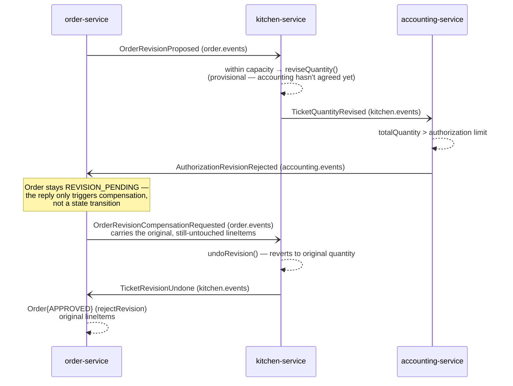
```mermaid
sequenceDiagram
    participant O as order-service
    participant K as kitchen-service
    participant A as accounting-service

    O-)K: OrderRevisionProposed (order.events)
    K-->>K: within capacity → reviseQuantity()<br/>(provisional — accounting hasn't agreed yet)
    K-)A: TicketQuantityRevised (kitchen.events)
    A-->>A: totalQuantity > authorization limit
    A-)O: AuthorizationRevisionRejected (accounting.events)
    Note over O: Order stays REVISION_PENDING —<br/>the reply only triggers compensation,<br/>not a state transition
    O-)K: OrderRevisionCompensationRequested (order.events)<br/>carries the original, still-untouched lineItems
    K-->>K: undoRevision() — reverts to original quantity
    K-)O: TicketRevisionUndone (kitchen.events)
    O-->>O: Order{APPROVED} (rejectRevision)<br/>original lineItems
```

`"OrderRevisionCompensationRequested"` is deliberately a distinct wire event from the terminal `"OrderRevisionRejected"` (Case A's outcome) — conflating them would make kitchen try to undo a revision that was rejected outright, with nothing ever applied to undo.

## Revise Order saga — orchestration

Stateless `ReviseOrderSagaOrchestrator`, driven by `saga.replies` (`sagaType=ReviseOrder`). Being stateless, it recomputes both the pending revised quantity and the original quantity by reloading `Order` fresh rather than caching them across the round trip — `Order.getPendingRevisedLineItems()` for the forward step, `Order.getLineItems()` (still untouched pre-revision) for the compensation step.

### Happy path

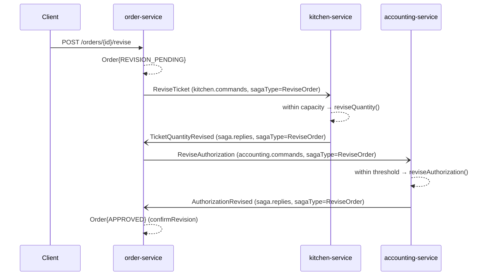
```mermaid
sequenceDiagram
    participant C as Client
    participant O as order-service
    participant K as kitchen-service
    participant A as accounting-service

    C->>O: POST /orders/{id}/revise
    O-->>O: Order{REVISION_PENDING}
    O-)K: ReviseTicket (kitchen.commands, sagaType=ReviseOrder)
    K-->>K: within capacity → reviseQuantity()
    K-)O: TicketQuantityRevised (saga.replies, sagaType=ReviseOrder)
    O-)A: ReviseAuthorization (accounting.commands, sagaType=ReviseOrder)
    A-->>A: within threshold → reviseAuthorization()
    A-)O: AuthorizationRevised (saga.replies, sagaType=ReviseOrder)
    O-->>O: Order{APPROVED} (confirmRevision)
```

### Case A — kitchen rejects outright (over capacity)

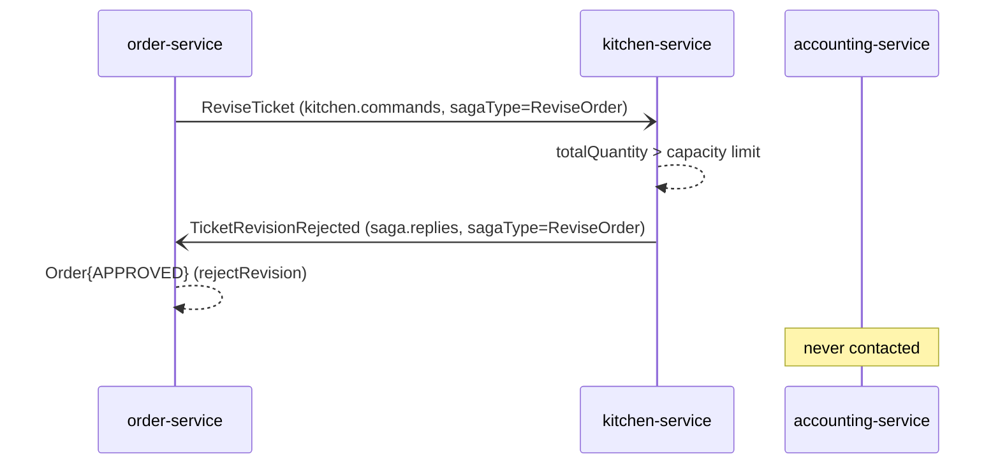
```mermaid
sequenceDiagram
    participant O as order-service
    participant K as kitchen-service
    participant A as accounting-service

    O-)K: ReviseTicket (kitchen.commands, sagaType=ReviseOrder)
    K-->>K: totalQuantity > capacity limit
    K-)O: TicketRevisionRejected (saga.replies, sagaType=ReviseOrder)
    O-->>O: Order{APPROVED} (rejectRevision)
    Note over A: never contacted
```

### Case B — kitchen confirms, accounting declines (real compensation)

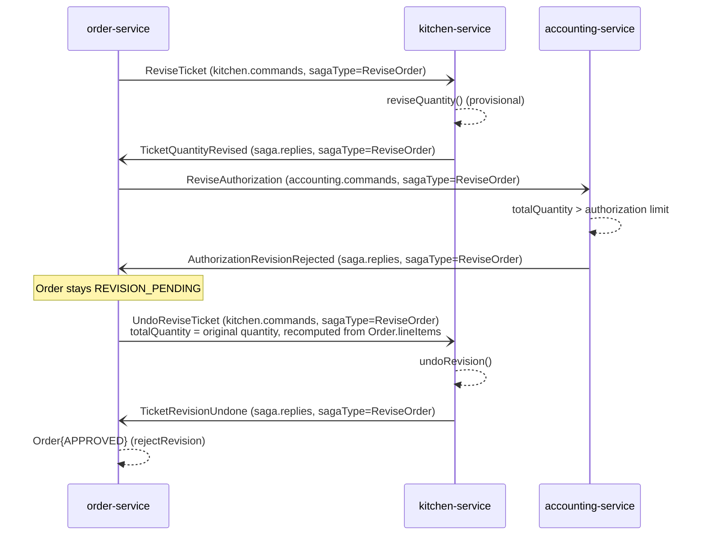
```mermaid
sequenceDiagram
    participant O as order-service
    participant K as kitchen-service
    participant A as accounting-service

    O-)K: ReviseTicket (kitchen.commands, sagaType=ReviseOrder)
    K-->>K: reviseQuantity() (provisional)
    K-)O: TicketQuantityRevised (saga.replies, sagaType=ReviseOrder)
    O-)A: ReviseAuthorization (accounting.commands, sagaType=ReviseOrder)
    A-->>A: totalQuantity > authorization limit
    A-)O: AuthorizationRevisionRejected (saga.replies, sagaType=ReviseOrder)
    Note over O: Order stays REVISION_PENDING
    O-)K: UndoReviseTicket (kitchen.commands, sagaType=ReviseOrder)<br/>totalQuantity = original quantity, recomputed from Order.lineItems
    K-->>K: undoRevision()
    K-)O: TicketRevisionUndone (saga.replies, sagaType=ReviseOrder)
    O-->>O: Order{APPROVED} (rejectRevision)
```

## Choreography vs. orchestration — what actually differs (Create Order saga)

| | Choreography | Orchestration |
|---|---|---|
| Coordination | Implicit — each service reacts to peers' events | Explicit — one orchestrator drives every step |
| accounting-service join | Needed (`SagaJoinState`, waits for 3 events — consumer, kitchen, delivery — in any order) | **Not needed at all** — orchestrator already waited |
| kitchen-service / delivery-service race table | Needed (`FailedOrder` in each — absorbs a timing race) | **Not needed** — orchestrator absorbs the race centrally |
| Order approval trigger | Waits for kitchen's `TicketConfirmed` echo | Approves directly on `CardAuthorized`, no wait |
| New Kafka topics | 0 (reuses existing domain-event topics) | 5 (4 command topics + 1 shared reply topic) |
| Saga state persistence | Distributed across each service's own local state (`SagaJoinState`, `FailedOrder`) | Centralized in one `CreateOrderSagaInstance` per order |
| Final observable outcome | Identical `Order`/`Ticket`/`Delivery`/`Authorization` end states for all 5 scenarios | Identical `Order`/`Ticket`/`Delivery`/`Authorization` end states for all 5 scenarios |

Both styles reach the exact same end states for the happy path and all four compensation cases (including the delivery-specific "no courier available" case) — verified by running the identical manual test scenarios against both. The difference is entirely in *how* that consistency is achieved: distributed reactive logic vs. centralized explicit coordination.

Cancel Order and Revise Order are simpler on this axis: Cancel Order is now a 3-step sequential chain (kitchen → delivery-release → accounting-reversal) and Revise Order stays a 2-step chain (kitchen, then conditionally accounting) — neither is a parallel join, so **neither ever needed a `SagaJoinState`/`FailedOrder`-style local state table in either saga mode**, and their orchestrators (`CancelOrderSagaOrchestrator`, `ReviseOrderSagaOrchestrator`) are stateless — no `*SagaInstance` table either. The choreography/orchestration contrast for those two sagas is almost entirely about *how a step is triggered* (reacting to a domain event vs. receiving an explicit command), not about coordination complexity, since there's no join to centralize away.

## Event sourcing — `Order` aggregate (Ch.6)

`order-service` gained a second persistence path for `Order`: instead of a mutable `orders` row updated in place, `Order`'s full history is stored as an append-only sequence of events (`order_events`), and current state is derived by replaying them. Selected per-deployment via `PERSISTENCE_MODE` (env var, default `jpa`, alternate `event-sourcing`):

```bash
PERSISTENCE_MODE=event-sourcing docker compose up -d --build
```

### The `OrderTransitions` facade

Every call site that used to depend on `OrderRepository` directly (`OrderController`, `OrderService`, all three choreography saga services, all three orchestration saga orchestrators) now depends on `OrderTransitions` instead — an interface with two implementations selected by `@ConditionalOnProperty(persistence.mode=...)`:

- **`JpaOrderTransitions`** — the pre-Ch.6 path: loads/saves a mutable `Order` row via `OrderRepository`, publishes via `OrderDomainEventPublisher` onto the outbox.
- **`EventSourcedOrderTransitions`** — backed by `OrderEventStore`/`OrderAggregate`.

`OrderTransitions` has two contracts, by method: `create`/`findById`/`cancel`/`revise` throw on invalid state (`OrderNotFoundException`, `UnsupportedStateTransitionException`); `approve`/`reject`/`noteCancelled`/`undoCancel`/`confirmRevision`/`rejectRevision`/`requestRevisionCompensation` **silently no-op** on invalid state or a missing order — this mirrors what a saga reply handler already needs (a duplicate or late reply for an order that moved on shouldn't crash the listener), and both implementations honor it identically.

A parallel `SagaCommandPublisher` facade does the same for orchestration-mode outbound saga commands (`OutboxSagaCommandPublisher` / `EventSourcedSagaCommandPublisher`), so the three orchestrators need zero `PERSISTENCE_MODE`-specific code of their own.

### The event store (`OrderEventStore`/`OrderAggregate`)

Hand-rolled, not Eventuate — `OrderAggregate` implements the book's `process(Command)`/`apply(Event)` split: `process()` validates a command against current state and returns the `List<OrderDomainEvent>` that *should* happen (no mutation); `apply()` unconditionally mutates state given an event that *already* happened. The same `apply()` is used both for the event just decided and for every historical event during replay — this is what makes replay possible at all.

```mermaid
sequenceDiagram
    participant C as Caller
    participant T as EventSourcedOrderTransitions
    participant S as OrderEventStore
    participant DB as order_events / order_snapshots / order_aggregate_version

    C->>T: cancel(orderId, eventId)
    T->>S: update(orderId, agg -> agg.process(CancelOrderCommand))
    S->>DB: load version row (optimistic-lock check target)
    S->>DB: load snapshot (if any) + event tail since it
    S-->>S: replay: aggregate = fromSnapshot ?: new; tail.forEach(apply)
    S->>S: events = aggregate.process(command)
    S->>S: events.forEach(aggregate::apply)
    S->>DB: append new event row(s)
    S->>DB: save version row (Hibernate dirty-check flush, not merge — @Version conflict throws here)
    opt every 5th event for this order
        S->>DB: write/update snapshot
    end
    S-->>T: updated OrderAggregate
```

**Snapshots** (`OrderSnapshot`/`OrderSnapshotData`) are a pure performance optimization — every 5 events, `OrderEventStore` writes a snapshot of the aggregate's full state plus a pointer to the last event it includes, so replay only has to fold the tail of events since the snapshot rather than the full history. `Order`'s lifecycle is short enough that this is never load-bearing in this codebase; it was implemented anyway to exercise the mechanism, not because it was needed.

**Optimistic locking** uses a dedicated `order_aggregate_version` table (`OrderAggregateVersion`, one row per order, a `@Version`-annotated Hibernate entity) rather than deriving a version number from `COUNT(*)` on `order_events` — this keeps "how many events exist" and "what version an update is conditioned on" as independently reasoned-about concerns, and mirrors the JPA path's own `@Version` column on `orders` closely enough that the two paths' concurrency behavior is genuinely comparable. `OrderEventStore.update()` loads the version row via its repository and mutates it in place (never detaches it), so Hibernate's own dirty-checking flush performs the optimistic-lock check — using `merge()` on a detached copy instead was tried first and silently defeated the check (see `docs/superpowers/plans/2026-07-22-order-event-sourcing.md`, Task 4, for the two-round bug hunt that surfaced this).

### CDC reuse and the wire-only pseudo-event gotcha

Choreography-mode publishing doesn't introduce a new Kafka pipeline — it extends the existing Ch.3 Debezium/Kafka Connect outbox connector's `table.include.list` to also cover `order_events` (alongside `outbox_events`), and `order_events`'s columns (`event_id`/`event_type`/`order_id`/`payload`) are deliberately named to match `outbox_events`' so one connector config routes both tables to `order.events` unchanged.

This creates a sharp edge: `order_events` now serves two purposes at once — the event-sourcing durability log (every row must be replayable back into `OrderAggregate.apply()`) and a CDC transport (every row that matters for Kafka delivery). Those two sets of rows aren't quite the same. The Revise Order saga's accounting-decline compensation path needs to notify kitchen-service of an in-flight compensation (`OrderRevisionCompensationRequested`) — in JPA mode this is a wire-only signal published straight to the outbox, never touching `Order`'s own state. Event-sourcing mode's first implementation wrote the equivalent row into `order_events` (so CDC would still carry it), but `OrderEventStore.replay()` treated *every* row in `order_events` as a real domain event and crashed trying to feed `OrderRevisionCompensationRequested` into `OrderAggregate.apply()` on the next replay of that order — a bug only Docker end-to-end testing surfaced (see Task 25 in the plan; no unit test exercised a real replay after a compensation request). Fixed with a `replayable` boolean column on `OrderEventEntity` (`true` for every real domain event, `false` only for this one pseudo-event), and `OrderEventStore.replay()`'s two event queries now filter on it. The lesson generalizes: any table doing double duty as both an event-sourcing replay log and a CDC transport needs an explicit way to say "this row is for Kafka only, never feed it back into the aggregate."

### Orchestration-mode saga commands: the pseudo-event mechanism

The book's actual mechanism for orchestration-mode commands under event sourcing is a `SagaCommandEvent`-style pseudo-event, not "publish in the same transaction as the aggregate update" — chosen deliberately here to see the real mechanism rather than the shortcut. `EventSourcedSagaCommandPublisher.publish(...)` writes a row to a **separate** table, `order_saga_command_requests` (`OrderSagaCommandRequest`), rather than into `order_events` itself:

```mermaid
sequenceDiagram
    participant Orch as CreateOrderSagaOrchestrator
    participant Pub as EventSourcedSagaCommandPublisher
    participant DB as order_saga_command_requests
    participant Poll as SagaCommandRequestPublisher (poller)
    participant K as Kafka (kitchen.commands / delivery.commands / accounting.commands / consumer.commands)

    Orch->>Pub: publish(topic, eventId, eventType, orderId, command)
    Pub->>DB: insert row {target_topic, payload, published_at=null}
    loop every outbox.poll-fixed-delay-ms
        Poll->>DB: find rows where published_at is null
        Poll->>K: send(topic, payload)
        Poll->>DB: mark published_at = now()
    end
```

This table is kept separate from `order_events` on purpose: the same CDC connector that now watches `order_events` unconditionally routes every row there to `order.events`, and saga commands are meant for `kitchen.commands`/`delivery.commands`/`accounting.commands`/`consumer.commands` instead — mixing them into one table would either leak saga commands onto `order.events` or require per-row topic filtering in the connector config, which Debezium's Outbox Event Router SMT doesn't support per-row. `order_saga_command_requests` is polled independently by its own `SagaCommandRequestPublisher`, sending before marking published — an at-least-once send, matching every other outbox-style publisher in this codebase.

## API composition — `GET /orders/{id}/view` (Ch.7)

This project's first query pattern. The order-detail screen needs data owned by four different services (`Order` itself, plus restaurant, ticket, authorization, and delivery info) — API composition assembles it behind one endpoint on order-service rather than making the client call four services and stitch the result together itself.

### Service discovery — who's registered with Eureka now

Ch.7 added three new Eureka clients. Every service order-service calls synchronously for this feature is now dynamically discoverable, matching the pattern restaurant-service already used since Ch.3:

| Service | Eureka client since | Called by |
|---|---|---|
| restaurant-service | Ch.3 | order-service (`POST /orders` validation, `GET /orders/{id}/view`) |
| kitchen-service | Ch.7 | order-service (`GET /orders/{id}/view`) |
| accounting-service | Ch.7 | order-service (`GET /orders/{id}/view`) |
| delivery-service | Ch.7 | order-service (`GET /orders/{id}/view`) |

Before this chapter, kitchen-service, accounting-service, and delivery-service were Kafka-only participants — nothing ever called them synchronously, so there was no reason for them to be discoverable. Each gained `spring-cloud-starter-netflix-eureka-client` and the same `eureka.client.service-url.defaultZone`/`eureka.instance.prefer-ip-address` config restaurant-service already had, plus a new read-only REST controller (accounting-service's is its first controller ever — see its own `README.md`).

### Parallel fan-out via virtual threads

`OrderViewController.view()` doesn't call the four downstream proxies sequentially — it fires all four via `CompletableFuture.supplyAsync(..., orderViewExecutor)` and joins on `CompletableFuture.allOf(...)` before assembling the response. `orderViewExecutor` (`VirtualThreadExecutorConfig`) is a dedicated `Executors.newVirtualThreadPerTaskExecutor()`, not the shared `ForkJoinPool.commonPool()` or a fixed-size pool:

```mermaid
sequenceDiagram
    participant C as Client
    participant O as OrderViewController
    participant R as RestaurantServiceProxy
    participant K as KitchenServiceProxy
    participant Ac as AccountingServiceProxy
    participant D as DeliveryServiceProxy

    C->>O: GET /orders/{id}/view
    O-->>O: load Order (local, no remote call)
    par 4 virtual threads, orderViewExecutor
        O->>R: findRestaurantForView(restaurantId)
        R-->>O: SectionResult<RestaurantInfo>
    and
        O->>K: findTicket(orderId)
        K-->>O: SectionResult<TicketInfo>
    and
        O->>Ac: findAuthorization(orderId)
        Ac-->>O: SectionResult<AuthorizationInfo>
    and
        O->>D: findDelivery(orderId)
        D-->>O: SectionResult<DeliveryInfo>
    end
    O-->>O: join all 4, assemble OrderViewResponse
    O-->>C: 200 OK
```

Virtual threads are a natural fit here: 4 short-lived, blocking, I/O-bound calls fired concurrently, with no pool-size tuning decision to make or justify (unlike a fixed-size `ExecutorService`, where "how many threads" is itself a decision that needs revisiting as load changes). Each downstream call still blocks its own virtual thread on the underlying `RestClient`'s synchronous HTTP call — virtual threads make that cheap to do 4 times in parallel, they don't change the RPI pattern itself.

### Per-proxy circuit breaker (reusing `restaurantService`'s settings)

Each of the 4 downstream calls goes through its own `@CircuitBreaker`-wrapped proxy (`RestaurantServiceProxy.findRestaurantForView`, `KitchenServiceProxy.findTicket`, `AccountingServiceProxy.findAuthorization`, `DeliveryServiceProxy.findDelivery`), one circuit breaker instance per service (`restaurantService`/`kitchenService`/`accountingService`/`deliveryService`) so one degraded downstream doesn't trip the breaker for the other three. All four instances share the exact same Resilience4j settings order-service's `restaurantService` breaker already used since Ch.3 — sliding window 5, failure-rate threshold 50%, 5s wait-duration-in-open-state, 3 permitted calls in half-open — reused rather than re-tuned, since there's no reason to expect kitchen/accounting/delivery to need different circuit-breaking behavior than restaurant-service did.

Each proxy method's `@CircuitBreaker` fallback returns `Unavailable<>(throwable.getMessage())` rather than throwing — this is the mechanism that turns a timeout, connection failure, or open circuit into a degraded section of the response instead of a failed request. `RestaurantServiceProxy` is the only proxy with two methods against the same circuit breaker instance: the pre-existing `findRestaurant` (throws `RestaurantNotFoundException`/`RestaurantServiceUnavailableException`, used by `POST /orders`'s creation-time validation) and the new `findRestaurantForView` (returns `SectionResult`, used only by the composite query) — same remote endpoint, two different failure-handling contracts because the two callers need different things from a failure.

### The 3-state `SectionResult` design

```mermaid
classDiagram
    class SectionResult~T~ {
        <<sealed interface>>
    }
    class Found~T~ {
        T data
    }
    class NotFound~T~ {
    }
    class Unavailable~T~ {
        String reason
    }
    SectionResult <|.. Found
    SectionResult <|.. NotFound
    SectionResult <|.. Unavailable
```

A naive composite query would either fail the whole request if any one downstream call fails, or silently coalesce "not found" and "unreachable" into the same null/absent value — losing information a client needs to render correctly (an order with no delivery yet scheduled should render differently from a delivery-service outage). `SectionResult<T>` (a sealed interface, `permits Found, NotFound, Unavailable`) keeps those two cases distinct:

- **`Found<T>(data)`** — the remote call succeeded and returned data.
- **`NotFound<T>()`** — the remote service responded `404` — a real, expected "this doesn't exist yet" (e.g. no `Ticket` row for an order still `APPROVAL_PENDING`), not an error.
- **`Unavailable<T>(reason)`** — the remote call failed for any other reason (timeout, connection refused, open circuit) — `reason` carries the exception message, a debugging aid rather than user-facing copy.

Each of the 4 sections resolves independently to one of these three states; the endpoint always returns `200` with whatever mix of `Found`/`NotFound`/`Unavailable` the four downstream calls produced — only a missing `Order` itself (the one piece of data this service owns directly) returns `404` for the whole request.

## CQRS — `ftgo-order-history-service` (Ch.7)

This project's second and last query pattern for Ch.7, and a deliberate architectural contrast with API composition above rather than a refinement of it — the book presents them as two genuinely different answers to "how does a client get a view spanning multiple services' data," not two versions of the same idea. Where API composition assembles a response at request time from four live calls, CQRS maintains a standing, pre-joined read model (`order_views`, one row per order) built incrementally from the same domain events every saga participant already publishes, and answers a query with a single local `findById` — no downstream call of any kind.

### Why this is a new, separate service rather than a mode on order-service

Every other query pattern decision in this codebase (`SAGA_MODE`, `PERSISTENCE_MODE`) has been a switch on an *existing* service, because both alternatives being switched between still live in the same bounded context. CQRS's read side deliberately isn't: it needs its own datastore, its own scaling characteristics (read-heavy, no write contention), and its own failure domain (a slow/down order-history-service must never affect order-service's own request/response cycle) — exactly the reasoning the book gives for CQRS query-side services being standalone. `ftgo-order-history-service` has no Eureka registration and is never called synchronously by anything else in this codebase; the only way data reaches it is Kafka.

### Consumes 4 topics, publishes nothing, one handler method per topic

```mermaid
sequenceDiagram
    participant O as order-service
    participant K as kitchen-service
    participant A as accounting-service
    participant D as delivery-service
    participant H as order-history-service
    participant DB as order_views

    O-)H: order.events (OrderCreated, OrderApproved, ...)
    K-)H: kitchen.events (TicketCreated, TicketConfirmed, ...)
    A-)H: accounting.events (CardAuthorized, AuthorizationReversed, ...)
    D-)H: delivery.events (DeliveryScheduled, DeliveryDelivered, ...)
    H-->>H: OrderViewService.handle*Event(eventId, eventType, orderId, ...)
    H->>DB: upsert order_views row (create stub if absent, else fill in owned fields)
```

`OrderEventListener`/`KitchenEventListener`/`AccountingEventListener`/`DeliveryEventListener` each deserialize their own topic's existing flat wire-format record (`OrderEvent`/`KitchenEvent`/`AccountingEvent`/`DeliveryEvent` — copy-pasted per-consumer, matching this codebase's existing convention for saga wire records) and hand off to one shared `OrderViewService`, which has exactly one `handle*Event` method per topic. Every handler dedupes via the same `processed_events` ledger every other consumer in this codebase uses before touching `order_views`.

### The upsert pattern — why no handler can assume `OrderCreated` came first

```mermaid
sequenceDiagram
    participant K as kitchen.events
    participant O as order.events
    participant H as OrderViewService
    participant DB as order_views

    Note over K,O: Kafka guarantees ordering only within one topic-partition —<br/>never across topics. TicketCreated can be consumed<br/>before this service has caught up on OrderCreated.
    K-)H: TicketCreated (orderId=42)
    H->>DB: findById(42) → absent → new OrderView(42), all fields null
    H->>DB: save (ticketStatus=CREATE_PENDING only)
    O-)H: OrderCreated (orderId=42)
    H->>DB: findById(42) → found (stub from above)
    H->>DB: save (consumerId/restaurantId/lineItems/orderStatus now filled in too)
```

Every one of the four `handle*Event` methods follows the identical shape: `orderViewRepository.findById(orderId).orElseGet(() -> new OrderView(orderId))`, then a `switch` on `eventType` that sets only the fields that handler owns, then save. None of the four is privileged as "the one that creates the row" — whichever event this service's consumer group happens to process first for a given order creates the stub, and the rest fill it in as they arrive, regardless of order. This is a direct, structural consequence of Kafka's ordering guarantee being per-topic-partition only, not global — a real property of this system, not a hypothetical edge case, since this service's four listeners run on independent consumer offsets against four independent topics.

### API composition vs. CQRS — what actually differs

| | API composition (`GET /orders/{id}/view`) | CQRS (`GET /order-views/{orderId}`) |
|---|---|---|
| Where the join happens | Request time, in `OrderViewController` | Continuously, in `OrderViewService` as events arrive |
| Data freshness | Always current as of the request (each downstream call reads live state) | Eventually consistent — a `GET` moments after a write can show a stale or partially-filled view until the relevant event is consumed |
| Request-time latency | Bounded by the slowest of 4 parallel downstream calls (mitigated by virtual threads, not eliminated) | One local indexed `findById` — near-instant regardless of what the write side is doing |
| Failure coupling | Availability of the composite endpoint is coupled to restaurant/kitchen/accounting/delivery-service being reachable — a circuit breaker degrades a section, but the endpoint's overall responsiveness still depends on 4 live services | Fully decoupled from write-side availability — order-history-service still answers from its own table even if every other service is down, as long as it isn't itself down |
| New service required | No — reuses order-service, adds proxies/controllers to 3 existing services | Yes — `ftgo-order-history-service`, standalone from the start |
| New Eureka registrations | 3 (kitchen/accounting/delivery-service, so order-service can discover them) | 0 — order-history-service registers with nobody and is discovered by nobody |
| New Kafka topics | 0 | 0 — reuses the 4 existing choreography topics as a 4th/5th consumer each |
| Partial-failure model | Per-section (`SectionResult`: `Found`/`NotFound`/`Unavailable`) — a degraded downstream degrades only its own field of the response | All-or-nothing at the row level — a field is either populated (its owning event was consumed) or still null (not yet), there's no "unavailable" state since nothing is called live |
| Consistency guarantee | Strong per-section (each section reflects the current DB state of its owning service at call time) | Eventual — bounded by how far behind this service's Kafka consumer group is, typically sub-second in this setup |

Both patterns solve the same underlying problem (a client needs data owned by more than one service) with opposite tradeoffs on the same axis: API composition pays latency and availability coupling at request time in exchange for always-current data; CQRS pays eventual consistency and the cost of a standing extra service/datastore in exchange for near-instant, fully decoupled reads. Neither is strictly better — the book's own framing (and this project's) is that API composition suits ad hoc, low-volume composite queries where freshness matters most, while CQRS suits high-volume, read-heavy queries (e.g. an order-history screen a consumer might poll or page through often) where the write-side services being briefly unreachable should never be visible to that screen at all.

## API Gateway / Backends for Frontends (Ch. 8)

Two new edge services front the six domain services from Ch. 1–7: `ftgo-mobile-gateway` (port 8090) and `ftgo-public-gateway` (port 8091), plus a shared library, `ftgo-gateway-common`, holding the cross-cutting edge functions both gateways need. Neither gateway contains any domain logic of its own — every route ultimately forwards to (or, for the mobile gateway's one composed endpoint, fans out to) an existing Ch.1–7 service.

### Gateway ownership model (BFF)

The book's Backends for Frontends pattern gives each class of client its own gateway, owned by the team that owns that client, rather than one shared gateway every client team has to coordinate changes through:

| Gateway | Port | Owned by (per the book's BFF diagram) | Serves |
|---|---|---|---|
| `ftgo-mobile-gateway` | 8090 | Mobile client team | The mobile app — coarse-grained, mobile-shaped responses, including one hand-composed multi-service endpoint |
| `ftgo-public-gateway` | 8091 | Public/3rd-party API team | External API consumers/partners — thin, uniform `/api/v1/...` passthrough routes, one per backend resource |

Both depend on `ftgo-gateway-common` for their edge functions (request logging, JWT bearer-token auth, per-caller rate limiting) but are independently deployable, independently configured (their own rate limit), and — per the book's ownership rationale — could evolve independently without either team blocking the other, even though in this single-learner project both happen to be built in the same session.

### Routing table

**`ftgo-public-gateway`** (pure Spring Cloud Gateway `RouteLocator`/YAML routes, no hand-written composition code), JWT bearer-token auth, 5 req/s per caller:

| Route id | Path | Rewritten to | Backend |
|---|---|---|---|
| `public-orders` | `/api/v1/orders/**` | `/orders**` | order-service |
| `public-tickets` | `/api/v1/tickets/**` | `/tickets**` | kitchen-service |
| `public-authorizations` | `/api/v1/authorizations/**` | `/authorizations**` | accounting-service |
| `public-deliveries` | `/api/v1/deliveries/**` | `/deliveries**` | delivery-service |
| `public-order-views` | `/api/v1/order-views/**` | `/order-views**` | order-history-service |
| `public-restaurants` | `/api/v1/restaurants/**` | `/restaurants**` | restaurant-service |

**`ftgo-mobile-gateway`**, JWT bearer-token auth, 20 req/s per caller:

| Route id / endpoint | Path | Kind | Backend(s) |
|---|---|---|---|
| `mobile-create-order` | `POST /mobile/orders` → `/orders` | Declared Gateway route | order-service |
| `mobile-cancel-order` | `POST /mobile/orders/{id}/cancel` → `/orders/{id}/cancel` | Declared Gateway route | order-service |
| `mobile-revise-order` | `POST /mobile/orders/{id}/revise` → `/orders/{id}/revise` | Declared Gateway route | order-service |
| (none — hand-written) | `GET /mobile/orders/{orderId}` | `RouterFunction` (not a Gateway route — see callout below) | order-service, kitchen-service, accounting-service, delivery-service (parallel fan-out) |

### Edge functions (`ftgo-gateway-common`)

Both gateways compose the same three cross-cutting filters from `ftgo-gateway-common`, registered via a `GatewayCommonAutoConfiguration` (`@Import`-based, since a consuming gateway's `@SpringBootApplication` doesn't component-scan this library's package):

- **`RequestLoggingFilter`** (`GlobalFilter`, `Ordered.getOrder() == Integer.MIN_VALUE`, i.e. runs first) — logs method/path/status/latency for every request, timed via `doFinally` around the rest of the chain so latency covers the whole filter pipeline.
- **`JwtValidationFilter`** (`GlobalFilter`, order `Integer.MIN_VALUE + 1`, i.e. runs immediately after logging) — validates the incoming `Authorization: Bearer <JWT>` header's signature against `ftgo-authorization-server`'s JWK Set (via a `ReactiveJwtDecoder` bean, `gateway.jwt.jwk-set-uri`), returning `401` on a missing or invalid token. The same token is forwarded to the routed-to backend service unchanged, and the decoded `Jwt` is stashed on the exchange (`JwtValidationFilter.VALIDATED_JWT_ATTRIBUTE`) so a later filter can read the caller's identity without re-decoding.
- **`PerKeyRateLimiterGatewayFilterFactory`** (a named, per-route `AbstractGatewayFilterFactory<Config>`, registered under the filter name `PerKeyRateLimiter` in YAML) — an in-memory, per-caller fixed-window token count (`Config.requestsPerSecond`), keyed off the validated JWT's `sub` claim (read from the exchange attribute `JwtValidationFilter` sets), returning `429` once a caller exceeds its configured rate within the current 1-second window. Chosen over Spring Cloud Gateway's built-in `RequestRateLimiter` specifically because that filter requires Redis, and this project has no Redis instance — trading away multi-instance correctness (each gateway instance counts independently) for zero new infrastructure, acceptable for a single-instance dev/learning deployment.

**Real, JWT-based identity (Ch.11 §11.1).** This originally shipped in Ch.8 as an `ApiKeyAuthFilter` stub — a single shared-secret header, not a token, session, or user identity of any kind, deliberately out of scope for a chapter about external-API-facing patterns (gateway routing, BFF composition, edge cross-cutting concerns) rather than authentication/authorization as a domain. Ch.11 §11.1 replaced it with real OAuth2/JWT bearer-token auth sourced from `ftgo-authorization-server` (see that service's own README): `JwtValidationFilter` now validates a real signed token carrying the authenticated end user's identity and roles, which each business service independently re-validates as its own OAuth2 resource server.

### The mobile gateway's composed endpoint: `GET /mobile/orders/{orderId}`

```mermaid
sequenceDiagram
    participant C as Mobile client
    participant G as mobile-gateway<br/>(OrderDetailsRouterConfig)
    participant O as order-service
    participant K as kitchen-service
    participant Ac as accounting-service
    participant D as delivery-service

    C->>G: GET /mobile/orders/{orderId}<br/>Authorization: Bearer &lt;JWT&gt;
    G-->>G: inline auth check (see callout below)
    par 4 backends, Mono.zip
        G->>O: GET /orders/{orderId}
        O-->>G: SectionResult<String>
    and
        G->>K: GET /tickets/order/{orderId}
        K-->>G: SectionResult<String>
    and
        G->>Ac: GET /authorizations/order/{orderId}
        Ac-->>G: SectionResult<String>
    and
        G->>D: GET /deliveries/order/{orderId}
        D-->>G: SectionResult<String>
    end
    G-->>G: Mono.zip → OrderDetails(order, ticket, authorization, delivery)
    G-->>C: 200 OK (always — each section degrades independently)
```

Each of the 4 backend calls is wrapped in its own `ReactiveCircuitBreaker` (2s timeout, resilience4j instances `orderService`/`kitchenService`/`accountingService`/`deliveryService`), resolving to a `SectionResult<T>` (`Found`/`NotFound`/`Unavailable`) exactly like Ch.7's API composition — a `404` from a backend degrades that section to `NotFound`, any other failure (timeout, connection refused, open circuit) degrades it to `Unavailable`, and the endpoint always returns `200` with whatever mix of the three the four calls produced.

**Contrast with Ch.7's `GET /orders/{id}/view`**: both are API composition in the general sense (assembling one response from several services' data), but *who* composes differs, and both now coexist in this codebase serving different callers. Ch.7's composition lives inside order-service itself (`OrderViewController`), fanning out via a dedicated virtual-thread executor to restaurant/kitchen/accounting/delivery-service, for any caller of order-service's own API. Ch.8's composition lives in the mobile gateway, an entirely separate service *in front of* order-service, fanning out reactively (`Mono.zip`) to order-service itself plus kitchen/accounting/delivery-service, exclusively for the mobile client. The mobile gateway's `GET /mobile/orders/{orderId}` deliberately does **not** delegate to order-service's `GET /{id}/view` — it composes independently, calling order-service's plain `GET /{id}` (added in this chapter) for the order section, so the two composition layers stay decoupled: order-service's own view endpoint can evolve to serve its own callers without constraining what the mobile gateway assembles for mobile clients, and vice versa.

| | Ch.7 API composition (`order-service`'s `GET /{id}/view`) | Ch.8 mobile gateway (`GET /mobile/orders/{orderId}`) |
|---|---|---|
| Who composes | order-service, for its own callers | mobile-gateway, a separate edge service, for mobile clients only |
| Concurrency mechanism | `CompletableFuture` on a dedicated virtual-thread `ExecutorService` (blocking `RestClient` calls) | `Mono.zip` (fully reactive `WebClient` calls) |
| Backends composed | restaurant, kitchen, accounting, delivery-service | order-service itself, kitchen, accounting, delivery-service |
| `SectionResult` type | `com.sanjay.ftgo.order.domain.SectionResult` (servlet-based) | `com.sanjay.ftgo.mobilegateway.orderdetails.SectionResult` (reactive) — same name, same 3-state pattern, independent implementations for two different stacks |
| Auth/rate-limit applied | Whatever order-service's own controller stack applies (none added by Ch.7/Ch.8) | See the RouterFunction callout below — bypasses the gateway's own filters entirely |

### Critical architectural finding: `RouterFunction` bypasses Gateway's own filter chain

Spring Cloud Gateway's `GlobalFilter`s (`RequestLoggingFilter`, `JwtValidationFilter`) and route-level `GatewayFilterFactory`s (`PerKeyRateLimiter`) only execute for requests matched by a declared `RouteLocator`/YAML route. The mobile gateway's composed endpoint, `GET /mobile/orders/{orderId}`, is a hand-written WebFlux `RouterFunction` bean (`OrderDetailsRouterConfig`/`OrderDetailsHandler`), **not** a Gateway route — it's dispatched by Spring WebFlux's own `RouterFunctionMapping`, which sits entirely outside Gateway's filter chain. Consequently none of `ftgo-gateway-common`'s three filters ever run for this one endpoint, even though it lives in the same Spring Boot application as the gateway routes that do get them.

This was discovered, not assumed, while implementing the endpoint — it is the single most important, non-obvious lesson from this chapter, easy to get wrong because everything else in a Spring Cloud Gateway application looks like it shares one filter pipeline. The fix applied here: `OrderDetailsRouterConfig` wraps its `RouterFunction` with its own `.filter(...)` replicating `JwtValidationFilter`'s validation logic (decodes `Authorization: Bearer <JWT>` via the same `ReactiveJwtDecoder` bean the declared routes use, `401` on missing/invalid token) — so the endpoint isn't left wide open. The same validated token is then forwarded, as the caller's own identity, on each of the four outbound backend calls the endpoint composes (`OrderDetailsHandler.fetchOrderDetails(orderId, token)`), so each backend's own instance-based ACL still applies to the actual requesting user rather than being bypassed by a gateway-wide credential. Request logging and rate limiting are **not** replicated for this endpoint; that gap is a known, deliberately parked limitation of this branch, not fixed here (see the session log for the full rationale).

## End-to-end testing (Ch.10, §10.3)

§10.3 places end-to-end tests at the very top of the test pyramid — the fewest in number, deliberately, because they're slow and brittle relative to the unit tests (Ch.9), consumer-driven contract tests (Ch.10 sub-project 1), and component tests (Ch.10 sub-project 2, `ftgo-order-service`'s `componentTest` source set) that sit below them. Where sub-project 2 deliberately isolated one service (order-service) and stubbed everything around it (restaurant-service via WireMock, the four saga participants via a single `SagaParticipantStub`), this sub-project is the complementary case: the *entire* application runs for real — all seven business services, both gateways, and infrastructure — and exactly one Gherkin scenario drives a full user journey through it, per the book's own guidance (§10.3.1) to minimize the number of end-to-end tests rather than write one per operation.

### The `ftgo-end-to-end-test` module

A new Gradle module (matching the book's own name for this concern), Cucumber over the JUnit Platform engine, following the same `com.avast.gradle.docker-compose` plugin wiring sub-project 2 introduced — but pointed at the root `compose.yml` unmodified, not a slimmed test-only compose file. `compose.yml` already stands up the full stack (MySQL, Zookeeper, Kafka, Kafka Connect/connector-registrar, service-registry, all seven business services, both gateways); the module overrides one environment variable at compose-up time, `SAGA_MODE=orchestration` (the file's own default is `choreography`), consistent with sub-project 2 and the book's own orchestration-based worked examples for these three sagas. `PERSISTENCE_MODE` is left at the file's existing default, `jpa` — event-sourced mode is out of scope here, same deferral sub-project 2 made. The module is not wired into the default `test`/`check` graph (same reasoning as sub-project 2: slow, requires Docker) — the module's own `test` task is disabled and a separate `e2eTest` task carries the Cucumber run and the `dockerCompose.isRequiredBy` wiring instead, mirroring sub-project 2's dedicated `componentTest` source set. Run it explicitly via `./gradlew :ftgo-end-to-end-test:e2eTest`.

### The journey: Create → Revise → Cancel, one scenario

```gherkin
Feature: Place, Revise, and Cancel Order (end-to-end)

  Scenario: A consumer places, revises, and cancels an order
    Given a restaurant "Ajanta E2E" with a menu item "Chicken Vindaloo" priced at 12.00
    And an active consumer "E2E Consumer"
    When the consumer places an order for 2 of the menu item at the restaurant
    Then the order is eventually approved
    When the consumer revises the order to 12 of the menu item
    Then the revision is eventually declined and the order keeps its original quantity of 2
    When the consumer cancels the order
    Then the order is eventually cancelled
```

Neither restaurant-service nor consumer-service had a way to create fresh data before this sub-project — both only ever seeded fixed fixtures via `DataSeeder` on startup. Rather than hardcode the test against those seeded ids (which sub-project 2's component test and every manual `docker compose up` verification since Ch.3 already depend on continuing to exist unchanged), this sub-project added `POST /restaurants` (`ftgo-restaurant-service/README.md`) and `POST /consumers` (`ftgo-consumer-service/README.md`, this service's first-ever REST controller) so the journey creates its own restaurant/menu-item/consumer. Both calls go directly to their service's own port (8085, 8081) inside the compose network — neither is exposed through a gateway, since creating restaurants/consumers isn't a public-facing operation in this application's design. Every order operation (create, poll status, revise, cancel), by contrast, goes through `ftgo-public-gateway` at `http://localhost:8091/api/v1/orders/...` with a JWT obtained from `ftgo-authorization-server` (`Authorization: Bearer <token>`), exactly as a real client would.

**Why quantity > 10 is the decline trigger:** accounting-service's `SagaJoinService.isAuthorized(totalQuantity)` approves iff total line-item quantity is ≤ `AUTHORIZATION_QUANTITY_LIMIT` (10) — this is the *only* decline mechanism that exists anywhere in this codebase; there is no card-expiry or amount-based sentinel to borrow from the book's own "expired credit card" framing. The scenario places quantity 2 (approves, exercising the Create Order saga's happy path) then revises to quantity 12 (declines, exercising the Revise Order saga's rejection path), chaining all three saga types into the one journey per §10.3.1's own recommendation, before finally cancelling to close it out (Cancel Order saga's happy path).

**Declined-revision terminal state, easy to get wrong:** `Order.rejectRevision()` returns the order's status to `APPROVED`, not `REJECTED` — `REJECTED` is reserved for a declined *initial* CreateOrder authorization, not a declined revision. A declined revision is observable only via the line items reverting to their pre-revision quantity while status returns to `APPROVED`; the scenario and its step definitions assert on quantity for that leg, not on status, for exactly this reason.

### Sequence: CreateOrder-approved leg (orchestration mode)

```mermaid
sequenceDiagram
    participant T as e2e test
    participant PG as public-gateway
    participant O as order-service
    participant Con as consumer-service
    participant K as kitchen-service
    participant D as delivery-service
    participant A as accounting-service

    T->>PG: POST /api/v1/orders (Authorization: Bearer <JWT>)
    PG->>O: POST /orders (routed, rewritten)
    O-->>O: Order{APPROVAL_PENDING}<br/>CreateOrderSagaInstance created
    par parallel commands
        O-)Con: VerifyConsumerCommand (consumer.commands)
    and
        O-)K: CreateTicketCommand (kitchen.commands)
    and
        O-)D: ScheduleDeliveryCommand (delivery.commands)
    end
    Con-->>Con: consumer active → verified
    Con-)O: ConsumerVerified (saga.replies)
    K-->>K: totalQuantity (2) within capacity → Ticket{CREATE_PENDING}
    K-)O: TicketCreated (saga.replies)
    D-->>D: courier available → Delivery{SCHEDULED}
    D-)O: DeliveryScheduled (saga.replies)
    O-->>O: all 3 replies received → AuthorizeCardCommand
    O-)A: AuthorizeCardCommand (accounting.commands)
    A-->>A: totalQuantity (2) ≤ limit (10) → authorize
    A-)O: CardAuthorized (saga.replies)
    O-)K: ConfirmCreateTicketCommand (kitchen.commands)
    K-->>K: Ticket{AWAITING_ACCEPTANCE}
    K-)O: TicketConfirmed (saga.replies)
    O-->>O: Order{APPROVED}
    T->>PG: GET /api/v1/orders/{id} (poll)
    PG->>O: GET /orders/{id}
    O-->>T: Order{APPROVED} (via gateway)
```

The Revise and Cancel legs that follow reuse the same orchestration mechanics already documented above ("Revise Order saga — orchestration", "Cancel Order saga — orchestration") — the only new ground this sub-project covers is that the request now genuinely originates outside the cluster, through the public gateway, against the real containerized stack, rather than being asserted against mocked or stubbed collaborators.

### Deferred

Choreography-mode end-to-end coverage, event-sourced-persistence-mode end-to-end coverage, and additional user journeys beyond Create/Revise/Cancel (e.g. courier assignment, delivery completion) are all deliberately out of scope, consistent with §10.3.1's guidance to keep the number of end-to-end tests small — see [`docs/superpowers/specs/2026-07-31-ch10-e2e-tests-design.md`](superpowers/specs/2026-07-31-ch10-e2e-tests-design.md) for the full design rationale.

---

## Health check API (Ch.11, §11.3.1)

Every business service (7) and both gateways (2) expose `GET /actuator/health` via Spring Boot
Actuator's auto-configured indicators — no custom `HealthIndicator` code. `ftgo-service-registry`
is excluded (it's the Eureka server, not a business service).

- **DB-backed services** (order, kitchen, restaurant, accounting, delivery, order-history):
  `db` (DataSource reachability), `discoveryComposite` (Eureka registration). No `kafka`
  component — Spring Boot 3.5.16's actuator-autoconfigure ships no Kafka health contributor
  (verified against the built jars; only `KafkaMetricsAutoConfiguration` remains), and a custom
  one is out of scope for this sub-project.
- **`ftgo-consumer-service`**: DB-backed like the other 6, but has no `eureka-client` dependency
  at all (pre-existing, unrelated to Ch.11) — reports `db` only, no `discoveryComposite`.
- **Gateways** (mobile, public): `discoveryComposite` only — no DB or Kafka of their own.

`compose.yml` adds a `healthcheck` block per service (`curl -f
http://localhost:<port>/actuator/health`) and upgrades `depends_on` to `condition:
service_healthy` for real inter-service dependencies (order-service → restaurant-service; both
gateways → the business services they route to), so the stack won't route traffic to a service
before it's actually ready. Verified end-to-end by `ftgo-end-to-end-test`'s
`AllServicesReportHealthy.feature`.

A full dedicated section with sequence diagrams, matching this file's other patterns, is deferred
to Ch.11's eventual chapter-completion documentation sweep — this is sub-project 1 of an
unscheduled number of Ch.11 sub-projects.

## Application metrics (Ch.11, §11.3.4)

All 9 services (7 business services + 2 gateways) expose Micrometer metrics via
`GET /actuator/prometheus` in Prometheus exposition format (`PrometheusMeterRegistry`), alongside
the existing `/actuator/health`. Access to `/actuator/prometheus` is unauthenticated on the 7
business services (a security-config fix made mid-sub-project, since Spring Security's default
actuator rules would otherwise block Prometheus's scrape requests, which carry no credentials).

**Custom business counters** — plain `Counter`s registered against each service's injected
`MeterRegistry`, incremented at the point in the code where the business event actually happens
(not derived from HTTP status or Kafka offsets):

| Service | Counter(s) | Where incremented |
|---|---|---|
| order-service | `orders_placed`, `orders_approved`, `orders_rejected`, `orders_cancelled` | `JpaOrderTransitions` (create/approve/reject/cancel) |
| kitchen-service | `tickets_cancelled` | `TicketService` (`ticket.cancel()`) |
| kitchen-service | `tickets_accepted`, `tickets_preparing`, `tickets_ready_for_pickup`, `tickets_picked_up` | `TicketController` |
| accounting-service | `authorizations_approved`, `authorizations_declined` | `SagaJoinService` |
| accounting-service | `authorizations_reversed` | `AuthorizationCancelService` |
| delivery-service | `deliveries_scheduled`, `deliveries_cancelled` | `DeliveryService` / `DeliveryController` (both the direct-call helper and the choreography/event path) |
| delivery-service | `deliveries_picked_up`, `deliveries_delivered` | `DeliveryController` |
| restaurant-service | `restaurants_created` | `RestaurantController` |
| consumer-service | `consumers_created` | `ConsumerController` |
| order-history-service | `order_views_updated` | `OrderViewService` |

Each counter appears in the `/actuator/prometheus` output with a `_total` suffix (e.g.
`orders_placed_total`), per Micrometer's Prometheus naming convention for counters.

**Prometheus** (`compose.yml` service, port 9090) scrapes all 9 services' `/actuator/prometheus`
endpoints every 5s and loads 3 alert rules:

- `ServiceDown` — `up == 0` for 30s.
- `HighOrderRejectionRate` — `orders_rejected_total` / `orders_placed_total` ratio > 0.5 for 2m.
- `HighAuthorizationDeclineRate` — `authorizations_declined_total` /
  (`authorizations_approved_total` + `authorizations_declined_total`) ratio > 0.5 for 2m.

Alertmanager and real alert-notification delivery are out of scope for this sub-project; the rules
fire within Prometheus's own alert state but are not routed anywhere.

**Grafana** (`compose.yml` service, port 3000, anonymous viewer access) auto-provisions one
dashboard, "FTGO Overview," with 8 panels: per-service up/down, JVM heap usage, HTTP request rate,
and the business counters listed above.

Verified by `ftgo-end-to-end-test`'s Cucumber scenario exercising order-service's counters, plus
manual Docker Compose verification (scrape targets up, alert rules loaded, dashboard renders) done
live during this sub-project's build. A full dedicated section with sequence diagrams is deferred
to Ch.11's eventual chapter-completion documentation sweep, same as the health-check section above.

## Distributed tracing (Ch.11, §11.3.3)

All 9 services (7 business services + 2 gateways) export distributed traces via **Micrometer
Tracing** bridged to **OpenTelemetry** (`micrometer-tracing-bridge-otel` +
`opentelemetry-exporter-otlp`, added to the same `actuatorModules` block in the root `build.gradle`
that already carries `spring-boot-starter-actuator` and `micrometer-registry-prometheus`), rather
than Spring Cloud Sleuth + Zipkin — Sleuth is deprecated (in maintenance mode since Spring Boot
2.6, with Micrometer Tracing as its official replacement) and would be the wrong pattern to teach
for a project already on Spring Boot 3.5.

**Export target — Grafana Tempo.** Each service's `application.yml` sets a `localhost`-based
default, following this project's usual convention for environment-dependent values (same pattern
as `spring.kafka.bootstrap-servers`/`spring.datasource.url`): `compose.yml` overrides it per
service via `MANAGEMENT_OTLP_TRACING_ENDPOINT`:

```yaml
management:
  tracing:
    sampling:
      probability: 1.0
  otlp:
    tracing:
      endpoint: http://localhost:4318/v1/traces
```

Traces ship over OTLP/HTTP to a new `tempo` `compose.yml` service (`grafana/tempo:2.6.1`, local
disk backend, 24h block retention — `tempo/tempo.yaml`), exposing its OTLP HTTP receiver on 4318
(published to the host, so the `localhost` default also works when running a service outside
Docker against a Compose-hosted Tempo) and its query API on 3200. A
`grafana/provisioning/datasources/tempo.yml` datasource wires Tempo into the existing Grafana
instance (the one already provisioned for Ch.11's application-metrics dashboard), so traces are
browsable there alongside the Prometheus-backed panels.

**100% sampling** (`probability: 1.0`) is a deliberate choice for a learning project driven by
manual/scripted e2e requests rather than production traffic volume: a percentage-based sampler
tuned for production (e.g. 10%) would make the very requests this project uses to demonstrate the
pattern likely to go unsampled, defeating the point. It guarantees the `ftgo-end-to-end-test`
scenario's trace is always exported and queryable.

**Automatic instrumentation.** HTTP server/client spans (Spring MVC controllers, `RestClient`
calls) and JDBC spans come for free from Spring Boot's autoconfiguration once
`micrometer-tracing-bridge-otel` is on the classpath — no manual `@NewSpan`/`Tracer` code was
needed anywhere in this sub-project's services.

**Kafka span propagation** is not automatic in the same way: it requires two explicit properties
per service, `spring.kafka.template.observation-enabled: true` (producer side) and
`spring.kafka.listener.observation-enabled: true` (consumer side), set in
order/kitchen/accounting/delivery/consumer/order-history-service's `application.yml` (the 6
services that produce or consume Kafka events in this project; `ftgo-restaurant-service` has no
Kafka involvement at all). `ftgo-consumer-service` only carries the `listener` property — it
publishes its own events via the Ch.3 CDC/outbox pipeline rather than a `KafkaTemplate`, so there's
no matching producer-side property to set.

Two services in this project hand-build a Kafka bean instead of relying on Boot's
property-driven autoconfiguration, and in both cases that bypasses the `spring.kafka.*`
observation properties above — the property alone has no effect on a custom bean, and it needs an
explicit `setObservationEnabled(true)` call instead:

- `ftgo-order-history-service`'s `KafkaConsumerConfig` hand-builds a
  `ConcurrentKafkaListenerContainerFactory` bean (to get retry behavior for optimistic-lock races
  across its four listeners — see the CQRS section above):
  ```java
  factory.getContainerProperties().setObservationEnabled(true);
  ```
- `ftgo-common`'s `KafkaProducerConfig` hand-builds the one and only `KafkaTemplate` used across
  the whole codebase (`eventKafkaTemplate`, shared by `OutboxPublisher` and order-service's
  `SagaCommandRequestPublisher`). This was initially missed during implementation — the template
  had no observation call, so `spring.kafka.template.observation-enabled: true` in every service's
  `application.yml` was silently inert and no Kafka message anywhere carried a `traceparent`
  header, breaking Kafka-side trace linkage project-wide. Fixed the same way:
  ```java
  template.setObservationEnabled(true);
  ```

**Gateway reactive context propagation.** Spring Boot 3.5's `ContextPropagationAutoConfiguration`
is documented to enable Reactor's automatic context propagation once `context-propagation` and
`reactor-core` are both on the classpath — which is necessary for a trace's span context to
survive a WebFlux gateway's reactive filter chain rather than getting lost between the request
thread and whatever thread completes the downstream `WebClient` call. Verification tests
(`ContextPropagationTest` in each gateway module) showed
`Hooks.isAutomaticContextPropagationEnabled()` was still `false` at runtime in this project's
gateway configuration, so `ftgo-gateway-common`'s `GatewayCommonAutoConfiguration` adds an explicit
fallback:

```java
@Bean
public InitializingBean enableReactorContextPropagation() {
    return () -> reactor.core.publisher.Hooks.enableAutomaticContextPropagation();
}
```

This guarantees the trace context set up by `RequestLoggingFilter`/`JwtValidationFilter` survives
across both gateways' reactive chains rather than only covering the initial Netty request thread.

**End-to-end verification** mirrors the Prometheus-counter-polling pattern from the
application-metrics section above, but against Tempo's HTTP API instead of Prometheus's:
`PlaceReviseCancelOrder.feature`'s tracing scenario places an order through the full stack, then
polls `GET /api/search` on Tempo for a trace tagged with `service.name=ftgo-public-gateway`,
fetches it via `GET /api/traces/{traceId}`, and asserts its spans cover at least 2 distinct
`service.name` values *and* specifically include `ftgo-kitchen-service`. The plain `>= 2` check
alone isn't sufficient proof of Kafka-side propagation — a gateway → order-service HTTP hop
satisfies it even if every Kafka producer/consumer span is broken, which is exactly the failure
mode a final whole-branch review caught in this sub-project (see below). `ftgo-kitchen-service` is
only reachable in this scenario via the choreography saga's Kafka events fired after order
placement, never a direct HTTP call from the gateway, so requiring its presence actually proves a
trace crossed a Kafka hop rather than only an HTTP one.

**Why `setObservationEnabled(true)` alone isn't enough for outbox-published events.** Every
domain event in this project is sent through `OutboxPublisher`, a `@Scheduled` poller that runs on
its own thread with no active trace/span context — it isn't handling the HTTP request or Kafka
message that originally caused the outbox row to be written. A live e2e run against the real stack
(not visible from unit tests or code review) showed that even with the producer-side observation
bean correctly instrumented, every event published from the poller started a *new*, disconnected
root trace instead of continuing the request's trace: kitchen-service's Kafka-consumer spans were
real but each rooted at itself, never linked back to the gateway/order-service trace that placed
the order.

The fix captures the W3C `traceparent` at the moment the event is *created* (while the original
request's span is still current) and replays it when the poller actually sends it later:

- `OutboxEvent` gained a nullable `traceparent` column, populated in its constructor via
  `TraceContextCapture.captureCurrentTraceparent()` — a small `@Component` holding static
  `Tracer`/`Propagator` references, since `OutboxEvent` is a plain JPA entity with no DI of its own
  and is constructed from roughly ten call sites spread across every Kafka-producing service's
  domain code.
- `OutboxPublisher.sendWithOriginalTraceContext` extracts that stored `traceparent` via
  `Propagator.extract`, starts a `PRODUCER`-kind `Span` from it, and calls `kafkaTemplate.send()`
  inside `tracer.withSpan(span)` — so the Kafka observation instrumentation parents the producer
  span (and the header it injects onto the record) under the *original* trace rather than one
  rooted at the scheduled task. Both `Tracer`/`Propagator` are optional
  (`@Autowired(required = false)`): a plain unit test or a non-tracing environment leaves them
  null, and the poller falls back to a plain untraced `kafkaTemplate.send()`, identical to its
  behavior before this fix existed.

Confirmed via a direct Tempo API query (`GET /api/traces/{id}`) against a live order-placement
trace: all 7 business/gateway services appear as spans within the single trace rooted at the
gateway's HTTP request, including kitchen-service and order-history-service — both reachable only
via the Kafka hop this fix repairs.
