# Architecture

Project-level reference for how the FTGO services fit together. For a single service's own API/events/domain model, see that service's own `README.md`.

## Hexagonal layout

Every service follows the same package structure (ports and adapters):

```
src/main/java/com/sanjay/ftgo/<service>/
├── api/            ← inbound adapters (REST controllers)
├── config/         ← PersistenceConfig (see "Shared outbox module" below)
├── domain/         ← aggregates, domain services, event/command records, ports (interfaces)
└── infrastructure/ ← outbound adapters (Kafka producers/consumers, saga listeners)
```

`OutboxEvent`/`ProcessedEvent` (JPA entities), their repositories, the `OutboxPublisher` poller, and `KafkaProducerConfig` no longer live under each service's own `domain/`/`infrastructure/` — they moved to a shared `ftgo-common` module (see below). What remains under each service's own `domain/`/`infrastructure/` is business-specific: saga event/command records, saga listeners, and domain services.

Each service owns its own MySQL schema — no shared database, no cross-service joins. Services communicate only via REST (for synchronous read lookups, e.g. order→restaurant) or Kafka (for everything else).

## Shared outbox module (`ftgo-common`)

`OutboxEvent`, `ProcessedEvent`, their JPA repositories, `OutboxPublisher`, and `KafkaProducerConfig` were originally copy-pasted verbatim into each of the four saga services (order/kitchen/consumer/accounting). As of 2026-07-18 they live in one place: the `ftgo-common` Gradle module, package `com.sanjay.ftgo.common.outbox`.

`ftgo-common` is a plain library, not a fifth runnable service — its `build.gradle` disables `bootJar` and enables the plain `jar` task, and exposes `spring-boot-starter-data-jpa`/`spring-kafka` via the `api` configuration so consumers get transitive compile-time visibility of `JpaRepository`/`KafkaTemplate` types. Each of the four saga services depends on it via `implementation project(':ftgo-common')`.

Because `com.sanjay.ftgo.common.outbox` sits outside every service's own base package, Spring Boot's default scanning (which only covers the `@SpringBootApplication` class's own package tree) doesn't pick it up automatically. Two separate mechanisms handle this, for two separate reasons:

- **Entities/repositories** (`OutboxEvent`, `ProcessedEvent`, their `JpaRepository`s): each service adds a small `<service>.config.PersistenceConfig` class carrying `@EntityScan`/`@EnableJpaRepositories`, pointed at both the service's own domain package and `com.sanjay.ftgo.common.outbox`. It's a separate `@Configuration` class rather than annotations directly on the `@SpringBootApplication` class because `@WebMvcTest` slice tests filter out `@Configuration`-discovered beans, but not annotations placed directly on the primary configuration class itself — order-service's `OrderControllerTest` broke when `@EntityScan`/`@EnableJpaRepositories` were tried directly on `FtgoOrderServiceApplication`, because that placement bypasses the slice filter and pulls in JPA repository beans a `@WebMvcTest` context has no `entityManagerFactory` for.
- **`@Component`/`@Configuration` beans** (`OutboxPublisher`, `KafkaProducerConfig`): `@EntityScan`/`@EnableJpaRepositories` do nothing for these — they only register entities/repositories. These beans are instead registered automatically via `ftgo-common`'s own Spring Boot auto-configuration (`OutboxAutoConfiguration`, listed in `ftgo-common/src/main/resources/META-INF/spring/org.springframework.boot.autoconfigure.AutoConfiguration.imports`), which any service picks up the moment it depends on `ftgo-common` — no per-service annotation needed at all. This wasn't the original design: the first version required each service's `PersistenceConfig` to carry its own explicit `@ComponentScan(basePackages = "com.sanjay.ftgo.common.outbox")`, which is forgettable — an earlier pass over this module shipped without it, and orders silently stuck in `APPROVAL_PENDING` forever with no startup error, since nothing else in a service directly required those beans to exist. Docker end-to-end verification caught it (no unit test boots a full Spring context with the shared module wired in). Moving the registration into `ftgo-common`'s own auto-configuration makes that failure mode structurally impossible for any future consumer of the module.

The saga wire-format records (`SagaReply`, `OrderCreatedEvent`, `ConsumerVerificationEvent`, `KitchenEvent`, `AccountingEvent`, `VerifyConsumerCommand`, `KitchenCommand`, `AuthorizeCardCommand`) deliberately stayed per-service, copy-pasted into every producer/consumer — they carry business meaning specific to who produces/consumes them, unlike the generic outbox/dedup plumbing above.

## The transactional outbox pattern (shared by all 4 saga services)

order-service, kitchen-service, consumer-service, and accounting-service all publish events via the same hand-rolled pattern (not Eventuate Tram — kept hand-rolled deliberately so the mechanics stay visible), implemented once in `ftgo-common` and used by all four:

1. A business write and an `OutboxEvent` row are saved in one local database transaction (e.g. `Order` + `OutboxEvent{eventType=OrderCreated}`).
2. A `@Scheduled` `OutboxPublisher` polls for unsent rows every ~2s, publishes each to Kafka, and marks it sent — all on the row's own `topic` column (see below), not a hardcoded constant.
3. Every consumer dedupes via a `processed_events` ledger — checks `existsById(eventId)`, inserts, *then* acts, all in one transaction — so Kafka's at-least-once delivery can never double-process a message.

This combination means a service crash at any point (before/during/after publish, before/during/after consumption) always resolves to "eventually delivered exactly-once from the consumer's point of view," without a distributed transaction anywhere.

**Why `OutboxEvent` has a `topic` column**: originally (Ch.3) each service's `OutboxPublisher` hardcoded one topic constant, since each service only ever published to one topic. Ch.4's orchestration pass generalized this — order-service's orchestrator needs to fan out to three different command topics from one outbox table — so `topic` became a per-row column, read by the publisher instead of hardcoded. This changed nothing observable for existing choreography publishers, which just now pass their topic literal explicitly instead of implicitly.

## Kafka topic catalog

| Topic | Producer | Consumers | Style |
|---|---|---|---|
| `order.events` | order-service | consumer-service, kitchen-service, delivery-service, order-history-service | choreography |
| `consumer.events` | consumer-service | order-service, kitchen-service, accounting-service, delivery-service | choreography |
| `kitchen.events` | kitchen-service | order-service, accounting-service, delivery-service, order-history-service | choreography |
| `accounting.events` | accounting-service | order-service, kitchen-service, order-history-service | choreography |
| `delivery.events` | delivery-service | order-service, kitchen-service, accounting-service, order-history-service | choreography |
| `consumer.commands` | order-service | consumer-service | orchestration |
| `kitchen.commands` | order-service | kitchen-service | orchestration |
| `accounting.commands` | order-service | accounting-service | orchestration |
| `delivery.commands` | order-service | delivery-service | orchestration |
| `saga.replies` | consumer-service, kitchen-service, accounting-service, delivery-service | order-service | orchestration |
| `audit-log` | order-service, kitchen-service, delivery-service, consumer-service (any `ftgo-common`-dependent service with a `@PostMapping`+`@PreAuthorize` endpoint, via `AuditLoggingAspect`) | audit-log-service | neither — cross-cutting observability (Ch.11, §11.3.6) |

Choreography topics carry domain events (things that already happened: `OrderCreated`, `TicketCreated`, ...). Orchestration topics carry either commands (imperatives: `VerifyConsumerCommand`, `KitchenCommand{commandType=CreateTicket}`, ...) or replies (a single shared `SagaReply{participant, eventType, sagaType, ...}` shape, discriminated by `participant` then `sagaType` — see "Multi-saga routing" below).

The original 8 topics from Ch.4 never grew new members as Cancel Order and Revise Order were added — each carries more `eventType`/`commandType` values on the *same* topics (`order.events` also carries `OrderCancelled`/`OrderRevisionProposed`/etc., `kitchen.commands` also carries `CancelTicket`/`ReviseTicket`/`UndoReviseTicket`, and so on), rather than dedicated topics per saga. Wiring delivery-service into the Create Order and Cancel Order sagas did add 2 genuinely new topics — `delivery.events` (choreography) and `delivery.commands` (orchestration) — one pair per producer, following the same one-topic-per-producing-service convention as every other saga participant, rather than a dedicated topic per saga.

Ch.7's CQRS sub-project (`order-history-service`, see below) added no new topics at all — it's a 4th/5th consumer added to the 4 choreography event topics that already existed, not a new producer. It's also the first consumer of these topics that is *not* a saga participant in either style — it never publishes a command, a reply, or a compensating event, so it needed no `SAGA_MODE` switch and shares Kafka consumer group `order-history-service` (a group of its own — joining an existing saga participant's group would split partition assignment and silently drop messages neither instance was meant to consume).

## The `SAGA_MODE` switch

Every saga-participating service reads `SAGA_MODE` (env var, default `choreography`, alternate `orchestration`). Every choreography `@KafkaListener` is gated `@ConditionalOnProperty(saga.mode=choreography, matchIfMissing=true)`; every orchestration listener is gated the opposite way with no default. Exactly one set is ever live per running instance — the two paths cannot both fire for the same deployment. Set it in `compose.yml`'s environment, e.g.:

```bash
SAGA_MODE=orchestration docker compose up -d --build
```

## Create Order saga — choreography

No central coordinator. Each service reacts to events published by others and publishes its own in turn. `order-service` listens **directly** to all failure events across all three legs, so rejecting the order never depends on a chain of other services' compensations completing first.

### Happy path

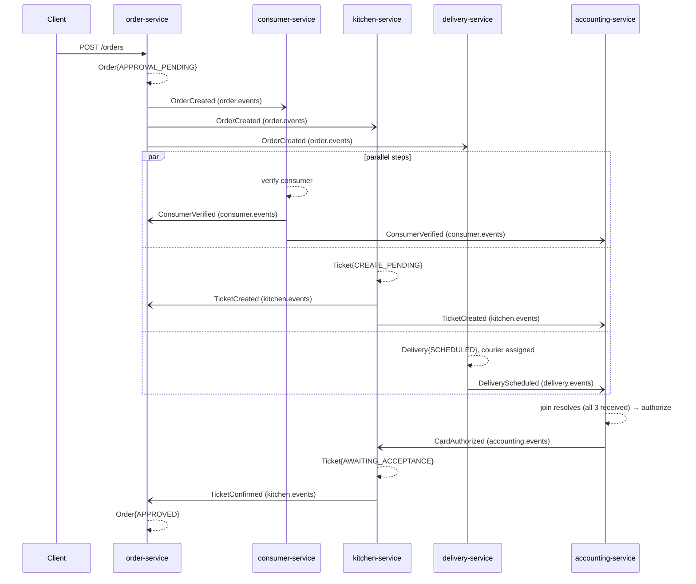
```mermaid
sequenceDiagram
    participant C as Client
    participant O as order-service
    participant Con as consumer-service
    participant K as kitchen-service
    participant D as delivery-service
    participant A as accounting-service

    C->>O: POST /orders
    O-->>O: Order{APPROVAL_PENDING}
    O-)Con: OrderCreated (order.events)
    O-)K: OrderCreated (order.events)
    O-)D: OrderCreated (order.events)
    par parallel steps
        Con-->>Con: verify consumer
        Con-)O: ConsumerVerified (consumer.events)
        Con-)A: ConsumerVerified (consumer.events)
    and
        K-->>K: Ticket{CREATE_PENDING}
        K-)O: TicketCreated (kitchen.events)
        K-)A: TicketCreated (kitchen.events)
    and
        D-->>D: Delivery{SCHEDULED}, courier assigned
        D-)A: DeliveryScheduled (delivery.events)
    end
    A-->>A: join resolves (all 3 received) → authorize
    A-)K: CardAuthorized (accounting.events)
    K-->>K: Ticket{AWAITING_ACCEPTANCE}
    K-)O: TicketConfirmed (kitchen.events)
    O-->>O: Order{APPROVED}
```

### Case A — consumer verification fails

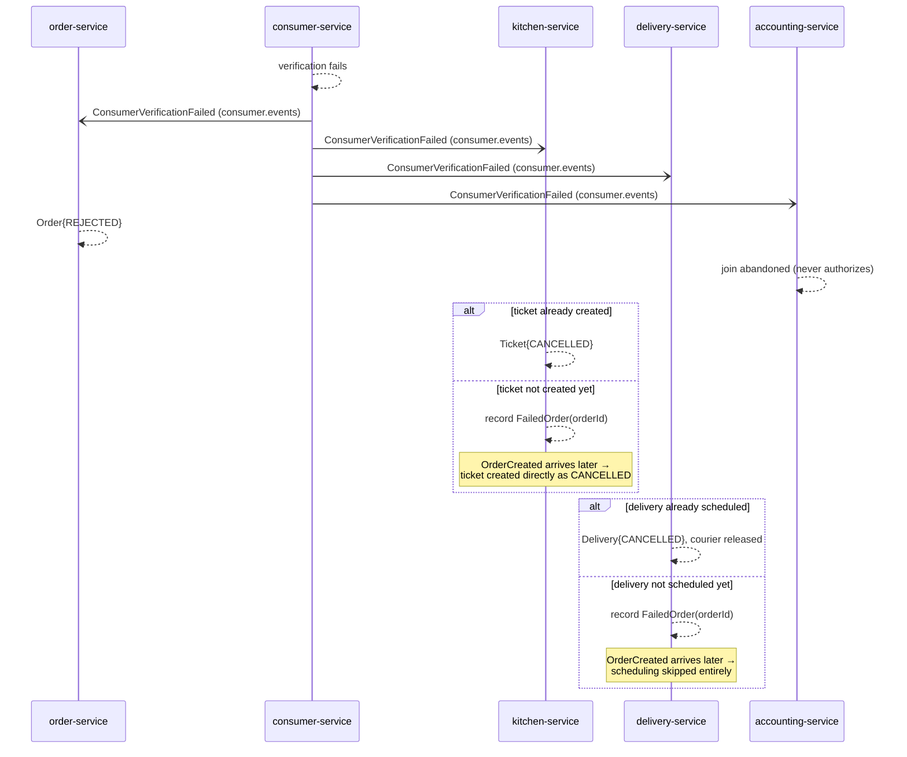
```mermaid
sequenceDiagram
    participant O as order-service
    participant Con as consumer-service
    participant K as kitchen-service
    participant D as delivery-service
    participant A as accounting-service

    Con-->>Con: verification fails
    Con-)O: ConsumerVerificationFailed (consumer.events)
    Con-)K: ConsumerVerificationFailed (consumer.events)
    Con-)D: ConsumerVerificationFailed (consumer.events)
    Con-)A: ConsumerVerificationFailed (consumer.events)
    O-->>O: Order{REJECTED}
    A-->>A: join abandoned (never authorizes)
    alt ticket already created
        K-->>K: Ticket{CANCELLED}
    else ticket not created yet
        K-->>K: record FailedOrder(orderId)
        Note over K: OrderCreated arrives later →<br/>ticket created directly as CANCELLED
    end
    alt delivery already scheduled
        D-->>D: Delivery{CANCELLED}, courier released
    else delivery not scheduled yet
        D-->>D: record FailedOrder(orderId)
        Note over D: OrderCreated arrives later →<br/>scheduling skipped entirely
    end
```

### Case B — kitchen capacity exceeded

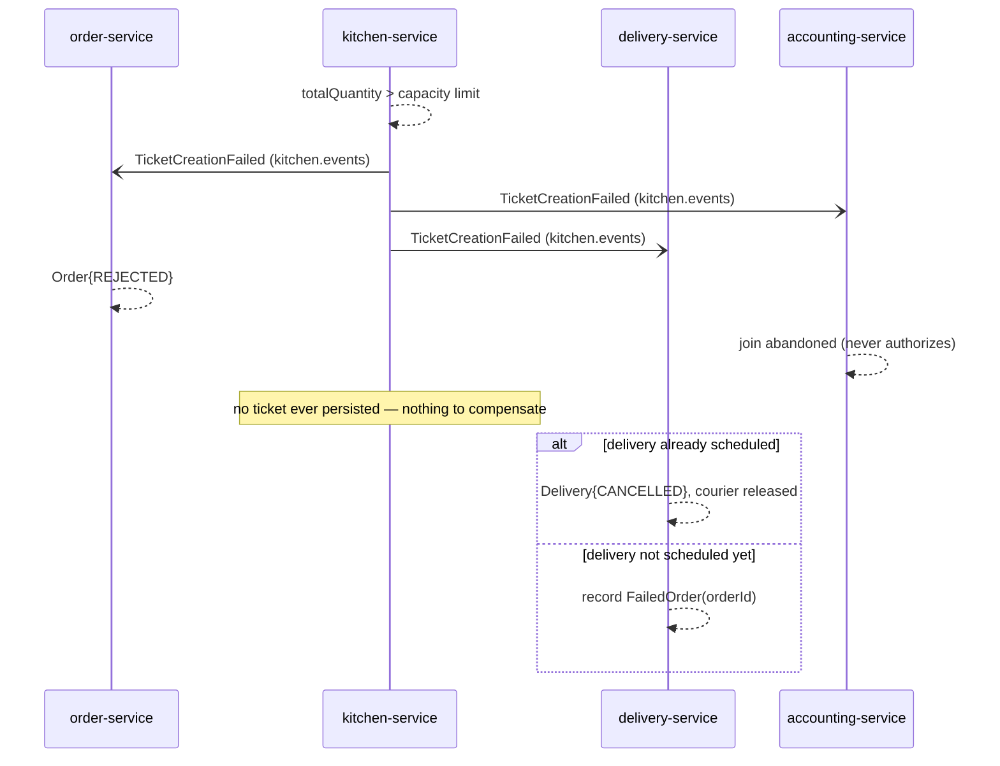
```mermaid
sequenceDiagram
    participant O as order-service
    participant K as kitchen-service
    participant D as delivery-service
    participant A as accounting-service

    K-->>K: totalQuantity > capacity limit
    K-)O: TicketCreationFailed (kitchen.events)
    K-)A: TicketCreationFailed (kitchen.events)
    K-)D: TicketCreationFailed (kitchen.events)
    O-->>O: Order{REJECTED}
    A-->>A: join abandoned (never authorizes)
    Note over K: no ticket ever persisted — nothing to compensate
    alt delivery already scheduled
        D-->>D: Delivery{CANCELLED}, courier released
    else delivery not scheduled yet
        D-->>D: record FailedOrder(orderId)
    end
```

### Case C — card authorization declined

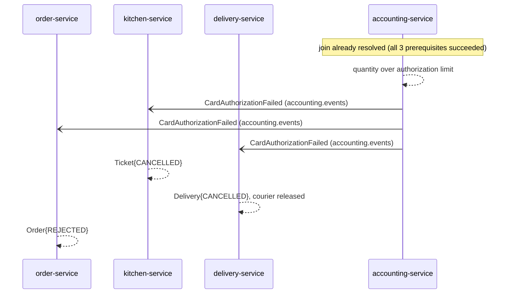
```mermaid
sequenceDiagram
    participant O as order-service
    participant K as kitchen-service
    participant D as delivery-service
    participant A as accounting-service

    Note over A: join already resolved (all 3 prerequisites succeeded)
    A-->>A: quantity over authorization limit
    A-)K: CardAuthorizationFailed (accounting.events)
    A-)O: CardAuthorizationFailed (accounting.events)
    A-)D: CardAuthorizationFailed (accounting.events)
    K-->>K: Ticket{CANCELLED}
    D-->>D: Delivery{CANCELLED}, courier released
    O-->>O: Order{REJECTED}
```

### Case D — no courier available

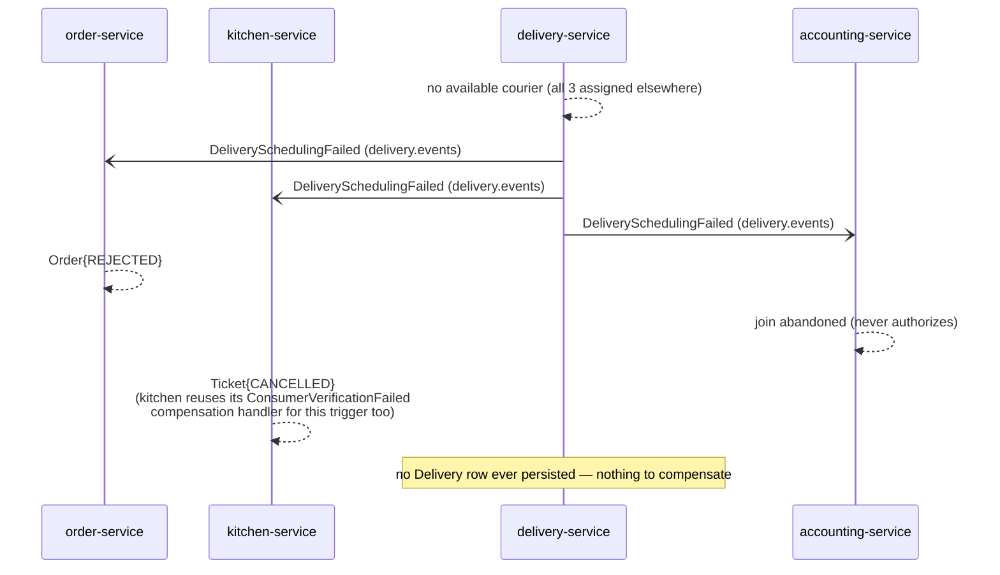
```mermaid
sequenceDiagram
    participant O as order-service
    participant K as kitchen-service
    participant D as delivery-service
    participant A as accounting-service

    D-->>D: no available courier (all 3 assigned elsewhere)
    D-)O: DeliverySchedulingFailed (delivery.events)
    D-)K: DeliverySchedulingFailed (delivery.events)
    D-)A: DeliverySchedulingFailed (delivery.events)
    O-->>O: Order{REJECTED}
    A-->>A: join abandoned (never authorizes)
    K-->>K: Ticket{CANCELLED}<br/>(kitchen reuses its ConsumerVerificationFailed<br/>compensation handler for this trigger too)
    Note over D: no Delivery row ever persisted — nothing to compensate
```

## Create Order saga — orchestration

A central `CreateOrderSagaOrchestrator` in order-service sends explicit commands and reacts to replies on a shared `saga.replies` topic. Progress is persisted in `CreateOrderSagaInstance` (with `@Version` optimistic locking — three Kafka consumer threads can race on the same order's saga state, same reasoning as choreography's `SagaJoinState`).

### Happy path

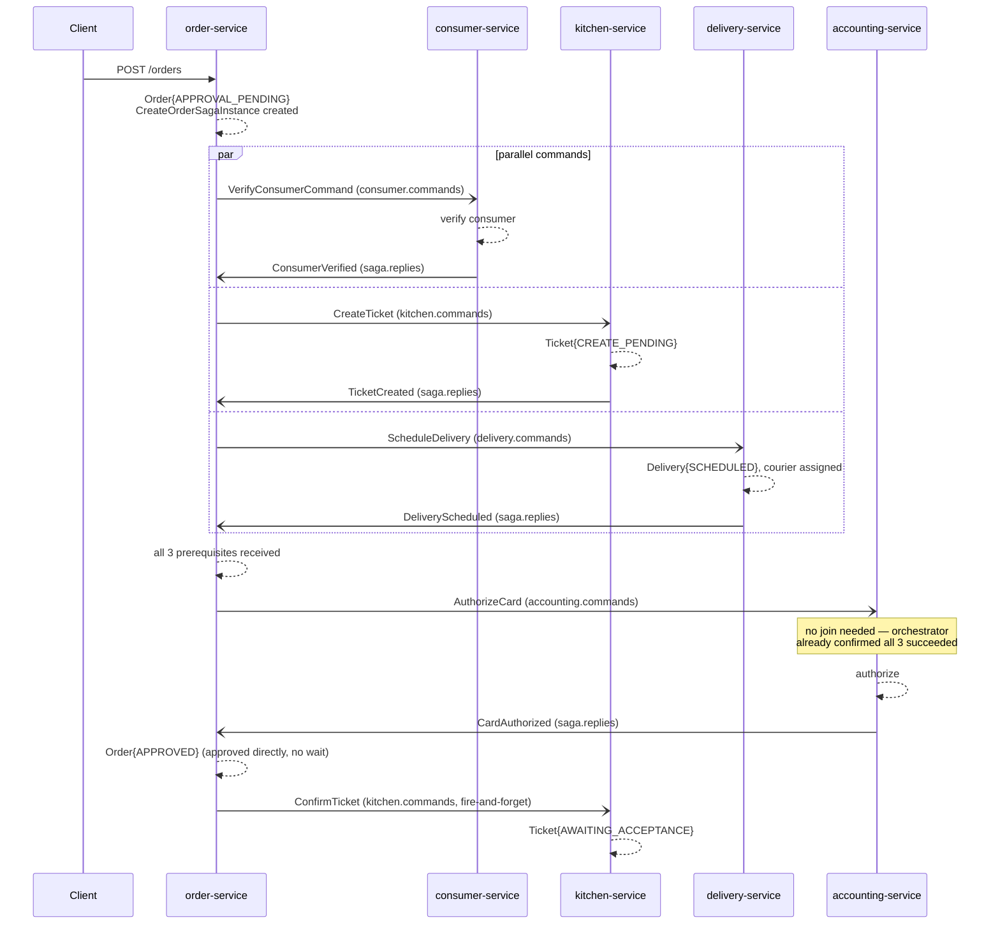
```mermaid
sequenceDiagram
    participant C as Client
    participant O as order-service
    participant Con as consumer-service
    participant K as kitchen-service
    participant D as delivery-service
    participant A as accounting-service

    C->>O: POST /orders
    O-->>O: Order{APPROVAL_PENDING}<br/>CreateOrderSagaInstance created
    par parallel commands
        O-)Con: VerifyConsumerCommand (consumer.commands)
        Con-->>Con: verify consumer
        Con-)O: ConsumerVerified (saga.replies)
    and
        O-)K: CreateTicket (kitchen.commands)
        K-->>K: Ticket{CREATE_PENDING}
        K-)O: TicketCreated (saga.replies)
    and
        O-)D: ScheduleDelivery (delivery.commands)
        D-->>D: Delivery{SCHEDULED}, courier assigned
        D-)O: DeliveryScheduled (saga.replies)
    end
    O-->>O: all 3 prerequisites received
    O-)A: AuthorizeCard (accounting.commands)
    Note over A: no join needed — orchestrator<br/>already confirmed all 3 succeeded
    A-->>A: authorize
    A-)O: CardAuthorized (saga.replies)
    O-->>O: Order{APPROVED}  (approved directly, no wait)
    O-)K: ConfirmTicket (kitchen.commands, fire-and-forget)
    K-->>K: Ticket{AWAITING_ACCEPTANCE}
```

Note the direct-approve step: order-service marks `APPROVED` immediately on `CardAuthorized`, then sends `ConfirmTicket` — it does not wait for a reply. In choreography, order-service had to wait for kitchen's `TicketConfirmed` echo as an indirect signal that accounting had already succeeded; here the orchestrator already knows that directly. There is a brief window where `Order=APPROVED` while `Ticket` is still `CREATE_PENDING`, but the `ConfirmTicket` command is on the same Kafka partition (keyed by `orderId`) as the earlier `CreateTicket`, so ordering is guaranteed and the ticket always converges to `AWAITING_ACCEPTANCE`.

### Case A — consumer verification fails

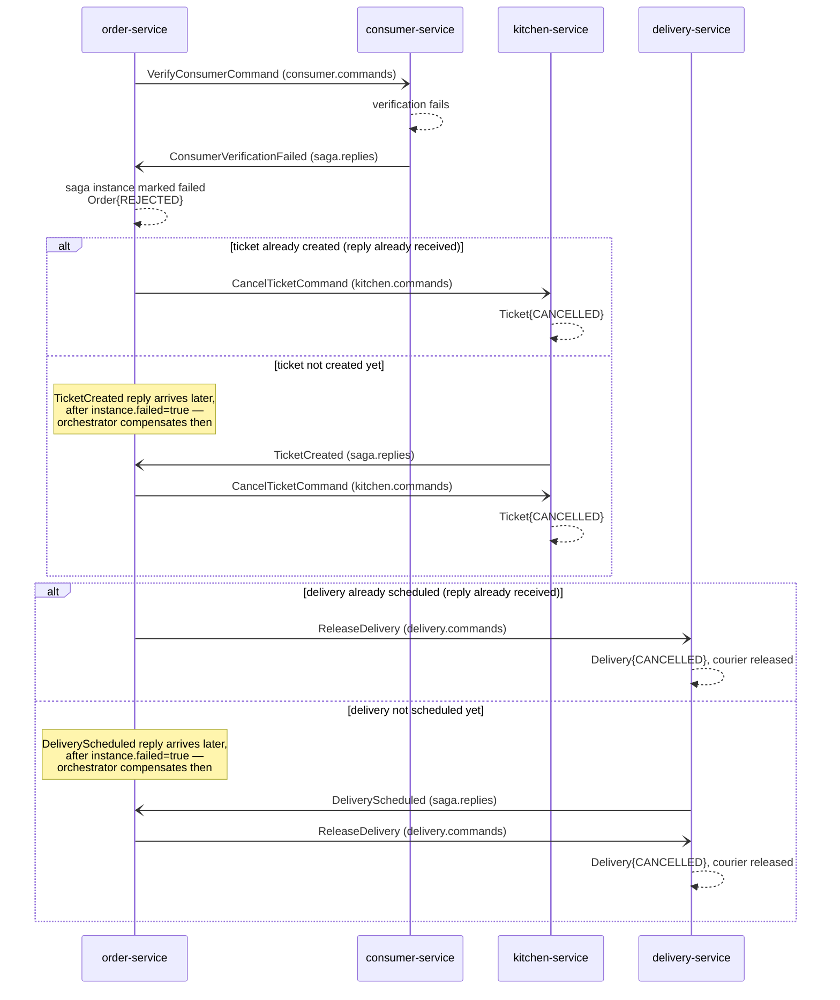
```mermaid
sequenceDiagram
    participant O as order-service
    participant Con as consumer-service
    participant K as kitchen-service
    participant D as delivery-service

    O-)Con: VerifyConsumerCommand (consumer.commands)
    Con-->>Con: verification fails
    Con-)O: ConsumerVerificationFailed (saga.replies)
    O-->>O: saga instance marked failed<br/>Order{REJECTED}
    alt ticket already created (reply already received)
        O-)K: CancelTicketCommand (kitchen.commands)
        K-->>K: Ticket{CANCELLED}
    else ticket not created yet
        Note over O: TicketCreated reply arrives later,<br/>after instance.failed=true —<br/>orchestrator compensates then
        K-)O: TicketCreated (saga.replies)
        O-)K: CancelTicketCommand (kitchen.commands)
        K-->>K: Ticket{CANCELLED}
    end
    alt delivery already scheduled (reply already received)
        O-)D: ReleaseDelivery (delivery.commands)
        D-->>D: Delivery{CANCELLED}, courier released
    else delivery not scheduled yet
        Note over O: DeliveryScheduled reply arrives later,<br/>after instance.failed=true —<br/>orchestrator compensates then
        D-)O: DeliveryScheduled (saga.replies)
        O-)D: ReleaseDelivery (delivery.commands)
        D-->>D: Delivery{CANCELLED}, courier released
    end
```

### Case B — kitchen capacity exceeded

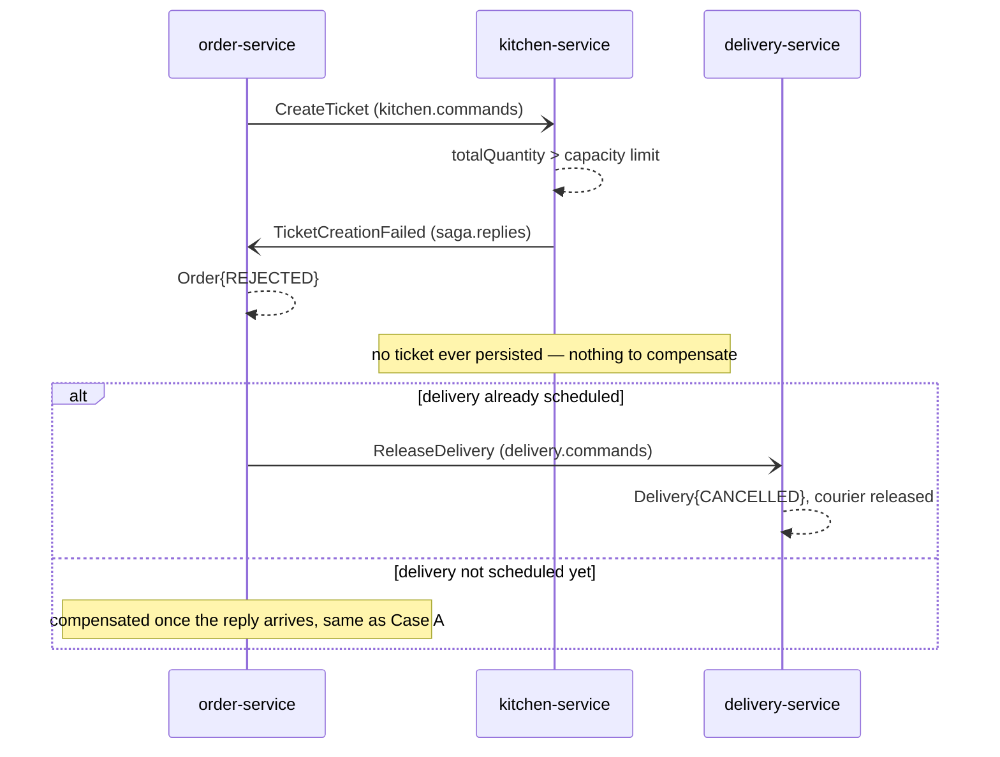
```mermaid
sequenceDiagram
    participant O as order-service
    participant K as kitchen-service
    participant D as delivery-service

    O-)K: CreateTicket (kitchen.commands)
    K-->>K: totalQuantity > capacity limit
    K-)O: TicketCreationFailed (saga.replies)
    O-->>O: Order{REJECTED}
    Note over K: no ticket ever persisted — nothing to compensate
    alt delivery already scheduled
        O-)D: ReleaseDelivery (delivery.commands)
        D-->>D: Delivery{CANCELLED}, courier released
    else delivery not scheduled yet
        Note over O: compensated once the reply arrives, same as Case A
    end
```

### Case C — card authorization declined

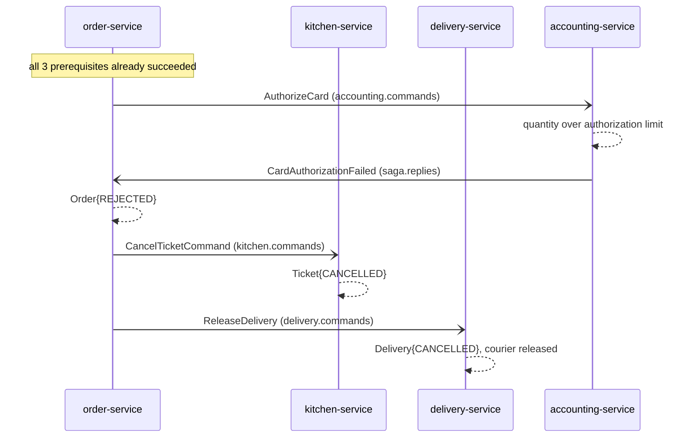
```mermaid
sequenceDiagram
    participant O as order-service
    participant K as kitchen-service
    participant D as delivery-service
    participant A as accounting-service

    Note over O: all 3 prerequisites already succeeded
    O-)A: AuthorizeCard (accounting.commands)
    A-->>A: quantity over authorization limit
    A-)O: CardAuthorizationFailed (saga.replies)
    O-->>O: Order{REJECTED}
    O-)K: CancelTicketCommand (kitchen.commands)
    K-->>K: Ticket{CANCELLED}
    O-)D: ReleaseDelivery (delivery.commands)
    D-->>D: Delivery{CANCELLED}, courier released
```

### Case D — no courier available

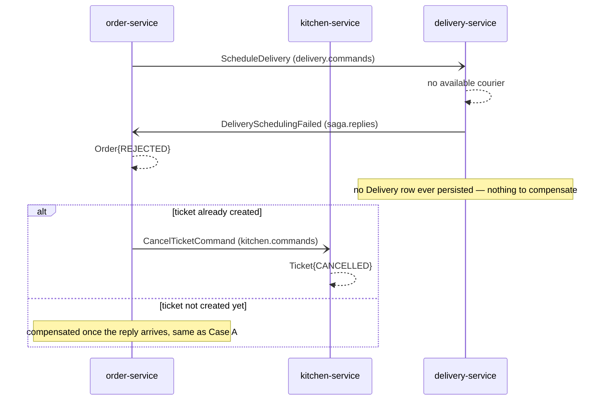
```mermaid
sequenceDiagram
    participant O as order-service
    participant K as kitchen-service
    participant D as delivery-service

    O-)D: ScheduleDelivery (delivery.commands)
    D-->>D: no available courier
    D-)O: DeliverySchedulingFailed (saga.replies)
    O-->>O: Order{REJECTED}
    Note over D: no Delivery row ever persisted — nothing to compensate
    alt ticket already created
        O-)K: CancelTicketCommand (kitchen.commands)
        K-->>K: Ticket{CANCELLED}
    else ticket not created yet
        Note over O: compensated once the reply arrives, same as Case A
    end
```

## Multi-saga routing (`sagaType`)

Three independent sagas (Create Order, Cancel Order, Revise Order) all run through order-service, and in orchestration mode all three share the same `kitchen.commands`/`delivery.commands`/`accounting.commands`/`saga.replies` topics rather than getting dedicated ones each. `SagaReply`, `KitchenCommand`, `DeliveryCommand`, and `AccountingCommand` each carry a `sagaType` field (`"CreateOrder"` / `"CancelOrder"` / `"ReviseOrder"`) so:

- order-service's one shared `OrchestratorReplyListener` (on `saga.replies`) routes each reply to the correct one of the three orchestrators (`CreateOrderSagaOrchestrator`, `CancelOrderSagaOrchestrator`, `ReviseOrderSagaOrchestrator`) before that orchestrator's own `handleReply` is ever called — no orchestrator has to guess which saga a message belongs to.
- A command type shared by more than one saga stays unambiguous. `KitchenCommand{commandType=CancelTicket}` is sent by both Create Order's compensation path (`CreateOrderSagaOrchestrator.sendCancelTicket`) and Cancel Order's primary flow (`CancelOrderSagaOrchestrator.start`) — the same `TicketService.handleCancelTicketCommand` handles both, and echoes the inbound `sagaType` back into its reply unchanged, since it cannot infer which saga's request it's servicing from `commandType` alone. `DeliveryCommand{commandType=ReleaseDelivery}` has the identical shape: sent by both Create Order's compensation path (`CreateOrderSagaOrchestrator.sendReleaseDelivery`) and Cancel Order's primary flow (`CancelOrderSagaOrchestrator.handleKitchenReply`), handled by one `DeliveryService.handleReleaseDeliveryCommand` that echoes `sagaType` back the same way.

`CancelOrderSagaOrchestrator` and `ReviseOrderSagaOrchestrator` are both deliberately stateless (no persisted saga-instance table, unlike `CreateOrderSagaOrchestrator`'s `CreateOrderSagaInstance`) — both are strict linear pipelines with no parallel replies to join, so `Order`'s own `status` (and, for Revise, its `lineItems`/`pendingRevisedLineItems`) is sufficient saga state on its own.

## Cancel Order saga — choreography

`Order.cancel()` is only legal from `APPROVED`, meaning the `Ticket` has already been confirmed and may be anywhere from `AWAITING_ACCEPTANCE` through `PICKED_UP` — cancellation isn't guaranteed to succeed. The saga asks kitchen first; delivery release and accounting's authorization reversal only happen if kitchen confirms the ticket cancellable. Delivery-service's step was inserted between kitchen and accounting (kitchen → delivery-release → accounting-reversal) rather than run in parallel with either, since it's a genuine sequential dependency, not a join — accounting now waits for `DeliveryCancelled` (not `TicketCancelled` directly) before reversing the authorization.

### Happy path

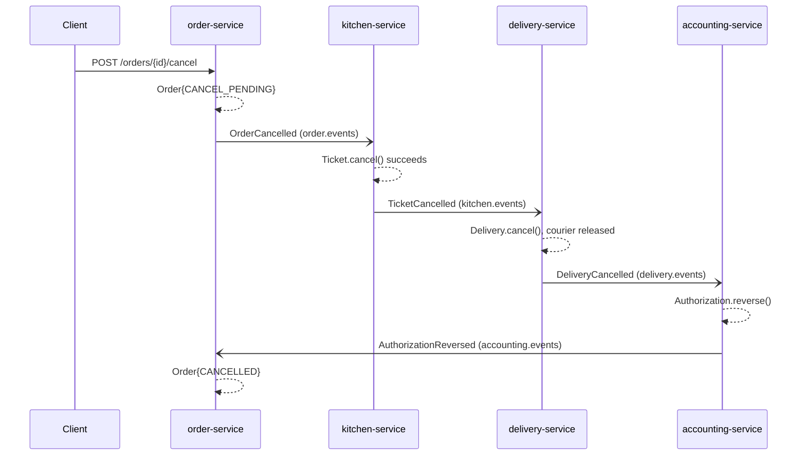
```mermaid
sequenceDiagram
    participant C as Client
    participant O as order-service
    participant K as kitchen-service
    participant D as delivery-service
    participant A as accounting-service

    C->>O: POST /orders/{id}/cancel
    O-->>O: Order{CANCEL_PENDING}
    O-)K: OrderCancelled (order.events)
    K-->>K: Ticket.cancel() succeeds
    K-)D: TicketCancelled (kitchen.events)
    D-->>D: Delivery.cancel(), courier released
    D-)A: DeliveryCancelled (delivery.events)
    A-->>A: Authorization.reverse()
    A-)O: AuthorizationReversed (accounting.events)
    O-->>O: Order{CANCELLED}
```

### Rejection — ticket already too far along

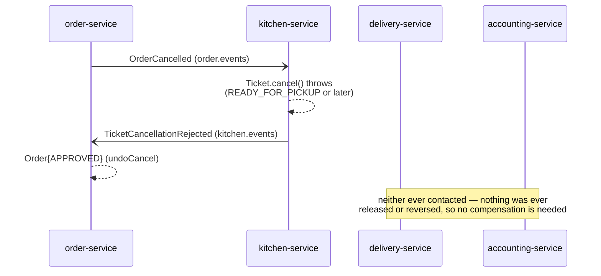
```mermaid
sequenceDiagram
    participant O as order-service
    participant K as kitchen-service
    participant D as delivery-service
    participant A as accounting-service

    O-)K: OrderCancelled (order.events)
    K-->>K: Ticket.cancel() throws<br/>(READY_FOR_PICKUP or later)
    K-)O: TicketCancellationRejected (kitchen.events)
    O-->>O: Order{APPROVED} (undoCancel)
    Note over D,A: neither ever contacted — nothing was ever<br/>released or reversed, so no compensation is needed
```

## Cancel Order saga — orchestration

Stateless `CancelOrderSagaOrchestrator`, driven purely by `saga.replies` (`sagaType=CancelOrder`), using `Order`'s own status as the implicit saga state. Same sequential 3-step chain as choreography — kitchen → delivery-release → accounting-reversal.

### Happy path

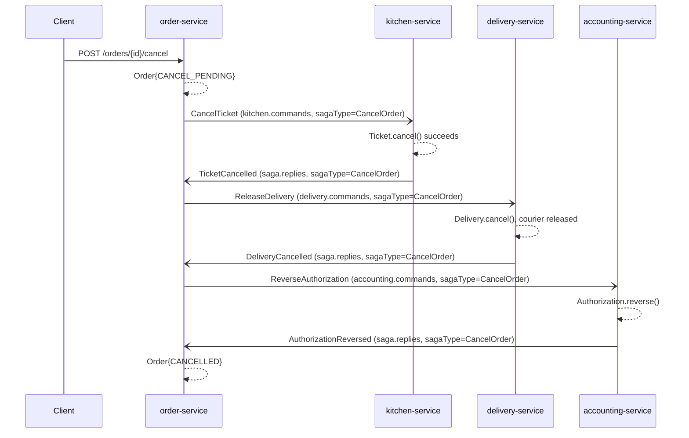
```mermaid
sequenceDiagram
    participant C as Client
    participant O as order-service
    participant K as kitchen-service
    participant D as delivery-service
    participant A as accounting-service

    C->>O: POST /orders/{id}/cancel
    O-->>O: Order{CANCEL_PENDING}
    O-)K: CancelTicket (kitchen.commands, sagaType=CancelOrder)
    K-->>K: Ticket.cancel() succeeds
    K-)O: TicketCancelled (saga.replies, sagaType=CancelOrder)
    O-)D: ReleaseDelivery (delivery.commands, sagaType=CancelOrder)
    D-->>D: Delivery.cancel(), courier released
    D-)O: DeliveryCancelled (saga.replies, sagaType=CancelOrder)
    O-)A: ReverseAuthorization (accounting.commands, sagaType=CancelOrder)
    A-->>A: Authorization.reverse()
    A-)O: AuthorizationReversed (saga.replies, sagaType=CancelOrder)
    O-->>O: Order{CANCELLED}
```

### Rejection — ticket already too far along

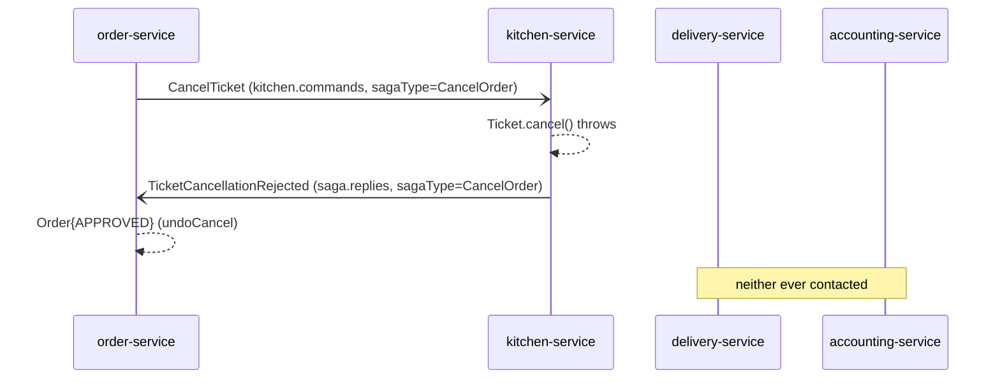
```mermaid
sequenceDiagram
    participant O as order-service
    participant K as kitchen-service
    participant D as delivery-service
    participant A as accounting-service

    O-)K: CancelTicket (kitchen.commands, sagaType=CancelOrder)
    K-->>K: Ticket.cancel() throws
    K-)O: TicketCancellationRejected (saga.replies, sagaType=CancelOrder)
    O-->>O: Order{APPROVED} (undoCancel)
    Note over D,A: neither ever contacted
```

## Revise Order saga — choreography

Same sequential, kitchen-gates-accounting shape as Cancel Order, but with a genuinely new wrinkle: kitchen *provisionally applies* the revised quantity before accounting is ever asked, since `Authorization.reviseAuthorization()` (unlike `reverse()`) is a real guarded threshold check that accounting can decline. That makes a real compensation path necessary — something Cancel Order never needed, because `reverse()` is unconditional.

### Happy path

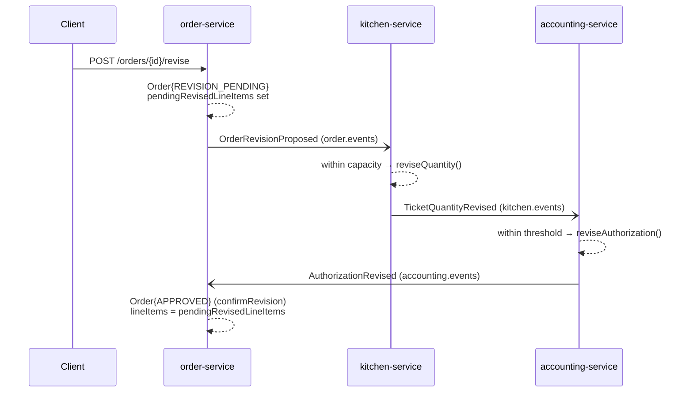
```mermaid
sequenceDiagram
    participant C as Client
    participant O as order-service
    participant K as kitchen-service
    participant A as accounting-service

    C->>O: POST /orders/{id}/revise
    O-->>O: Order{REVISION_PENDING}<br/>pendingRevisedLineItems set
    O-)K: OrderRevisionProposed (order.events)
    K-->>K: within capacity → reviseQuantity()
    K-)A: TicketQuantityRevised (kitchen.events)
    A-->>A: within threshold → reviseAuthorization()
    A-)O: AuthorizationRevised (accounting.events)
    O-->>O: Order{APPROVED} (confirmRevision)<br/>lineItems = pendingRevisedLineItems
```

### Case A — kitchen rejects outright (over capacity)

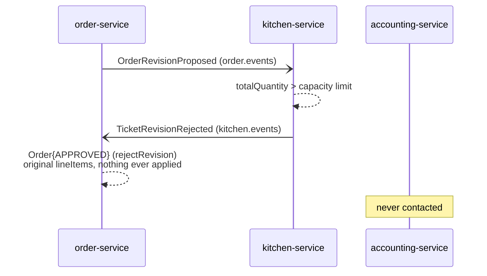
```mermaid
sequenceDiagram
    participant O as order-service
    participant K as kitchen-service
    participant A as accounting-service

    O-)K: OrderRevisionProposed (order.events)
    K-->>K: totalQuantity > capacity limit
    K-)O: TicketRevisionRejected (kitchen.events)
    O-->>O: Order{APPROVED} (rejectRevision)<br/>original lineItems, nothing ever applied
    Note over A: never contacted
```

### Case B — kitchen confirms, accounting declines (real compensation)

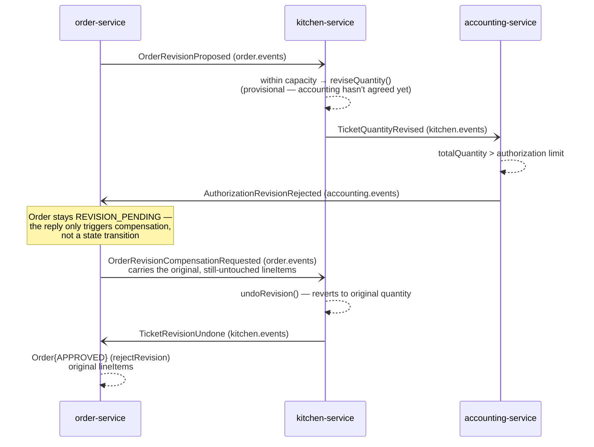
```mermaid
sequenceDiagram
    participant O as order-service
    participant K as kitchen-service
    participant A as accounting-service

    O-)K: OrderRevisionProposed (order.events)
    K-->>K: within capacity → reviseQuantity()<br/>(provisional — accounting hasn't agreed yet)
    K-)A: TicketQuantityRevised (kitchen.events)
    A-->>A: totalQuantity > authorization limit
    A-)O: AuthorizationRevisionRejected (accounting.events)
    Note over O: Order stays REVISION_PENDING —<br/>the reply only triggers compensation,<br/>not a state transition
    O-)K: OrderRevisionCompensationRequested (order.events)<br/>carries the original, still-untouched lineItems
    K-->>K: undoRevision() — reverts to original quantity
    K-)O: TicketRevisionUndone (kitchen.events)
    O-->>O: Order{APPROVED} (rejectRevision)<br/>original lineItems
```

`"OrderRevisionCompensationRequested"` is deliberately a distinct wire event from the terminal `"OrderRevisionRejected"` (Case A's outcome) — conflating them would make kitchen try to undo a revision that was rejected outright, with nothing ever applied to undo.

## Revise Order saga — orchestration

Stateless `ReviseOrderSagaOrchestrator`, driven by `saga.replies` (`sagaType=ReviseOrder`). Being stateless, it recomputes both the pending revised quantity and the original quantity by reloading `Order` fresh rather than caching them across the round trip — `Order.getPendingRevisedLineItems()` for the forward step, `Order.getLineItems()` (still untouched pre-revision) for the compensation step.

### Happy path

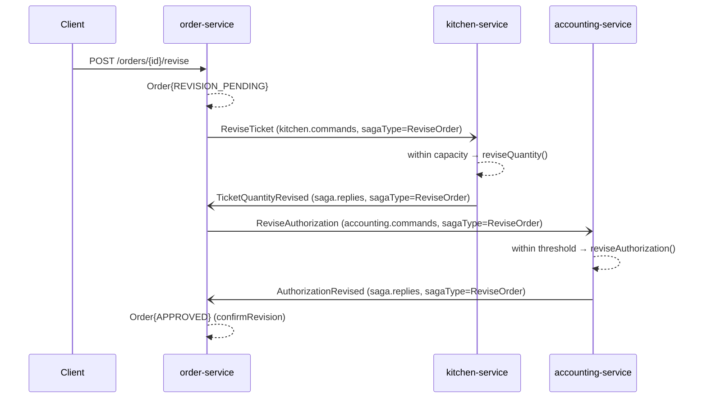
```mermaid
sequenceDiagram
    participant C as Client
    participant O as order-service
    participant K as kitchen-service
    participant A as accounting-service

    C->>O: POST /orders/{id}/revise
    O-->>O: Order{REVISION_PENDING}
    O-)K: ReviseTicket (kitchen.commands, sagaType=ReviseOrder)
    K-->>K: within capacity → reviseQuantity()
    K-)O: TicketQuantityRevised (saga.replies, sagaType=ReviseOrder)
    O-)A: ReviseAuthorization (accounting.commands, sagaType=ReviseOrder)
    A-->>A: within threshold → reviseAuthorization()
    A-)O: AuthorizationRevised (saga.replies, sagaType=ReviseOrder)
    O-->>O: Order{APPROVED} (confirmRevision)
```

### Case A — kitchen rejects outright (over capacity)

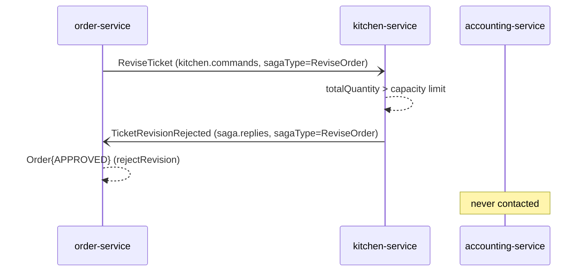
```mermaid
sequenceDiagram
    participant O as order-service
    participant K as kitchen-service
    participant A as accounting-service

    O-)K: ReviseTicket (kitchen.commands, sagaType=ReviseOrder)
    K-->>K: totalQuantity > capacity limit
    K-)O: TicketRevisionRejected (saga.replies, sagaType=ReviseOrder)
    O-->>O: Order{APPROVED} (rejectRevision)
    Note over A: never contacted
```

### Case B — kitchen confirms, accounting declines (real compensation)

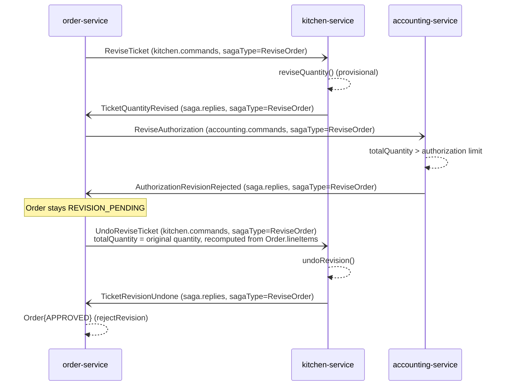
```mermaid
sequenceDiagram
    participant O as order-service
    participant K as kitchen-service
    participant A as accounting-service

    O-)K: ReviseTicket (kitchen.commands, sagaType=ReviseOrder)
    K-->>K: reviseQuantity() (provisional)
    K-)O: TicketQuantityRevised (saga.replies, sagaType=ReviseOrder)
    O-)A: ReviseAuthorization (accounting.commands, sagaType=ReviseOrder)
    A-->>A: totalQuantity > authorization limit
    A-)O: AuthorizationRevisionRejected (saga.replies, sagaType=ReviseOrder)
    Note over O: Order stays REVISION_PENDING
    O-)K: UndoReviseTicket (kitchen.commands, sagaType=ReviseOrder)<br/>totalQuantity = original quantity, recomputed from Order.lineItems
    K-->>K: undoRevision()
    K-)O: TicketRevisionUndone (saga.replies, sagaType=ReviseOrder)
    O-->>O: Order{APPROVED} (rejectRevision)
```

## Choreography vs. orchestration — what actually differs (Create Order saga)

| | Choreography | Orchestration |
|---|---|---|
| Coordination | Implicit — each service reacts to peers' events | Explicit — one orchestrator drives every step |
| accounting-service join | Needed (`SagaJoinState`, waits for 3 events — consumer, kitchen, delivery — in any order) | **Not needed at all** — orchestrator already waited |
| kitchen-service / delivery-service race table | Needed (`FailedOrder` in each — absorbs a timing race) | **Not needed** — orchestrator absorbs the race centrally |
| Order approval trigger | Waits for kitchen's `TicketConfirmed` echo | Approves directly on `CardAuthorized`, no wait |
| New Kafka topics | 0 (reuses existing domain-event topics) | 5 (4 command topics + 1 shared reply topic) |
| Saga state persistence | Distributed across each service's own local state (`SagaJoinState`, `FailedOrder`) | Centralized in one `CreateOrderSagaInstance` per order |
| Final observable outcome | Identical `Order`/`Ticket`/`Delivery`/`Authorization` end states for all 5 scenarios | Identical `Order`/`Ticket`/`Delivery`/`Authorization` end states for all 5 scenarios |

Both styles reach the exact same end states for the happy path and all four compensation cases (including the delivery-specific "no courier available" case) — verified by running the identical manual test scenarios against both. The difference is entirely in *how* that consistency is achieved: distributed reactive logic vs. centralized explicit coordination.

Cancel Order and Revise Order are simpler on this axis: Cancel Order is now a 3-step sequential chain (kitchen → delivery-release → accounting-reversal) and Revise Order stays a 2-step chain (kitchen, then conditionally accounting) — neither is a parallel join, so **neither ever needed a `SagaJoinState`/`FailedOrder`-style local state table in either saga mode**, and their orchestrators (`CancelOrderSagaOrchestrator`, `ReviseOrderSagaOrchestrator`) are stateless — no `*SagaInstance` table either. The choreography/orchestration contrast for those two sagas is almost entirely about *how a step is triggered* (reacting to a domain event vs. receiving an explicit command), not about coordination complexity, since there's no join to centralize away.

## Event sourcing — `Order` aggregate (Ch.6)

`order-service` gained a second persistence path for `Order`: instead of a mutable `orders` row updated in place, `Order`'s full history is stored as an append-only sequence of events (`order_events`), and current state is derived by replaying them. Selected per-deployment via `PERSISTENCE_MODE` (env var, default `jpa`, alternate `event-sourcing`):

```bash
PERSISTENCE_MODE=event-sourcing docker compose up -d --build
```

### The `OrderTransitions` facade

Every call site that used to depend on `OrderRepository` directly (`OrderController`, `OrderService`, all three choreography saga services, all three orchestration saga orchestrators) now depends on `OrderTransitions` instead — an interface with two implementations selected by `@ConditionalOnProperty(persistence.mode=...)`:

- **`JpaOrderTransitions`** — the pre-Ch.6 path: loads/saves a mutable `Order` row via `OrderRepository`, publishes via `OrderDomainEventPublisher` onto the outbox.
- **`EventSourcedOrderTransitions`** — backed by `OrderEventStore`/`OrderAggregate`.

`OrderTransitions` has two contracts, by method: `create`/`findById`/`cancel`/`revise` throw on invalid state (`OrderNotFoundException`, `UnsupportedStateTransitionException`); `approve`/`reject`/`noteCancelled`/`undoCancel`/`confirmRevision`/`rejectRevision`/`requestRevisionCompensation` **silently no-op** on invalid state or a missing order — this mirrors what a saga reply handler already needs (a duplicate or late reply for an order that moved on shouldn't crash the listener), and both implementations honor it identically.

A parallel `SagaCommandPublisher` facade does the same for orchestration-mode outbound saga commands (`OutboxSagaCommandPublisher` / `EventSourcedSagaCommandPublisher`), so the three orchestrators need zero `PERSISTENCE_MODE`-specific code of their own.

### The event store (`OrderEventStore`/`OrderAggregate`)

Hand-rolled, not Eventuate — `OrderAggregate` implements the book's `process(Command)`/`apply(Event)` split: `process()` validates a command against current state and returns the `List<OrderDomainEvent>` that *should* happen (no mutation); `apply()` unconditionally mutates state given an event that *already* happened. The same `apply()` is used both for the event just decided and for every historical event during replay — this is what makes replay possible at all.

```mermaid
sequenceDiagram
    participant C as Caller
    participant T as EventSourcedOrderTransitions
    participant S as OrderEventStore
    participant DB as order_events / order_snapshots / order_aggregate_version

    C->>T: cancel(orderId, eventId)
    T->>S: update(orderId, agg -> agg.process(CancelOrderCommand))
    S->>DB: load version row (optimistic-lock check target)
    S->>DB: load snapshot (if any) + event tail since it
    S-->>S: replay: aggregate = fromSnapshot ?: new; tail.forEach(apply)
    S->>S: events = aggregate.process(command)
    S->>S: events.forEach(aggregate::apply)
    S->>DB: append new event row(s)
    S->>DB: save version row (Hibernate dirty-check flush, not merge — @Version conflict throws here)
    opt every 5th event for this order
        S->>DB: write/update snapshot
    end
    S-->>T: updated OrderAggregate
```

**Snapshots** (`OrderSnapshot`/`OrderSnapshotData`) are a pure performance optimization — every 5 events, `OrderEventStore` writes a snapshot of the aggregate's full state plus a pointer to the last event it includes, so replay only has to fold the tail of events since the snapshot rather than the full history. `Order`'s lifecycle is short enough that this is never load-bearing in this codebase; it was implemented anyway to exercise the mechanism, not because it was needed.

**Optimistic locking** uses a dedicated `order_aggregate_version` table (`OrderAggregateVersion`, one row per order, a `@Version`-annotated Hibernate entity) rather than deriving a version number from `COUNT(*)` on `order_events` — this keeps "how many events exist" and "what version an update is conditioned on" as independently reasoned-about concerns, and mirrors the JPA path's own `@Version` column on `orders` closely enough that the two paths' concurrency behavior is genuinely comparable. `OrderEventStore.update()` loads the version row via its repository and mutates it in place (never detaches it), so Hibernate's own dirty-checking flush performs the optimistic-lock check — using `merge()` on a detached copy instead was tried first and silently defeated the check (see `docs/superpowers/plans/2026-07-22-order-event-sourcing.md`, Task 4, for the two-round bug hunt that surfaced this).

### CDC reuse and the wire-only pseudo-event gotcha

Choreography-mode publishing doesn't introduce a new Kafka pipeline — it extends the existing Ch.3 Debezium/Kafka Connect outbox connector's `table.include.list` to also cover `order_events` (alongside `outbox_events`), and `order_events`'s columns (`event_id`/`event_type`/`order_id`/`payload`) are deliberately named to match `outbox_events`' so one connector config routes both tables to `order.events` unchanged.

This creates a sharp edge: `order_events` now serves two purposes at once — the event-sourcing durability log (every row must be replayable back into `OrderAggregate.apply()`) and a CDC transport (every row that matters for Kafka delivery). Those two sets of rows aren't quite the same. The Revise Order saga's accounting-decline compensation path needs to notify kitchen-service of an in-flight compensation (`OrderRevisionCompensationRequested`) — in JPA mode this is a wire-only signal published straight to the outbox, never touching `Order`'s own state. Event-sourcing mode's first implementation wrote the equivalent row into `order_events` (so CDC would still carry it), but `OrderEventStore.replay()` treated *every* row in `order_events` as a real domain event and crashed trying to feed `OrderRevisionCompensationRequested` into `OrderAggregate.apply()` on the next replay of that order — a bug only Docker end-to-end testing surfaced (see Task 25 in the plan; no unit test exercised a real replay after a compensation request). Fixed with a `replayable` boolean column on `OrderEventEntity` (`true` for every real domain event, `false` only for this one pseudo-event), and `OrderEventStore.replay()`'s two event queries now filter on it. The lesson generalizes: any table doing double duty as both an event-sourcing replay log and a CDC transport needs an explicit way to say "this row is for Kafka only, never feed it back into the aggregate."

### Orchestration-mode saga commands: the pseudo-event mechanism

The book's actual mechanism for orchestration-mode commands under event sourcing is a `SagaCommandEvent`-style pseudo-event, not "publish in the same transaction as the aggregate update" — chosen deliberately here to see the real mechanism rather than the shortcut. `EventSourcedSagaCommandPublisher.publish(...)` writes a row to a **separate** table, `order_saga_command_requests` (`OrderSagaCommandRequest`), rather than into `order_events` itself:

```mermaid
sequenceDiagram
    participant Orch as CreateOrderSagaOrchestrator
    participant Pub as EventSourcedSagaCommandPublisher
    participant DB as order_saga_command_requests
    participant Poll as SagaCommandRequestPublisher (poller)
    participant K as Kafka (kitchen.commands / delivery.commands / accounting.commands / consumer.commands)

    Orch->>Pub: publish(topic, eventId, eventType, orderId, command)
    Pub->>DB: insert row {target_topic, payload, published_at=null}
    loop every outbox.poll-fixed-delay-ms
        Poll->>DB: find rows where published_at is null
        Poll->>K: send(topic, payload)
        Poll->>DB: mark published_at = now()
    end
```

This table is kept separate from `order_events` on purpose: the same CDC connector that now watches `order_events` unconditionally routes every row there to `order.events`, and saga commands are meant for `kitchen.commands`/`delivery.commands`/`accounting.commands`/`consumer.commands` instead — mixing them into one table would either leak saga commands onto `order.events` or require per-row topic filtering in the connector config, which Debezium's Outbox Event Router SMT doesn't support per-row. `order_saga_command_requests` is polled independently by its own `SagaCommandRequestPublisher`, sending before marking published — an at-least-once send, matching every other outbox-style publisher in this codebase.

## API composition — `GET /orders/{id}/view` (Ch.7)

This project's first query pattern. The order-detail screen needs data owned by four different services (`Order` itself, plus restaurant, ticket, authorization, and delivery info) — API composition assembles it behind one endpoint on order-service rather than making the client call four services and stitch the result together itself.

### Service discovery — who's registered with Eureka now

Ch.7 added three new Eureka clients. Every service order-service calls synchronously for this feature is now dynamically discoverable, matching the pattern restaurant-service already used since Ch.3:

| Service | Eureka client since | Called by |
|---|---|---|
| restaurant-service | Ch.3 | order-service (`POST /orders` validation, `GET /orders/{id}/view`) |
| kitchen-service | Ch.7 | order-service (`GET /orders/{id}/view`) |
| accounting-service | Ch.7 | order-service (`GET /orders/{id}/view`) |
| delivery-service | Ch.7 | order-service (`GET /orders/{id}/view`) |

Before this chapter, kitchen-service, accounting-service, and delivery-service were Kafka-only participants — nothing ever called them synchronously, so there was no reason for them to be discoverable. Each gained `spring-cloud-starter-netflix-eureka-client` and the same `eureka.client.service-url.defaultZone`/`eureka.instance.prefer-ip-address` config restaurant-service already had, plus a new read-only REST controller (accounting-service's is its first controller ever — see its own `README.md`).

### Parallel fan-out via virtual threads

`OrderViewController.view()` doesn't call the four downstream proxies sequentially — it fires all four via `CompletableFuture.supplyAsync(..., orderViewExecutor)` and joins on `CompletableFuture.allOf(...)` before assembling the response. `orderViewExecutor` (`VirtualThreadExecutorConfig`) is a dedicated `Executors.newVirtualThreadPerTaskExecutor()`, not the shared `ForkJoinPool.commonPool()` or a fixed-size pool:

```mermaid
sequenceDiagram
    participant C as Client
    participant O as OrderViewController
    participant R as RestaurantServiceProxy
    participant K as KitchenServiceProxy
    participant Ac as AccountingServiceProxy
    participant D as DeliveryServiceProxy

    C->>O: GET /orders/{id}/view
    O-->>O: load Order (local, no remote call)
    par 4 virtual threads, orderViewExecutor
        O->>R: findRestaurantForView(restaurantId)
        R-->>O: SectionResult<RestaurantInfo>
    and
        O->>K: findTicket(orderId)
        K-->>O: SectionResult<TicketInfo>
    and
        O->>Ac: findAuthorization(orderId)
        Ac-->>O: SectionResult<AuthorizationInfo>
    and
        O->>D: findDelivery(orderId)
        D-->>O: SectionResult<DeliveryInfo>
    end
    O-->>O: join all 4, assemble OrderViewResponse
    O-->>C: 200 OK
```

Virtual threads are a natural fit here: 4 short-lived, blocking, I/O-bound calls fired concurrently, with no pool-size tuning decision to make or justify (unlike a fixed-size `ExecutorService`, where "how many threads" is itself a decision that needs revisiting as load changes). Each downstream call still blocks its own virtual thread on the underlying `RestClient`'s synchronous HTTP call — virtual threads make that cheap to do 4 times in parallel, they don't change the RPI pattern itself.

### Per-proxy circuit breaker (reusing `restaurantService`'s settings)

Each of the 4 downstream calls goes through its own `@CircuitBreaker`-wrapped proxy (`RestaurantServiceProxy.findRestaurantForView`, `KitchenServiceProxy.findTicket`, `AccountingServiceProxy.findAuthorization`, `DeliveryServiceProxy.findDelivery`), one circuit breaker instance per service (`restaurantService`/`kitchenService`/`accountingService`/`deliveryService`) so one degraded downstream doesn't trip the breaker for the other three. All four instances share the exact same Resilience4j settings order-service's `restaurantService` breaker already used since Ch.3 — sliding window 5, failure-rate threshold 50%, 5s wait-duration-in-open-state, 3 permitted calls in half-open — reused rather than re-tuned, since there's no reason to expect kitchen/accounting/delivery to need different circuit-breaking behavior than restaurant-service did.

Each proxy method's `@CircuitBreaker` fallback returns `Unavailable<>(throwable.getMessage())` rather than throwing — this is the mechanism that turns a timeout, connection failure, or open circuit into a degraded section of the response instead of a failed request. `RestaurantServiceProxy` is the only proxy with two methods against the same circuit breaker instance: the pre-existing `findRestaurant` (throws `RestaurantNotFoundException`/`RestaurantServiceUnavailableException`, used by `POST /orders`'s creation-time validation) and the new `findRestaurantForView` (returns `SectionResult`, used only by the composite query) — same remote endpoint, two different failure-handling contracts because the two callers need different things from a failure.

### The 3-state `SectionResult` design

```mermaid
classDiagram
    class SectionResult~T~ {
        <<sealed interface>>
    }
    class Found~T~ {
        T data
    }
    class NotFound~T~ {
    }
    class Unavailable~T~ {
        String reason
    }
    SectionResult <|.. Found
    SectionResult <|.. NotFound
    SectionResult <|.. Unavailable
```

A naive composite query would either fail the whole request if any one downstream call fails, or silently coalesce "not found" and "unreachable" into the same null/absent value — losing information a client needs to render correctly (an order with no delivery yet scheduled should render differently from a delivery-service outage). `SectionResult<T>` (a sealed interface, `permits Found, NotFound, Unavailable`) keeps those two cases distinct:

- **`Found<T>(data)`** — the remote call succeeded and returned data.
- **`NotFound<T>()`** — the remote service responded `404` — a real, expected "this doesn't exist yet" (e.g. no `Ticket` row for an order still `APPROVAL_PENDING`), not an error.
- **`Unavailable<T>(reason)`** — the remote call failed for any other reason (timeout, connection refused, open circuit) — `reason` carries the exception message, a debugging aid rather than user-facing copy.

Each of the 4 sections resolves independently to one of these three states; the endpoint always returns `200` with whatever mix of `Found`/`NotFound`/`Unavailable` the four downstream calls produced — only a missing `Order` itself (the one piece of data this service owns directly) returns `404` for the whole request.

## CQRS — `ftgo-order-history-service` (Ch.7)

This project's second and last query pattern for Ch.7, and a deliberate architectural contrast with API composition above rather than a refinement of it — the book presents them as two genuinely different answers to "how does a client get a view spanning multiple services' data," not two versions of the same idea. Where API composition assembles a response at request time from four live calls, CQRS maintains a standing, pre-joined read model (`order_views`, one row per order) built incrementally from the same domain events every saga participant already publishes, and answers a query with a single local `findById` — no downstream call of any kind.

### Why this is a new, separate service rather than a mode on order-service

Every other query pattern decision in this codebase (`SAGA_MODE`, `PERSISTENCE_MODE`) has been a switch on an *existing* service, because both alternatives being switched between still live in the same bounded context. CQRS's read side deliberately isn't: it needs its own datastore, its own scaling characteristics (read-heavy, no write contention), and its own failure domain (a slow/down order-history-service must never affect order-service's own request/response cycle) — exactly the reasoning the book gives for CQRS query-side services being standalone. `ftgo-order-history-service` has no Eureka registration and is never called synchronously by anything else in this codebase; the only way data reaches it is Kafka.

### Consumes 4 topics, publishes nothing, one handler method per topic

```mermaid
sequenceDiagram
    participant O as order-service
    participant K as kitchen-service
    participant A as accounting-service
    participant D as delivery-service
    participant H as order-history-service
    participant DB as order_views

    O-)H: order.events (OrderCreated, OrderApproved, ...)
    K-)H: kitchen.events (TicketCreated, TicketConfirmed, ...)
    A-)H: accounting.events (CardAuthorized, AuthorizationReversed, ...)
    D-)H: delivery.events (DeliveryScheduled, DeliveryDelivered, ...)
    H-->>H: OrderViewService.handle*Event(eventId, eventType, orderId, ...)
    H->>DB: upsert order_views row (create stub if absent, else fill in owned fields)
```

`OrderEventListener`/`KitchenEventListener`/`AccountingEventListener`/`DeliveryEventListener` each deserialize their own topic's existing flat wire-format record (`OrderEvent`/`KitchenEvent`/`AccountingEvent`/`DeliveryEvent` — copy-pasted per-consumer, matching this codebase's existing convention for saga wire records) and hand off to one shared `OrderViewService`, which has exactly one `handle*Event` method per topic. Every handler dedupes via the same `processed_events` ledger every other consumer in this codebase uses before touching `order_views`.

### The upsert pattern — why no handler can assume `OrderCreated` came first

```mermaid
sequenceDiagram
    participant K as kitchen.events
    participant O as order.events
    participant H as OrderViewService
    participant DB as order_views

    Note over K,O: Kafka guarantees ordering only within one topic-partition —<br/>never across topics. TicketCreated can be consumed<br/>before this service has caught up on OrderCreated.
    K-)H: TicketCreated (orderId=42)
    H->>DB: findById(42) → absent → new OrderView(42), all fields null
    H->>DB: save (ticketStatus=CREATE_PENDING only)
    O-)H: OrderCreated (orderId=42)
    H->>DB: findById(42) → found (stub from above)
    H->>DB: save (consumerId/restaurantId/lineItems/orderStatus now filled in too)
```

Every one of the four `handle*Event` methods follows the identical shape: `orderViewRepository.findById(orderId).orElseGet(() -> new OrderView(orderId))`, then a `switch` on `eventType` that sets only the fields that handler owns, then save. None of the four is privileged as "the one that creates the row" — whichever event this service's consumer group happens to process first for a given order creates the stub, and the rest fill it in as they arrive, regardless of order. This is a direct, structural consequence of Kafka's ordering guarantee being per-topic-partition only, not global — a real property of this system, not a hypothetical edge case, since this service's four listeners run on independent consumer offsets against four independent topics.

### API composition vs. CQRS — what actually differs

| | API composition (`GET /orders/{id}/view`) | CQRS (`GET /order-views/{orderId}`) |
|---|---|---|
| Where the join happens | Request time, in `OrderViewController` | Continuously, in `OrderViewService` as events arrive |
| Data freshness | Always current as of the request (each downstream call reads live state) | Eventually consistent — a `GET` moments after a write can show a stale or partially-filled view until the relevant event is consumed |
| Request-time latency | Bounded by the slowest of 4 parallel downstream calls (mitigated by virtual threads, not eliminated) | One local indexed `findById` — near-instant regardless of what the write side is doing |
| Failure coupling | Availability of the composite endpoint is coupled to restaurant/kitchen/accounting/delivery-service being reachable — a circuit breaker degrades a section, but the endpoint's overall responsiveness still depends on 4 live services | Fully decoupled from write-side availability — order-history-service still answers from its own table even if every other service is down, as long as it isn't itself down |
| New service required | No — reuses order-service, adds proxies/controllers to 3 existing services | Yes — `ftgo-order-history-service`, standalone from the start |
| New Eureka registrations | 3 (kitchen/accounting/delivery-service, so order-service can discover them) | 0 — order-history-service registers with nobody and is discovered by nobody |
| New Kafka topics | 0 | 0 — reuses the 4 existing choreography topics as a 4th/5th consumer each |
| Partial-failure model | Per-section (`SectionResult`: `Found`/`NotFound`/`Unavailable`) — a degraded downstream degrades only its own field of the response | All-or-nothing at the row level — a field is either populated (its owning event was consumed) or still null (not yet), there's no "unavailable" state since nothing is called live |
| Consistency guarantee | Strong per-section (each section reflects the current DB state of its owning service at call time) | Eventual — bounded by how far behind this service's Kafka consumer group is, typically sub-second in this setup |

Both patterns solve the same underlying problem (a client needs data owned by more than one service) with opposite tradeoffs on the same axis: API composition pays latency and availability coupling at request time in exchange for always-current data; CQRS pays eventual consistency and the cost of a standing extra service/datastore in exchange for near-instant, fully decoupled reads. Neither is strictly better — the book's own framing (and this project's) is that API composition suits ad hoc, low-volume composite queries where freshness matters most, while CQRS suits high-volume, read-heavy queries (e.g. an order-history screen a consumer might poll or page through often) where the write-side services being briefly unreachable should never be visible to that screen at all.

## API Gateway / Backends for Frontends (Ch. 8)

Two new edge services front the six domain services from Ch. 1–7: `ftgo-mobile-gateway` (port 8090) and `ftgo-public-gateway` (port 8091), plus a shared library, `ftgo-gateway-common`, holding the cross-cutting edge functions both gateways need. Neither gateway contains any domain logic of its own — every route ultimately forwards to (or, for the mobile gateway's one composed endpoint, fans out to) an existing Ch.1–7 service.

### Gateway ownership model (BFF)

The book's Backends for Frontends pattern gives each class of client its own gateway, owned by the team that owns that client, rather than one shared gateway every client team has to coordinate changes through:

| Gateway | Port | Owned by (per the book's BFF diagram) | Serves |
|---|---|---|---|
| `ftgo-mobile-gateway` | 8090 | Mobile client team | The mobile app — coarse-grained, mobile-shaped responses, including one hand-composed multi-service endpoint |
| `ftgo-public-gateway` | 8091 | Public/3rd-party API team | External API consumers/partners — thin, uniform `/api/v1/...` passthrough routes, one per backend resource |

Both depend on `ftgo-gateway-common` for their edge functions (request logging, JWT bearer-token auth, per-caller rate limiting) but are independently deployable, independently configured (their own rate limit), and — per the book's ownership rationale — could evolve independently without either team blocking the other, even though in this single-learner project both happen to be built in the same session.

### Routing table

**`ftgo-public-gateway`** (pure Spring Cloud Gateway `RouteLocator`/YAML routes, no hand-written composition code), JWT bearer-token auth, 5 req/s per caller:

| Route id | Path | Rewritten to | Backend |
|---|---|---|---|
| `public-orders` | `/api/v1/orders/**` | `/orders**` | order-service |
| `public-tickets` | `/api/v1/tickets/**` | `/tickets**` | kitchen-service |
| `public-authorizations` | `/api/v1/authorizations/**` | `/authorizations**` | accounting-service |
| `public-deliveries` | `/api/v1/deliveries/**` | `/deliveries**` | delivery-service |
| `public-order-views` | `/api/v1/order-views/**` | `/order-views**` | order-history-service |
| `public-restaurants` | `/api/v1/restaurants/**` | `/restaurants**` | restaurant-service |

**`ftgo-mobile-gateway`**, JWT bearer-token auth, 20 req/s per caller:

| Route id / endpoint | Path | Kind | Backend(s) |
|---|---|---|---|
| `mobile-create-order` | `POST /mobile/orders` → `/orders` | Declared Gateway route | order-service |
| `mobile-cancel-order` | `POST /mobile/orders/{id}/cancel` → `/orders/{id}/cancel` | Declared Gateway route | order-service |
| `mobile-revise-order` | `POST /mobile/orders/{id}/revise` → `/orders/{id}/revise` | Declared Gateway route | order-service |
| (none — hand-written) | `GET /mobile/orders/{orderId}` | `RouterFunction` (not a Gateway route — see callout below) | order-service, kitchen-service, accounting-service, delivery-service (parallel fan-out) |

### Edge functions (`ftgo-gateway-common`)

Both gateways compose the same three cross-cutting filters from `ftgo-gateway-common`, registered via a `GatewayCommonAutoConfiguration` (`@Import`-based, since a consuming gateway's `@SpringBootApplication` doesn't component-scan this library's package):

- **`RequestLoggingFilter`** (`GlobalFilter`, `Ordered.getOrder() == Integer.MIN_VALUE`, i.e. runs first) — logs method/path/status/latency for every request, timed via `doFinally` around the rest of the chain so latency covers the whole filter pipeline.
- **`JwtValidationFilter`** (`GlobalFilter`, order `Integer.MIN_VALUE + 1`, i.e. runs immediately after logging) — validates the incoming `Authorization: Bearer <JWT>` header's signature against `ftgo-authorization-server`'s JWK Set (via a `ReactiveJwtDecoder` bean, `gateway.jwt.jwk-set-uri`), returning `401` on a missing or invalid token. The same token is forwarded to the routed-to backend service unchanged, and the decoded `Jwt` is stashed on the exchange (`JwtValidationFilter.VALIDATED_JWT_ATTRIBUTE`) so a later filter can read the caller's identity without re-decoding.
- **`PerKeyRateLimiterGatewayFilterFactory`** (a named, per-route `AbstractGatewayFilterFactory<Config>`, registered under the filter name `PerKeyRateLimiter` in YAML) — an in-memory, per-caller fixed-window token count (`Config.requestsPerSecond`), keyed off the validated JWT's `sub` claim (read from the exchange attribute `JwtValidationFilter` sets), returning `429` once a caller exceeds its configured rate within the current 1-second window. Chosen over Spring Cloud Gateway's built-in `RequestRateLimiter` specifically because that filter requires Redis, and this project has no Redis instance — trading away multi-instance correctness (each gateway instance counts independently) for zero new infrastructure, acceptable for a single-instance dev/learning deployment.

**Real, JWT-based identity (Ch.11 §11.1).** This originally shipped in Ch.8 as an `ApiKeyAuthFilter` stub — a single shared-secret header, not a token, session, or user identity of any kind, deliberately out of scope for a chapter about external-API-facing patterns (gateway routing, BFF composition, edge cross-cutting concerns) rather than authentication/authorization as a domain. Ch.11 §11.1 replaced it with real OAuth2/JWT bearer-token auth sourced from `ftgo-authorization-server` (see that service's own README): `JwtValidationFilter` now validates a real signed token carrying the authenticated end user's identity and roles, which each business service independently re-validates as its own OAuth2 resource server.

### The mobile gateway's composed endpoint: `GET /mobile/orders/{orderId}`

```mermaid
sequenceDiagram
    participant C as Mobile client
    participant G as mobile-gateway<br/>(OrderDetailsRouterConfig)
    participant O as order-service
    participant K as kitchen-service
    participant Ac as accounting-service
    participant D as delivery-service

    C->>G: GET /mobile/orders/{orderId}<br/>Authorization: Bearer &lt;JWT&gt;
    G-->>G: inline auth check (see callout below)
    par 4 backends, Mono.zip
        G->>O: GET /orders/{orderId}
        O-->>G: SectionResult<String>
    and
        G->>K: GET /tickets/order/{orderId}
        K-->>G: SectionResult<String>
    and
        G->>Ac: GET /authorizations/order/{orderId}
        Ac-->>G: SectionResult<String>
    and
        G->>D: GET /deliveries/order/{orderId}
        D-->>G: SectionResult<String>
    end
    G-->>G: Mono.zip → OrderDetails(order, ticket, authorization, delivery)
    G-->>C: 200 OK (always — each section degrades independently)
```

Each of the 4 backend calls is wrapped in its own `ReactiveCircuitBreaker` (2s timeout, resilience4j instances `orderService`/`kitchenService`/`accountingService`/`deliveryService`), resolving to a `SectionResult<T>` (`Found`/`NotFound`/`Unavailable`) exactly like Ch.7's API composition — a `404` from a backend degrades that section to `NotFound`, any other failure (timeout, connection refused, open circuit) degrades it to `Unavailable`, and the endpoint always returns `200` with whatever mix of the three the four calls produced.

**Contrast with Ch.7's `GET /orders/{id}/view`**: both are API composition in the general sense (assembling one response from several services' data), but *who* composes differs, and both now coexist in this codebase serving different callers. Ch.7's composition lives inside order-service itself (`OrderViewController`), fanning out via a dedicated virtual-thread executor to restaurant/kitchen/accounting/delivery-service, for any caller of order-service's own API. Ch.8's composition lives in the mobile gateway, an entirely separate service *in front of* order-service, fanning out reactively (`Mono.zip`) to order-service itself plus kitchen/accounting/delivery-service, exclusively for the mobile client. The mobile gateway's `GET /mobile/orders/{orderId}` deliberately does **not** delegate to order-service's `GET /{id}/view` — it composes independently, calling order-service's plain `GET /{id}` (added in this chapter) for the order section, so the two composition layers stay decoupled: order-service's own view endpoint can evolve to serve its own callers without constraining what the mobile gateway assembles for mobile clients, and vice versa.

| | Ch.7 API composition (`order-service`'s `GET /{id}/view`) | Ch.8 mobile gateway (`GET /mobile/orders/{orderId}`) |
|---|---|---|
| Who composes | order-service, for its own callers | mobile-gateway, a separate edge service, for mobile clients only |
| Concurrency mechanism | `CompletableFuture` on a dedicated virtual-thread `ExecutorService` (blocking `RestClient` calls) | `Mono.zip` (fully reactive `WebClient` calls) |
| Backends composed | restaurant, kitchen, accounting, delivery-service | order-service itself, kitchen, accounting, delivery-service |
| `SectionResult` type | `com.sanjay.ftgo.order.domain.SectionResult` (servlet-based) | `com.sanjay.ftgo.mobilegateway.orderdetails.SectionResult` (reactive) — same name, same 3-state pattern, independent implementations for two different stacks |
| Auth/rate-limit applied | Whatever order-service's own controller stack applies (none added by Ch.7/Ch.8) | See the RouterFunction callout below — bypasses the gateway's own filters entirely |

### Critical architectural finding: `RouterFunction` bypasses Gateway's own filter chain

Spring Cloud Gateway's `GlobalFilter`s (`RequestLoggingFilter`, `JwtValidationFilter`) and route-level `GatewayFilterFactory`s (`PerKeyRateLimiter`) only execute for requests matched by a declared `RouteLocator`/YAML route. The mobile gateway's composed endpoint, `GET /mobile/orders/{orderId}`, is a hand-written WebFlux `RouterFunction` bean (`OrderDetailsRouterConfig`/`OrderDetailsHandler`), **not** a Gateway route — it's dispatched by Spring WebFlux's own `RouterFunctionMapping`, which sits entirely outside Gateway's filter chain. Consequently none of `ftgo-gateway-common`'s three filters ever run for this one endpoint, even though it lives in the same Spring Boot application as the gateway routes that do get them.

This was discovered, not assumed, while implementing the endpoint — it is the single most important, non-obvious lesson from this chapter, easy to get wrong because everything else in a Spring Cloud Gateway application looks like it shares one filter pipeline. The fix applied here: `OrderDetailsRouterConfig` wraps its `RouterFunction` with its own `.filter(...)` replicating `JwtValidationFilter`'s validation logic (decodes `Authorization: Bearer <JWT>` via the same `ReactiveJwtDecoder` bean the declared routes use, `401` on missing/invalid token) — so the endpoint isn't left wide open. The same validated token is then forwarded, as the caller's own identity, on each of the four outbound backend calls the endpoint composes (`OrderDetailsHandler.fetchOrderDetails(orderId, token)`), so each backend's own instance-based ACL still applies to the actual requesting user rather than being bypassed by a gateway-wide credential. Request logging and rate limiting are **not** replicated for this endpoint; that gap is a known, deliberately parked limitation of this branch, not fixed here (see the session log for the full rationale).

## End-to-end testing (Ch.10, §10.3)

§10.3 places end-to-end tests at the very top of the test pyramid — the fewest in number, deliberately, because they're slow and brittle relative to the unit tests (Ch.9), consumer-driven contract tests (Ch.10 sub-project 1), and component tests (Ch.10 sub-project 2, `ftgo-order-service`'s `componentTest` source set) that sit below them. Where sub-project 2 deliberately isolated one service (order-service) and stubbed everything around it (restaurant-service via WireMock, the four saga participants via a single `SagaParticipantStub`), this sub-project is the complementary case: the *entire* application runs for real — all seven business services, both gateways, and infrastructure — and exactly one Gherkin scenario drives a full user journey through it, per the book's own guidance (§10.3.1) to minimize the number of end-to-end tests rather than write one per operation.

### The `ftgo-end-to-end-test` module

A new Gradle module (matching the book's own name for this concern), Cucumber over the JUnit Platform engine, following the same `com.avast.gradle.docker-compose` plugin wiring sub-project 2 introduced — but pointed at the root `compose.yml` unmodified, not a slimmed test-only compose file. `compose.yml` already stands up the full stack (MySQL, Zookeeper, Kafka, Kafka Connect/connector-registrar, service-registry, all seven business services, both gateways); the module overrides one environment variable at compose-up time, `SAGA_MODE=orchestration` (the file's own default is `choreography`), consistent with sub-project 2 and the book's own orchestration-based worked examples for these three sagas. `PERSISTENCE_MODE` is left at the file's existing default, `jpa` — event-sourced mode is out of scope here, same deferral sub-project 2 made. The module is not wired into the default `test`/`check` graph (same reasoning as sub-project 2: slow, requires Docker) — the module's own `test` task is disabled and a separate `e2eTest` task carries the Cucumber run and the `dockerCompose.isRequiredBy` wiring instead, mirroring sub-project 2's dedicated `componentTest` source set. Run it explicitly via `./gradlew :ftgo-end-to-end-test:e2eTest`.

### The journey: Create → Revise → Cancel, one scenario

```gherkin
Feature: Place, Revise, and Cancel Order (end-to-end)

  Scenario: A consumer places, revises, and cancels an order
    Given a restaurant "Ajanta E2E" with a menu item "Chicken Vindaloo" priced at 12.00
    And an active consumer "E2E Consumer"
    When the consumer places an order for 2 of the menu item at the restaurant
    Then the order is eventually approved
    When the consumer revises the order to 12 of the menu item
    Then the revision is eventually declined and the order keeps its original quantity of 2
    When the consumer cancels the order
    Then the order is eventually cancelled
```

Neither restaurant-service nor consumer-service had a way to create fresh data before this sub-project — both only ever seeded fixed fixtures via `DataSeeder` on startup. Rather than hardcode the test against those seeded ids (which sub-project 2's component test and every manual `docker compose up` verification since Ch.3 already depend on continuing to exist unchanged), this sub-project added `POST /restaurants` (`ftgo-restaurant-service/README.md`) and `POST /consumers` (`ftgo-consumer-service/README.md`, this service's first-ever REST controller) so the journey creates its own restaurant/menu-item/consumer. Both calls go directly to their service's own port (8085, 8081) inside the compose network — neither is exposed through a gateway, since creating restaurants/consumers isn't a public-facing operation in this application's design. Every order operation (create, poll status, revise, cancel), by contrast, goes through `ftgo-public-gateway` at `http://localhost:8091/api/v1/orders/...` with a JWT obtained from `ftgo-authorization-server` (`Authorization: Bearer <token>`), exactly as a real client would.

**Why quantity > 10 is the decline trigger:** accounting-service's `SagaJoinService.isAuthorized(totalQuantity)` approves iff total line-item quantity is ≤ `AUTHORIZATION_QUANTITY_LIMIT` (10) — this is the *only* decline mechanism that exists anywhere in this codebase; there is no card-expiry or amount-based sentinel to borrow from the book's own "expired credit card" framing. The scenario places quantity 2 (approves, exercising the Create Order saga's happy path) then revises to quantity 12 (declines, exercising the Revise Order saga's rejection path), chaining all three saga types into the one journey per §10.3.1's own recommendation, before finally cancelling to close it out (Cancel Order saga's happy path).

**Declined-revision terminal state, easy to get wrong:** `Order.rejectRevision()` returns the order's status to `APPROVED`, not `REJECTED` — `REJECTED` is reserved for a declined *initial* CreateOrder authorization, not a declined revision. A declined revision is observable only via the line items reverting to their pre-revision quantity while status returns to `APPROVED`; the scenario and its step definitions assert on quantity for that leg, not on status, for exactly this reason.

### Sequence: CreateOrder-approved leg (orchestration mode)

```mermaid
sequenceDiagram
    participant T as e2e test
    participant PG as public-gateway
    participant O as order-service
    participant Con as consumer-service
    participant K as kitchen-service
    participant D as delivery-service
    participant A as accounting-service

    T->>PG: POST /api/v1/orders (Authorization: Bearer <JWT>)
    PG->>O: POST /orders (routed, rewritten)
    O-->>O: Order{APPROVAL_PENDING}<br/>CreateOrderSagaInstance created
    par parallel commands
        O-)Con: VerifyConsumerCommand (consumer.commands)
    and
        O-)K: CreateTicketCommand (kitchen.commands)
    and
        O-)D: ScheduleDeliveryCommand (delivery.commands)
    end
    Con-->>Con: consumer active → verified
    Con-)O: ConsumerVerified (saga.replies)
    K-->>K: totalQuantity (2) within capacity → Ticket{CREATE_PENDING}
    K-)O: TicketCreated (saga.replies)
    D-->>D: courier available → Delivery{SCHEDULED}
    D-)O: DeliveryScheduled (saga.replies)
    O-->>O: all 3 replies received → AuthorizeCardCommand
    O-)A: AuthorizeCardCommand (accounting.commands)
    A-->>A: totalQuantity (2) ≤ limit (10) → authorize
    A-)O: CardAuthorized (saga.replies)
    O-)K: ConfirmCreateTicketCommand (kitchen.commands)
    K-->>K: Ticket{AWAITING_ACCEPTANCE}
    K-)O: TicketConfirmed (saga.replies)
    O-->>O: Order{APPROVED}
    T->>PG: GET /api/v1/orders/{id} (poll)
    PG->>O: GET /orders/{id}
    O-->>T: Order{APPROVED} (via gateway)
```

The Revise and Cancel legs that follow reuse the same orchestration mechanics already documented above ("Revise Order saga — orchestration", "Cancel Order saga — orchestration") — the only new ground this sub-project covers is that the request now genuinely originates outside the cluster, through the public gateway, against the real containerized stack, rather than being asserted against mocked or stubbed collaborators.

### Deferred

Choreography-mode end-to-end coverage, event-sourced-persistence-mode end-to-end coverage, and additional user journeys beyond Create/Revise/Cancel (e.g. courier assignment, delivery completion) are all deliberately out of scope, consistent with §10.3.1's guidance to keep the number of end-to-end tests small — see [`docs/superpowers/specs/2026-07-31-ch10-e2e-tests-design.md`](superpowers/specs/2026-07-31-ch10-e2e-tests-design.md) for the full design rationale.

---

## Health check API (Ch.11, §11.3.1)

Every business service (7) and both gateways (2) expose `GET /actuator/health` via Spring Boot
Actuator's auto-configured indicators — no custom `HealthIndicator` code. `ftgo-service-registry`
is excluded (it's the Eureka server, not a business service).

- **DB-backed services** (order, kitchen, restaurant, accounting, delivery, order-history):
  `db` (DataSource reachability), `discoveryComposite` (Eureka registration). No `kafka`
  component — Spring Boot 3.5.16's actuator-autoconfigure ships no Kafka health contributor
  (verified against the built jars; only `KafkaMetricsAutoConfiguration` remains), and a custom
  one is out of scope for this sub-project.
- **`ftgo-consumer-service`**: DB-backed like the other 6, but has no `eureka-client` dependency
  at all (pre-existing, unrelated to Ch.11) — reports `db` only, no `discoveryComposite`.
- **Gateways** (mobile, public): `discoveryComposite` only — no DB or Kafka of their own.

`compose.yml` adds a `healthcheck` block per service (`curl -f
http://localhost:<port>/actuator/health`) and upgrades `depends_on` to `condition:
service_healthy` for real inter-service dependencies (order-service → restaurant-service; both
gateways → the business services they route to), so the stack won't route traffic to a service
before it's actually ready. Verified end-to-end by `ftgo-end-to-end-test`'s
`AllServicesReportHealthy.feature`.

**Startup ordering the health checks actually buy** — `depends_on: condition: service_healthy`
turns a liveness signal into a dependency gate, so nothing routes to a half-started service:

```mermaid
sequenceDiagram
    participant D as docker compose
    participant M as mysql
    participant R as restaurant-service
    participant O as order-service
    participant G as public-gateway

    D->>M: start
    M-->>D: healthcheck OK (mysqladmin ping)
    D->>R: start (mysql healthy)
    loop every 10s, up to 10 retries
        D->>R: curl -f /actuator/health
    end
    R-->>D: 200 {"status":"UP","components":{"db":…,"discoveryComposite":…}}
    D->>O: start (restaurant-service healthy)
    O-->>D: 200 UP
    D->>G: start (all routed-to services healthy)
```

A service that never reports `UP` (e.g. MySQL unreachable, so the `db` indicator is `DOWN`)
holds its dependents in `created` state rather than letting them start and fail their first real
request — the whole point of the pattern, and the reason `ftgo-end-to-end-test`'s
`AllServicesReportHealthy.feature` can assume the stack is ready the moment compose returns.

## Application metrics (Ch.11, §11.3.4)

All 10 services (8 business services + 2 gateways) expose Micrometer metrics via
`GET /actuator/prometheus` in Prometheus exposition format (`PrometheusMeterRegistry`), alongside
the existing `/actuator/health`. Access to `/actuator/prometheus` is unauthenticated on the 7
business services (a security-config fix made mid-sub-project, since Spring Security's default
actuator rules would otherwise block Prometheus's scrape requests, which carry no credentials).

**Custom business counters** — plain `Counter`s registered against each service's injected
`MeterRegistry`, incremented at the point in the code where the business event actually happens
(not derived from HTTP status or Kafka offsets):

| Service | Counter(s) | Where incremented |
|---|---|---|
| order-service | `orders_placed`, `orders_approved`, `orders_rejected`, `orders_cancelled` | `JpaOrderTransitions` (create/approve/reject/cancel) |
| kitchen-service | `tickets_cancelled` | `TicketService` (`ticket.cancel()`) |
| kitchen-service | `tickets_accepted`, `tickets_preparing`, `tickets_ready_for_pickup`, `tickets_picked_up` | `TicketController` |
| accounting-service | `authorizations_approved`, `authorizations_declined` | `SagaJoinService` |
| accounting-service | `authorizations_reversed` | `AuthorizationCancelService` |
| delivery-service | `deliveries_scheduled`, `deliveries_cancelled` | `DeliveryService` / `DeliveryController` (both the direct-call helper and the choreography/event path) |
| delivery-service | `deliveries_picked_up`, `deliveries_delivered` | `DeliveryController` |
| restaurant-service | `restaurants_created` | `RestaurantController` |
| consumer-service | `consumers_created` | `ConsumerController` |
| order-history-service | `order_views_updated` | `OrderViewService` |

Each counter appears in the `/actuator/prometheus` output with a `_total` suffix (e.g.
`orders_placed_total`), per Micrometer's Prometheus naming convention for counters.

**Prometheus** (`compose.yml` service, port 9090) scrapes all 10 services' `/actuator/prometheus`
endpoints every 5s and loads 3 alert rules:

- `ServiceDown` — `up == 0` for 30s.
- `HighOrderRejectionRate` — `orders_rejected_total` / `orders_placed_total` ratio > 0.5 for 2m.
- `HighAuthorizationDeclineRate` — `authorizations_declined_total` /
  (`authorizations_approved_total` + `authorizations_declined_total`) ratio > 0.5 for 2m.

Alertmanager and real alert-notification delivery are out of scope for this sub-project; the rules
fire within Prometheus's own alert state but are not routed anywhere.

**Grafana** (`compose.yml` service, port 3000, anonymous viewer access) auto-provisions one
dashboard, "FTGO Overview," with 8 panels: per-service up/down, JVM heap usage, HTTP request rate,
and the business counters listed above.

Verified by `ftgo-end-to-end-test`'s Cucumber scenario exercising order-service's counters, plus
manual Docker Compose verification (scrape targets up, alert rules loaded, dashboard renders) done
live during this sub-project's build.

**The pull-based collection cycle** — nothing in a service ever pushes a metric; Prometheus
scrapes, which is why the `/actuator/prometheus` endpoint had to be opened to unauthenticated
access:

```mermaid
sequenceDiagram
    participant C as Client
    participant O as order-service
    participant P as prometheus
    participant G as grafana

    C->>O: POST /orders
    O->>O: meterRegistry.counter("orders_placed").increment()
    Note over O: in-memory PrometheusMeterRegistry — no I/O yet
    loop every 5s
        P->>O: GET /actuator/prometheus (no credentials)
        O-->>P: orders_placed_total 1 …
    end
    P->>P: evaluate alert rules (ServiceDown, HighOrderRejectionRate, …)
    G->>P: PromQL query (FTGO Overview dashboard)
    P-->>G: time series
```

The counter increment is a memory write on the request thread — a scrape failure, a Prometheus
outage, or a dropped alert can never fail or slow the business request that produced the metric.
The tradeoff is resolution: a counter incremented and then lost to a container restart inside one
5s scrape window is simply never observed.

## Distributed tracing (Ch.11, §11.3.3)

All 10 services (8 business services + 2 gateways) export distributed traces via **Micrometer
Tracing** bridged to **OpenTelemetry** (`micrometer-tracing-bridge-otel` +
`opentelemetry-exporter-otlp`, added to the same `actuatorModules` block in the root `build.gradle`
that already carries `spring-boot-starter-actuator` and `micrometer-registry-prometheus`), rather
than Spring Cloud Sleuth + Zipkin — Sleuth is deprecated (in maintenance mode since Spring Boot
2.6, with Micrometer Tracing as its official replacement) and would be the wrong pattern to teach
for a project already on Spring Boot 3.5.

**Export target — Grafana Tempo.** Each service's `application.yml` sets a `localhost`-based
default, following this project's usual convention for environment-dependent values (same pattern
as `spring.kafka.bootstrap-servers`/`spring.datasource.url`): `compose.yml` overrides it per
service via `MANAGEMENT_OTLP_TRACING_ENDPOINT`:

```yaml
management:
  tracing:
    sampling:
      probability: 1.0
  otlp:
    tracing:
      endpoint: http://localhost:4318/v1/traces
```

Traces ship over OTLP/HTTP to a new `tempo` `compose.yml` service (`grafana/tempo:2.6.1`, local
disk backend, 24h block retention — `tempo/tempo.yaml`), exposing its OTLP HTTP receiver on 4318
(published to the host, so the `localhost` default also works when running a service outside
Docker against a Compose-hosted Tempo) and its query API on 3200. A
`grafana/provisioning/datasources/tempo.yml` datasource wires Tempo into the existing Grafana
instance (the one already provisioned for Ch.11's application-metrics dashboard), so traces are
browsable there alongside the Prometheus-backed panels.

**100% sampling** (`probability: 1.0`) is a deliberate choice for a learning project driven by
manual/scripted e2e requests rather than production traffic volume: a percentage-based sampler
tuned for production (e.g. 10%) would make the very requests this project uses to demonstrate the
pattern likely to go unsampled, defeating the point. It guarantees the `ftgo-end-to-end-test`
scenario's trace is always exported and queryable.

**Automatic instrumentation.** HTTP server/client spans (Spring MVC controllers, `RestClient`
calls) and JDBC spans come for free from Spring Boot's autoconfiguration once
`micrometer-tracing-bridge-otel` is on the classpath — no manual `@NewSpan`/`Tracer` code was
needed anywhere in this sub-project's services.

**Kafka span propagation** is not automatic in the same way: it requires two explicit properties
per service, `spring.kafka.template.observation-enabled: true` (producer side) and
`spring.kafka.listener.observation-enabled: true` (consumer side), set in
order/kitchen/accounting/delivery/consumer/order-history-service's `application.yml` (the 6
services that produce or consume Kafka events in this project; `ftgo-restaurant-service` has no
Kafka involvement at all). `ftgo-consumer-service` only carries the `listener` property — it
publishes its own events via the Ch.3 CDC/outbox pipeline rather than a `KafkaTemplate`, so there's
no matching producer-side property to set.

Two services in this project hand-build a Kafka bean instead of relying on Boot's
property-driven autoconfiguration, and in both cases that bypasses the `spring.kafka.*`
observation properties above — the property alone has no effect on a custom bean, and it needs an
explicit `setObservationEnabled(true)` call instead:

- `ftgo-order-history-service`'s `KafkaConsumerConfig` hand-builds a
  `ConcurrentKafkaListenerContainerFactory` bean (to get retry behavior for optimistic-lock races
  across its four listeners — see the CQRS section above):
  ```java
  factory.getContainerProperties().setObservationEnabled(true);
  ```
- `ftgo-common`'s `KafkaProducerConfig` hand-builds the one and only `KafkaTemplate` used across
  the whole codebase (`eventKafkaTemplate`, shared by `OutboxPublisher` and order-service's
  `SagaCommandRequestPublisher`). This was initially missed during implementation — the template
  had no observation call, so `spring.kafka.template.observation-enabled: true` in every service's
  `application.yml` was silently inert and no Kafka message anywhere carried a `traceparent`
  header, breaking Kafka-side trace linkage project-wide. Fixed the same way:
  ```java
  template.setObservationEnabled(true);
  ```

**Gateway reactive context propagation.** Spring Boot 3.5's `ContextPropagationAutoConfiguration`
is documented to enable Reactor's automatic context propagation once `context-propagation` and
`reactor-core` are both on the classpath — which is necessary for a trace's span context to
survive a WebFlux gateway's reactive filter chain rather than getting lost between the request
thread and whatever thread completes the downstream `WebClient` call. Verification tests
(`ContextPropagationTest` in each gateway module) showed
`Hooks.isAutomaticContextPropagationEnabled()` was still `false` at runtime in this project's
gateway configuration, so `ftgo-gateway-common`'s `GatewayCommonAutoConfiguration` adds an explicit
fallback:

```java
@Bean
public InitializingBean enableReactorContextPropagation() {
    return () -> reactor.core.publisher.Hooks.enableAutomaticContextPropagation();
}
```

This guarantees the trace context set up by `RequestLoggingFilter`/`JwtValidationFilter` survives
across both gateways' reactive chains rather than only covering the initial Netty request thread.

**End-to-end verification** mirrors the Prometheus-counter-polling pattern from the
application-metrics section above, but against Tempo's HTTP API instead of Prometheus's:
`PlaceReviseCancelOrder.feature`'s tracing scenario places an order through the full stack, then
polls `GET /api/search` on Tempo for a trace tagged with `service.name=ftgo-public-gateway`,
fetches it via `GET /api/traces/{traceId}`, and asserts its spans cover at least 2 distinct
`service.name` values *and* specifically include `ftgo-kitchen-service`. The plain `>= 2` check
alone isn't sufficient proof of Kafka-side propagation — a gateway → order-service HTTP hop
satisfies it even if every Kafka producer/consumer span is broken, which is exactly the failure
mode a final whole-branch review caught in this sub-project (see below). `ftgo-kitchen-service` is
only reachable in this scenario via the choreography saga's Kafka events fired after order
placement, never a direct HTTP call from the gateway, so requiring its presence actually proves a
trace crossed a Kafka hop rather than only an HTTP one.

**Why `setObservationEnabled(true)` alone isn't enough for outbox-published events.** Every
domain event in this project is sent through `OutboxPublisher`, a `@Scheduled` poller that runs on
its own thread with no active trace/span context — it isn't handling the HTTP request or Kafka
message that originally caused the outbox row to be written. A live e2e run against the real stack
(not visible from unit tests or code review) showed that even with the producer-side observation
bean correctly instrumented, every event published from the poller started a *new*, disconnected
root trace instead of continuing the request's trace: kitchen-service's Kafka-consumer spans were
real but each rooted at itself, never linked back to the gateway/order-service trace that placed
the order.

The fix captures the W3C `traceparent` at the moment the event is *created* (while the original
request's span is still current) and replays it when the poller actually sends it later:

- `OutboxEvent` gained a nullable `traceparent` column, populated in its constructor via
  `TraceContextCapture.captureCurrentTraceparent()` — a small `@Component` holding static
  `Tracer`/`Propagator` references, since `OutboxEvent` is a plain JPA entity with no DI of its own
  and is constructed from roughly ten call sites spread across every Kafka-producing service's
  domain code.
- `OutboxPublisher.sendWithOriginalTraceContext` extracts that stored `traceparent` via
  `Propagator.extract`, starts a `PRODUCER`-kind `Span` from it, and calls `kafkaTemplate.send()`
  inside `tracer.withSpan(span)` — so the Kafka observation instrumentation parents the producer
  span (and the header it injects onto the record) under the *original* trace rather than one
  rooted at the scheduled task. Both `Tracer`/`Propagator` are optional
  (`@Autowired(required = false)`): a plain unit test or a non-tracing environment leaves them
  null, and the poller falls back to a plain untraced `kafkaTemplate.send()`, identical to its
  behavior before this fix existed.

Confirmed via a direct Tempo API query (`GET /api/traces/{id}`) against a live order-placement
trace: all 7 business/gateway services appear as spans within the single trace rooted at the
gateway's HTTP request, including kitchen-service and order-history-service — both reachable only
via the Kafka hop this fix repairs.

This fix covers the default `OUTBOX_PUBLISH_MODE=polling` path only. In `cdc` mode, Debezium's
`EventRouter` transform reads the outbox table directly and doesn't map the `traceparent` column
onto the outgoing Kafka message, so events published via CDC carry no trace context.

## Log aggregation (Ch.11, §11.3.2)

All 9 `actuatorModules` services log structured JSON to stdout via a per-service `logback-spring.xml` paired with the `logstash-logback-encoder` library, which produces JSON payloads with application, request, and trace context fields. An ELK stack deployed in `compose.yml` aggregates these logs into a searchable central store, enabling correlation with the distributed traces from §11.3.3 via a shared `traceId` field.

**Excluded from JSON logging.** `ftgo-config-server`, `ftgo-authorization-server`, and `ftgo-service-registry` are not in the `actuatorModules` list in `build.gradle`, so they get neither the `logstash-logback-encoder` dependency nor a `logback-spring.xml`. Their stdout stays plain text, which the Logstash `json` filter cannot parse — those lines get tagged `_jsonparsefailure` and dropped, so these three services' logs are not searchable in Kibana. This is an intentional, visible gap, not a bug: bringing them into structured logging is a scope decision beyond this sub-project.

### Architecture

```mermaid
graph LR
    A["service stdout<br/>(structured JSON)"]
    B["Docker json-file<br/>log driver"]
    C["Filebeat<br/>(autodiscovery)"]
    D["Logstash<br/>(beats input, json filter)"]
    E["Elasticsearch<br/>(ftgo-logs-* indices)"]
    F["Kibana<br/>(search & discovery)"]
    
    A -->|newline-delimited<br/>JSON| B
    B -->|container logs API| C
    C -->|beats protocol| D
    D -->|parsed events| E
    E -->|indexed search| F
```

### Components

- **Elasticsearch** (port 9200): distributed search and analytics engine, configured for a single node (`discovery.type: single-node`). Every log event is indexed under `ftgo-logs-YYYY.MM.DD` indices — rotation is not a Logstash `date` filter (there isn't one in `logstash.conf`); it comes entirely from the sprintf pattern in the Elasticsearch output's `index => "ftgo-logs-%{+YYYY.MM.dd}"`, which resolves against the event's own `@timestamp` field (the JSON log line's timestamp, not Filebeat's ingest time) — so a service with a skewed clock would land in the wrong daily index. Fields stored as searchable metadata: `@timestamp`, `@version`, `message`, `logger_name`, `thread_name`, `level`, `service`, `traceId`, `spanId`, and on exceptions a single `stack_trace` string field. Elasticsearch itself runs with `xpack.security.enabled: false` — no authentication on `0.0.0.0:9200` — an accepted local-dev-only tradeoff (parallel to Grafana's anonymous-access config, described above), not something to carry into a real deployment.

- **Logstash** (port 5044): log processing pipeline. The `beats` input plugin listens for events from Filebeat, the `json` filter parses newline-delimited JSON payloads into structured fields (safe because this project's structured logging already produces valid JSON to stdout), and the Elasticsearch output plugin indexes documents with a daily index pattern. Configuration lives in `logstash/pipeline/` under the Docker volume mount.

- **Kibana** (port 5601): visualization and search UI for Elasticsearch indices. The `kibana-index-pattern-registrar` service (a one-time `curl` job) auto-provisioning step runs once at startup via its `entrypoint` script, registering the `ftgo-logs-*` saved object (index pattern) so users can search logs without manual setup.

- **Filebeat** (no host port, runs as `root`): lightweight log shipper using Docker's `containers` API to discover all running services and tail their `stdout` streams. It uses an `autodiscover` provider with a `docker` type, but with no `hints.enabled` annotations on the FTGO containers, plain hints-based autodiscovery would collect nothing. Instead, `filebeat/filebeat.yml` scopes collection via a `templates` condition matching `docker.container.labels.com.docker.compose.project.config_files` containing the literal string `"my-food-to-go-app"`, with a `default_config` fallback for containers that don't match. This keeps ingestion to this stack even when the host also runs unrelated docker-compose projects, but it's a fragile match: a repo rename or a checkout under a different directory name would silently stop all log collection — zero documents in Kibana, no error surfaced anywhere.

### Structured logging

All 9 `actuatorModules` services require a per-service `logback-spring.xml` (Gradle dependency: `logstash-logback-encoder`) — there is no Spring Boot auto-detection mechanism that wires this in from the classpath alone. Each service's `logback-spring.xml` configures a console `ConsoleAppender` using `LogstashEncoder`, with a `springProperty` pulling in `spring.application.name` and passing it through as a `service` custom field (`customFields => {"service":"${appName}"}`). Every log line includes the fields `LogstashEncoder` emits by default plus that one custom field:

- **Core fields**: `@timestamp`, `@version`, `message`, `logger_name`, `thread_name`, `level`.
- **Service identity**: `service` (from `customFields`, not `service.name`).
- **Trace context** (when under an active trace span, from Micrometer Tracing): `traceId`, `spanId` copied from the MDC by the encoder itself.
- **Error details** (on exceptions): a single `stack_trace` string field — not separate `exception.type`/`exception.message` fields.

There is no `http.method`/`http.url`/`http.status_code` in these logs — nothing bridges Actuator's `HttpExchangeRepository` to the logging pipeline.

**Why structured JSON over grok-parsed plain text.** Grok parsing (a regex-based approach used in many Logstash deployments) would require defining a fragile regex pattern for each log format — if a service changes its text format, the pattern breaks silently and some logs fail to parse. Structured JSON produced at the source has no brittle pattern-matching step: every log is already a valid JSON object, parsed losslessly by Logstash's `json` filter. Multi-line stack traces stay intact as a single `stack_trace` field, not split across multiple log lines. Field names are machine-readable and stable across service changes (unlike text format changes). Query-time aggregations (e.g. counts per `service`) work on actual typed fields, not regex captures.

### Correlation with distributed tracing (§11.3.3)

The distributed tracing sub-project (§11.3.3) configures Micrometer Tracing to populate the MDC with `traceId` and `spanId` from every trace span. The `logstash-logback-encoder` library reads these fields from the MDC and includes them in every JSON log payload. A user discovering a slow order-placement request in Tempo (§11.3.3) can copy that request's `traceId` and search Kibana's `ftgo-logs-*` indices for `traceId: <value>`, returning all log lines from any service handling that request — order-service, kitchen-service, delivery-service, etc. — in a single result set, ordered by timestamp.

**No additional application code required.** The encoder copies MDC fields into JSON automatically; services need only emit logs via standard `log.info()` / `log.error()` calls. Explicit logging of the trace context is not needed — it's captured from the MDC by the encoder.

## Exception tracking (Ch.11, §11.3.5)

All 9 `actuatorModules` services include `sentry-spring-boot-starter-jakarta:7.22.5` (the plan's originally-specified `7.14.0` is not a published Maven Central version — pinned to the latest stable 7.x release to stay off the unreleased-at-plan-time 8.x line). The `-jakarta` variant is required, not optional: this project is Spring Boot 3, which discovers auto-configuration via `AutoConfiguration.imports`, not the legacy `spring.factories` mechanism the plain (non-jakarta) `sentry-spring-boot-starter` still uses. An earlier revision of this dependency pinned the non-jakarta artifact by mistake; its `SentryAutoConfiguration` silently never ran under Spring Boot 3, so no exception was ever actually captured despite the dependency being present — caught in final review, not by the original verification, which never inspected the artifact's registered auto-configuration. With the `-jakarta` artifact, the starter auto-registers a Spring `HandlerExceptionResolver` that captures any exception reaching Spring's default error handling and reports it to GlitchTip, a self-hosted, Sentry-protocol-compatible error tracker deployed alongside the rest of the observability stack in `compose.yml`.

**Auto-capture is scoped to uncaught exceptions only.** Every service in this codebase already has one or more `@ExceptionHandler` methods translating expected business errors (`OrderNotFoundException`, `RestaurantServiceUnavailableException`, optimistic-lock conflicts, etc.) into the correct HTTP response. Those methods are left completely untouched by this sub-project — an exception handled by a local `@ExceptionHandler` never reaches Spring's default handling path, so the Sentry starter never sees it and never reports it. Only exceptions with *no* matching handler — genuine bugs or unanticipated failures — get reported. This is a deliberate design decision: reporting every 404/409 from expected business-rule violations would flood GlitchTip with noise indistinguishable from real defects, defeating the point of an exception tracker.

### Architecture

```mermaid
graph LR
    A["glitchtip-provisioner<br/>(one-shot, docker:27-cli)"]
    B["glitchtip<br/>(GlitchTip v4.2.9)"]
    C["glitchtip-db<br/>(Postgres 16)"]
    D["glitchtip-redis<br/>(Redis 7)"]
    E["sentry-dsn<br/>(shared Docker volume)"]
    F["9 service containers<br/>(entrypoint wrapper)"]

    A -->|"Django management shell:<br/>create org/project/DSN/API token"| B
    B --> C
    B --> D
    A -->|"writes dsn.env"| E
    E -->|"sourced at container startup"| F
    F -->|"HTTPS: uncaught exceptions"| B
```

### DSN provisioning flow

GlitchTip has no first-run API for minting an org/project/DSN without a chicken-and-egg authentication step, so `glitchtip-provisioner` (image `docker:27-cli`, chosen because it needs the docker client but not a full compose CLI — `docker:27-cli` ships only the former) drives GlitchTip's own Django management shell instead of the REST API, via `docker exec` against the `glitchtip` container (targeted by its compose-assigned label, since `docker:27-cli` has no `docker compose` command of its own). `glitchtip/provision.sh` is idempotent (`get_or_create` throughout) so re-running it on a compose restart doesn't mint duplicate orgs, projects, or API tokens:

1. Creates (or reuses) a superuser (`admin@localhost`) — GlitchTip's user model has no `username` field; email is the identifier and the display-name field is `name`, both details only confirmed by reading the actual model source under `apps.<app>.models`, not GlitchTip's docs.
2. Creates (or reuses) organization `ftgo` and project `ftgo`, and reads the DSN off the project's `ProjectKey`.
3. `ProjectKey.get_dsn()` bakes in `GLITCHTIP_DOMAIN` (`http://localhost:8000`) — correct for a human hitting the GlitchTip UI from the host machine, but wrong for the other 9 containers, where `localhost` resolves to themselves, not to `glitchtip`. The script rewrites the DSN's host to the compose service name `glitchtip`, which every container on the compose network can resolve, without touching `GLITCHTIP_DOMAIN` itself.
4. Mints (or reuses) a GlitchTip API token scoped to `org:read`/`project:read`/`event:read`/`member:read` — the minimum the e2e test's issues-API polling needs (see below). GlitchTip's `scopes` field is a django-bitfield: passing `scopes=[...]` to the model constructor silently no-ops (it coerces to an int, not the bit list), so each flag is set individually via `setattr(token.scopes, '<flag>', True)` after creation.
5. Writes both values to `glitchtip/dsn.env` (`SENTRY_DSN=...`, `GLITCHTIP_API_TOKEN=...`), a host-bind-mounted, gitignored file, then copies it into the `sentry-dsn` Docker volume shared with all 10 service containers.

Each of the 10 services' Dockerfiles ends with a shell-wrapped `ENTRYPOINT` (`[ -f /shared/dsn.env ] && export $(grep '^SENTRY_DSN=' /shared/dsn.env) ; exec java -jar app.jar`) that sources only the `SENTRY_DSN` line as an environment variable immediately before the JVM starts, matching how other environment-specific values (e.g. `SPRING_KAFKA_BOOTSTRAP_SERVERS`) are injected via `compose.yml` env vars rather than baked into `config-repo`. `dsn.env` also carries a second line, `GLITCHTIP_API_TOKEN` (an org-wide GlitchTip read credential minted for the e2e test's issues-API polling, see below) — the entrypoint deliberately greps for the `SENTRY_DSN=` line only rather than exporting the whole file, so that token is never handed to any of the 10 application containers, which have no use for it. `compose.yml` gives all 10 services a `depends_on: glitchtip-provisioner: condition: service_completed_successfully`, so no service can start (and race ahead of the DSN file existing) before provisioning finishes.

**`sentry.dsn` is deliberately absent from `config-repo/application.yml`.** `config-repo/application.yml` sets only `sentry.environment: local` and `sentry.send-default-pii: false`; `sentry.traces-sample-rate` is left unset (defaults to 0), since this sub-project only needs error capture, not Sentry's separate performance-tracing feature, which would duplicate what Tempo (§11.3.3) already does via the Micrometer Tracing bridge.

### Exception capture and correlation with tracing/logging (§11.3.2, §11.3.3)

```mermaid
sequenceDiagram
    participant Client
    participant OrderService as order-service
    participant Sentry as sentry-spring-boot-starter
    participant GlitchTip
    participant Tempo
    participant Kibana

    Client->>OrderService: GET /orders/_diagnostics/trigger-exception
    OrderService->>OrderService: throws IllegalStateException<br/>(no matching @ExceptionHandler)
    OrderService->>Sentry: reaches Spring's default error handling
    Sentry->>GlitchTip: report exception (own independent event ID,<br/>NOT correlated with Tempo/Kibana traceId)
    OrderService-->>Client: 500 Internal Server Error
```

**Trace correlation is NOT implemented.** An earlier draft of this document (and this sub-project's design spec) claimed captured exceptions are automatically tagged with the active `traceId`/`spanId` from the Micrometer Tracing bridge used by §11.3.2/§11.3.3, allowing a GlitchTip issue to be cross-referenced against its Tempo trace and Kibana log lines. That claim was never actually implemented and was corrected during final review. `sentry-spring-boot-starter-jakarta` does not adopt Micrometer/OpenTelemetry trace context on its own — the Sentry Java SDK maintains its own independent event/trace id unless a `sentry-opentelemetry-*` integration module is added and wired in, which this sub-project does not do. A GlitchTip issue captured for a given request currently has **no** relationship to that request's `traceId` in Tempo or Kibana; correlating an exception with its trace/logs today requires matching by approximate timestamp and request path, not by a shared ID. Adding real correlation (a `sentry-opentelemetry-agentless*` dependency plus wiring) is a candidate for a future sub-project, not something to assume is already working.

**Verification.** An ADMIN-gated `GET /orders/_diagnostics/trigger-exception` endpoint on `OrderController` (order-service) exists solely to exercise this pipeline end-to-end — it throws an uncaught `IllegalStateException` with no matching handler. A Cucumber scenario in `ftgo-end-to-end-test` calls it (as an ADMIN-authenticated user) and then polls GlitchTip's issues API to confirm the exception was captured, authenticating with the API token provisioned above (resolved from the `GLITCHTIP_API_TOKEN` environment variable or, falling back, read directly out of `glitchtip/dsn.env` — no hardcoded token value anywhere in source).

## Externalized configuration (Ch.11, §11.2)

All 10 services (8 business services + 2 gateways) source their configuration from a **three-tier
hierarchy**: environment variables (push) > Spring Cloud Config Server (pull) > local
`application.yml` (fallback). This hierarchy enables centralized management of some properties
without forcing an overhaul of every service's bootstrap process.

**Spring Cloud Config Server** (`ftgo-config-server`, port 8888) is a leaf service backed by this
repository's own `config-repo/` git directory, containing:

- `config-repo/application.yml` — **shared defaults** for all 10 services (Kafka bootstrap-servers,
  Eureka defaultZone, JWT jwk-set-uri, outbox polling interval, saga mode, etc.).
- `config-repo/ftgo-<service>.yml` — **per-service overrides** for the 5 outbox-publishing
  services (order, kitchen, accounting, delivery, consumer); the other 5 services (restaurant,
  order-history, audit-log, mobile-gateway, public-gateway) have no per-service file.

Every service's `build.gradle` injects `spring.config.import: optional:configserver:http://localhost:8888`
as a bootstrapping property via the `bootRun` block's `SPRING_CONFIG_IMPORT` environment variable
(local dev default `optional:configserver:http://localhost:8888`). `compose.yml` overrides this
to `http://config-server:8888` (the compose DNS name) for containerized runs. The `optional:` prefix
and each service's `spring.cloud.config.fail-fast: false` setting implement a **non-blocking
contract**: if the config server is unreachable at startup, the service continues with local
`application.yml` values rather than failing the boot sequence — this is the "optional" fallback.
In `compose.yml`, config-server itself has no `depends_on` of its own (it's a leaf), and other
services use `condition: service_started` rather than `service_healthy` on the config-server
dependency, ensuring no service waits on its availability.

**Live refresh** is possible for a subset of properties consumed by the 5 outbox services:
`ftgo-common`'s `OutboxProperties` (`@RefreshScope` `@ConfigurationProperties(prefix = "outbox")`)
exposes `outbox.poll-fixed-delay-ms` with a default of 2000ms, and `OutboxSchedulingConfig` (a
`SchedulingConfigurer` implementing a custom `Trigger`) re-reads this property on every outbox poll
cycle instead of baking it in via `@Scheduled`'s one-time placeholder resolution. A `POST
/actuator/refresh` call on any of the 5 outbox services re-fetches from config-server, updates
`OutboxProperties`, and changes the poll frequency live without restarting. The config server query
response (via `curl http://localhost:8888/ftgo-order-service/default`) includes a `version` field
carrying the git commit SHA, usable for audit trails.

**Intentional scope limitation — what is NOT refreshable:** Kafka bootstrap-servers, Eureka
defaultZone, and JWT jwk-set-uri settings are read at startup and cached by singleton beans
(`KafkaTemplate`, `DiscoveryClient`, `JwtDecoder`) that are not `@RefreshScope`-aware. Changing
them via config-server requires a full service restart, which is out of scope for this project
(a production deployment's operator would handle such changes deliberately, not as a dynamic tweak).
`outbox.batch-size` and `saga.mode` are read once per each poll/saga invocation, not `@RefreshScope`d,
so only the `outbox.poll-fixed-delay-ms` property is truly live-refreshable in the current design.

## Authentication & authorization (Ch.11, §11.1)

Every request that reaches a business service carries a signed JWT issued by
`ftgo-authorization-server` (port 9000, a Spring Authorization Server). There is no session, no
API key, and no trust in anything the caller puts in a request body: identity is the token's
`sub` claim and authority is its `roles` claim, both re-validated independently by every service.

**Two grant types, two kinds of caller:**

| Grant | Caller | Principal | Roles | Used by |
|---|---|---|---|---|
| Custom resource-owner-password | End user (mobile/public client) | one of `FtgoUserDetailsService`'s 5 hardcoded seed users | `CONSUMER` / `RESTAURANT` / `COURIER` / `ADMIN` | every human-facing endpoint |
| `client_credentials` | `ftgo-order-service` itself | none (no end user) | `SERVICE` | order-service's internal proxy calls to restaurant/kitchen/accounting/delivery-service |

Seed users and a password grant are a deliberate learning-project simplification — the point of
the sub-project is the *token flow* and the resource-server/`@PreAuthorize` mechanics, not user
management. The resource-owner-password grant is also deprecated in OAuth 2.1; it is used here
precisely because it is the shortest path from "a curl command" to "a real signed JWT".

### End-user request, happy path

```mermaid
sequenceDiagram
    participant C as Client
    participant A as authorization-server
    participant G as public-gateway
    participant O as order-service

    C->>A: POST /oauth2/token (grant_type=password, username, password)
    A-->>C: 200 {access_token: <JWT sub=alice, roles=[CONSUMER]>}
    C->>G: POST /api/v1/orders<br/>Authorization: Bearer <JWT>
    G->>A: GET /oauth2/jwks (cached)
    A-->>G: JWK Set
    G->>G: JwtValidationFilter — verify signature/expiry
    G->>G: PerKeyRateLimiter — key = JWT sub
    G->>O: POST /orders (same bearer token forwarded unchanged)
    O->>A: GET /oauth2/jwks (cached, independently)
    O->>O: @PreAuthorize("hasAnyRole('CONSUMER','ADMIN')")
    O->>O: consumerId := jwt.getSubject() — request body's consumerId NOT trusted
    O-->>C: 201 Created
```

The gateway validating the token does **not** excuse the service from validating it again. Each
business service is its own OAuth2 resource server with its own `JwtDecoder` pointed at the same
JWK Set URI, so a request that somehow reaches a service directly (bypassing the gateway, which
is trivially possible on the compose network) is rejected exactly the same way.

### Failure cases

```mermaid
sequenceDiagram
    participant C as Client
    participant G as public-gateway
    participant O as order-service

    Note over C,G: Case A — no/invalid token
    C->>G: POST /api/v1/orders (no Authorization header)
    G-->>C: 401 Unauthorized (JwtValidationFilter, never routed)

    Note over C,O: Case B — valid token, wrong role
    C->>G: POST /api/v1/orders<br/>Bearer <JWT roles=[COURIER]>
    G->>O: POST /orders (gateway only checks signature, not roles)
    O-->>C: 403 Forbidden (@PreAuthorize denies)

    Note over C,O: Case C — valid token, right role, someone else's order
    C->>G: GET /api/v1/orders/42<br/>Bearer <JWT sub=bob, roles=[CONSUMER]>
    G->>O: GET /orders/42
    O->>O: load Order 42 (consumerId=alice)
    O->>O: OrderAccessControl.enforce(order, jwt)
    O-->>C: 403 Forbidden
```

Case C is the book's **instance-based access control** — role-based checks alone would happily let
any `CONSUMER` read any order, because "is a consumer" is a property of the caller, not of the
relationship between the caller and *this specific* `Order`. `OrderAccessControl.enforce` closes
that by comparing the loaded aggregate's `consumerId` against the JWT's `sub`, admitting `ADMIN`
unconditionally. It guards `GET /orders/{id}` and `GET /orders/{id}/view`.

### Service-to-service calls

order-service's API-composition endpoint (`GET /orders/{id}/view`, Ch.7) fans out to four other
services, all of which now require a token. Forwarding the end user's token would be wrong (the
user has no `RESTAURANT`/`ADMIN` authority on those services), so order-service obtains its own:

```mermaid
sequenceDiagram
    participant O as order-service
    participant A as authorization-server
    participant K as kitchen-service

    O->>O: ServiceTokenClient.getToken() — cached, refreshed near expiry
    alt cache miss or expiring
        O->>A: POST /oauth2/token (grant_type=client_credentials)
        A-->>O: {access_token: <JWT roles=[SERVICE]>}
    end
    O->>K: GET /tickets/order/42<br/>Bearer <SERVICE JWT>
    K->>K: @PreAuthorize allows SERVICE
    K-->>O: 200 TicketResponse
```

Adding the `SERVICE` role forced exactly one widening on the participant side:
accounting-service's `GET /authorizations/order/{orderId}` went from `ADMIN`-only to
`hasAnyRole('ADMIN','SERVICE')`. Everything else already admitted the roles it needed.

Per-endpoint role requirements are documented in each service's own README rather than duplicated
here, since they vary per service and change with the endpoint set.

---

## Audit logging (Ch.11, §11.3.6)

The book's audit-logging pattern records "who did what to which business object" in a durable,
queryable store separate from the services that produced the activity. This project implements it
as an **AOP interceptor in `ftgo-common` publishing to a Kafka topic, consumed by a new,
dedicated `ftgo-audit-log-service`** (port 8089) — the third of the book's three audit-logging
implementation options (the other two: hand-written logging in the business logic, and mining an
event-sourcing event store, which would only cover order-service and only in `PERSISTENCE_MODE=eventsourcing`).

### Architecture

```mermaid
flowchart LR
    subgraph services["Business services (ftgo-common on the classpath)"]
        OC["OrderController<br/>createOrder / cancel / revise"]
        TC["TicketController<br/>accept / preparing / ready / picked-up"]
        DC["DeliveryController<br/>picked-up / delivered"]
        CC["ConsumerController<br/>createConsumer"]
    end
    ASP["AuditLoggingAspect<br/>(@Around, ftgo-common)"]
    K(["Kafka topic<br/>audit-log"])
    AL["ftgo-audit-log-service<br/>AuditLogEventListener"]
    DB[("MySQL ftgo_audit_log<br/>audit_log_entries")]
    API["GET /audit-log<br/>ADMIN only"]

    OC --> ASP
    TC --> ASP
    DC --> ASP
    CC --> ASP
    ASP -->|AuditLogEntryEvent JSON| K
    K --> AL
    AL --> DB
    DB --> API
```

This is the same shape as Ch.7's CQRS read model (`ftgo-order-history-service`): a pure Kafka
consumer owning its own schema, plus one read-only query endpoint, with no synchronous coupling
back to the services it observes. The contrast is what it projects — `order_views` is a
denormalized *business* state projection keyed by `orderId`; `audit_log_entries` is an
append-only *activity* ledger keyed by nothing (a surrogate `id`), where no row is ever updated.

### What gets audited, and what deliberately doesn't

The pointcut is deliberately narrow:

```java
@Around("@annotation(org.springframework.web.bind.annotation.PostMapping) "
      + "&& @annotation(org.springframework.security.access.prepost.PreAuthorize)")
```

Both annotations must be present. `@PostMapping` restricts it to mutating calls — "who did what
to which business object" is answered by mutations alone, and auditing every `@GetMapping` would
multiply volume with no demonstrated need. `@PreAuthorize` restricts it to endpoints that have an
authenticated caller at all, which is what makes the "who" meaningful. The 10 endpoints currently
matched:

| Service | Endpoint | Roles | `entityType` | `entityId` source |
|---|---|---|---|---|
| order-service | `POST /orders` | `CONSUMER`,`ADMIN` | `Order` | none — id doesn't exist yet |
| order-service | `POST /orders/{id}/cancel` | `CONSUMER`,`ADMIN` | `Order` | `{id}` |
| order-service | `POST /orders/{id}/revise` | `CONSUMER`,`ADMIN` | `Order` | `{id}` |
| kitchen-service | `POST /tickets/{ticketId}/accept` | `RESTAURANT`,`ADMIN` | `Ticket` | `{ticketId}` |
| kitchen-service | `POST /tickets/{ticketId}/preparing` | `RESTAURANT`,`ADMIN` | `Ticket` | `{ticketId}` |
| kitchen-service | `POST /tickets/{ticketId}/ready-for-pickup` | `RESTAURANT`,`ADMIN` | `Ticket` | `{ticketId}` |
| kitchen-service | `POST /tickets/{ticketId}/picked-up` | `RESTAURANT`,`ADMIN` | `Ticket` | `{ticketId}` |
| delivery-service | `POST /deliveries/{deliveryId}/picked-up` | `COURIER`,`ADMIN` | `Delivery` | `{deliveryId}` |
| delivery-service | `POST /deliveries/{deliveryId}/delivered` | `COURIER`,`ADMIN` | `Delivery` | `{deliveryId}` |
| consumer-service | `POST /consumers` | `ADMIN` | `Consumer` | none — id doesn't exist yet |

**Not audited, but should be:** `POST /restaurants` (restaurant-service) carries both annotations
and would match the pointcut, but restaurant-service is the one business service that does not
depend on `ftgo-common` — it has no Kafka involvement of any kind, so it never needed the shared
outbox module — and the aspect ships in `ftgo-common`. It is therefore never registered there and
that endpoint is silently unaudited. Closing the gap means either adding the `ftgo-common`
dependency (dragging in Kafka and outbox entities it has no other use for) or extracting the
aspect into a smaller shared module; neither was done in this sub-project. This is the cost of
delivering a cross-cutting concern through a module that not every service happens to depend on.

Not audited, deliberately: every `@GetMapping` (including the audit query endpoint itself);
saga-driven state changes that no human initiated (a `Ticket` moving to `CANCELLED` because a
compensating transaction said so has no actor to attribute it to — the originating human action,
`POST /orders/{id}/cancel`, *is* audited); and anything in the two gateways, which depend on
`ftgo-gateway-common`, not `ftgo-common`, and are pure pass-through anyway.

`entityType` is derived by stripping the `Controller` suffix off the declaring class
(`OrderController` → `Order`), and `entityId` from the first `@PathVariable` parameter in declared
order — every mutating endpoint here that identifies an existing object does so with exactly one
path variable. Creation endpoints legitimately have no id at call time; they still record actor,
action, and outcome, which is the part that matters for "who created something".

**The "who" requires the controller to expose a `Jwt`.** The aspect finds the caller by scanning
the intercepted method's arguments for a `org.springframework.security.oauth2.jwt.Jwt`, so it only
sees an actor on endpoints that declare an `@AuthenticationPrincipal Jwt` parameter.
`OrderController.createOrder` already declared one for its own consumerId-derivation purposes; the
other 9 audited endpoints (`cancel`/`revise`, the 4 `TicketController` transitions, the 2
`DeliveryController` transitions, `ConsumerController.createConsumer`) had no other reason to take
one, so each now declares `@AuthenticationPrincipal Jwt jwt` solely for the aspect to pick up —
otherwise unused by the method body. This was chosen over having the aspect pull the actor from
`SecurityContextHolder` directly, which would work without touching any controller signature but
makes the audit trail's coverage invisible at each call site; declaring the parameter, even
unused, keeps "this endpoint is audited for who" visible in the method signature itself.

### Registration: an auto-configuration, not a per-service annotation

`AuditLoggingAutoConfiguration` (`@AutoConfiguration @EnableAspectJAutoProxy @ComponentScan`)
registers the aspect for any module that puts `ftgo-common` on its classpath, via
`META-INF/spring/org.springframework.boot.autoconfigure.AutoConfiguration.imports`. This is the
same mechanism `OutboxAutoConfiguration` already uses, and for the same historical reason: the
outbox infrastructure was originally wired by a hand-copied `@ComponentScan` in each service's
`PersistenceConfig`, and a service that forgot the line silently never published anything (see
the Ch.5 session log). A cross-cutting concern that only works if every service remembers to
opt in is a bug waiting for the next service.

### Runtime flow, both outcomes

```mermaid
sequenceDiagram
    participant C as Client (CONSUMER)
    participant A as AuditLoggingAspect
    participant O as OrderController
    participant K as Kafka audit-log
    participant L as AuditLogEventListener
    participant DB as ftgo_audit_log

    Note over C,DB: Success
    C->>A: POST /orders/42/cancel
    A->>A: action/entityType/entityId from signature; jwt := first Jwt argument (cancel() declares one → userId populated)
    A->>O: joinPoint.proceed()
    O-->>A: 200 OrderResponse
    A->>K: AuditLogEntryEvent{outcome=SUCCESS, failureReason=null}
    A-->>C: 200 OrderResponse
    K->>L: consume (group audit-log-service)
    L->>DB: INSERT audit_log_entries

    Note over C,DB: Failure — the caller still gets the error
    C->>A: POST /orders/999/cancel
    A->>O: joinPoint.proceed()
    O--xA: OrderNotFoundException
    A->>K: AuditLogEntryEvent{outcome=FAILURE, failureReason="OrderNotFoundException"}
    A-->>C: rethrown → 404 (unchanged by the aspect)
```

Failed attempts are audited on purpose: "alice tried to cancel order 999 and was refused" is
exactly the kind of record an audit log exists for. The aspect rethrows the original throwable
untouched, so every existing `@ExceptionHandler` still produces the same HTTP response it did
before — auditing is observational, never behavioural.

**Best-effort publishing.** The `publish` call is wrapped in its own try/catch that logs a warning
and swallows: a Kafka outage must never fail or block the business request being audited. That is
a deliberate availability-over-completeness tradeoff, and the honest limitation of this
implementation — unlike the domain events in this codebase, audit events do **not** go through the
transactional outbox, so an audit record can be lost while its business transaction commits. The
outbox would be the correct upgrade for a real compliance requirement; it was left out because the
aspect is generic across services (it has no `EntityManager`/transaction of the audited service to
enlist in) and this sub-project is about the pattern's shape, not its durability guarantees.

### Storage and query API

`AuditLogEntry` (`@Entity`, table `audit_log_entries`) is not a DDD aggregate — it has no
invariants and no state transitions, only an insert. Fields: `id`, `userId`, `roles` (the JWT's
role list comma-joined into a single column — write-once and only ever read back whole, so a
normalized child table would be pure overhead), `action`, `entityType`, `entityId`, `outcome`
(`SUCCESS`/`FAILURE`), `failureReason`, `serviceName`, `timestamp` (column `occurred_at`).

`GET /audit-log` is `ADMIN`-only (`@PreAuthorize("hasRole('ADMIN')")`) — an audit log records who
did what, so read access to it is itself sensitive. Filters are mutually exclusive and evaluated
in a fixed precedence order — `userId`, else `entityType`+`entityId`, else `from`+`to`, else
everything — all returning newest-first. That is a deliberately small query surface for a learning
project; a combinatorial filter would need a `Specification`/Criteria query rather than derived
repository methods.

### Correlation with the other §11.3 patterns

`ftgo-audit-log-service` is in the same `actuatorModules` group as every other service, so it gets
`/actuator/health`, `/actuator/prometheus`, OTLP traces to Tempo, JSON logs to ELK, and GlitchTip
exception capture for free. The audit *record* itself carries no `traceId` — it's keyed by actor
and business object, which is the axis an auditor searches on, whereas Tempo/Kibana are keyed by
request. Adding `traceId` to `AuditLogEntryEvent` would be a small and genuinely useful
enhancement; it is not implemented.

Verified live end-to-end by `ftgo-end-to-end-test`'s "Placing an order records an audit log
entry" scenario (`PlaceReviseCancelOrder.feature`), which places an order through the full
containerized stack and polls `GET /audit-log` until an `entityType=Order` entry whose `action`
contains `createOrder` appears. The step definitions filter client-side rather than by query
parameter, because `createOrder`'s entry has a null `entityId` (no path variable) and the query
API supports only single-field lookups.

## Kubernetes deployment (Ch.12, §12.4)

Sub-project B1 of Ch.12 §12.4 (Deploying microservices — Kubernetes) redeploys the entire
`compose.yml` stack — all 13 buildable app images, MySQL, Kafka/Zookeeper, the ELK stack,
Prometheus/Grafana/Tempo, and GlitchTip + its Postgres/Redis — onto a local `kind` cluster via a
single umbrella Helm chart at `k8s/ftgo/`, rather than the book's illustrative partial example
(`restaurant-service` + one gateway). Compose already proves the full system works together; a
partial K8s conversion would leave two parallel, drifting deployment definitions instead of one
chart in parity with the other. This is B1 of three planned §12.4 sub-projects — B2 (zero-downtime
rolling deployment) and B3 (service mesh, closing out the topic deferred from Ch.11 §11.4) are
future work, not implemented here.

### Resource mapping from `compose.yml`

| Compose concept | Kubernetes equivalent | Services |
|---|---|---|
| Service with a named volume | `StatefulSet` + `PersistentVolumeClaim` | `mysql`, `zookeeper`+`kafka`, `elasticsearch`, `glitchtip-db`, `glitchtip-redis` |
| Stateless service, published port | `Deployment` + `Service` (ClusterIP) | 13 app services, `authorization-server`, `config-server`, `service-registry`, `tempo`, `prometheus`, `grafana`, `logstash`, `kibana`, `glitchtip`, `glitchtip-worker` |
| Host-mount-based log/metric collector | `DaemonSet` | `filebeat` (mounts `/var/log/pods`, but the shipped `filebeat.yml` still uses compose's `docker` autodiscover input requiring `/var/run/docker.sock`, which is deliberately not wired in — filebeat is deployed on k8s but non-functional there, pending a future `/var/log/pods`-based input; out of scope for this sub-project) |
| One-shot setup container (`restart: "no"`) | Helm hook `Job` (`post-install,post-upgrade`) | `connector-registrar`, `kibana-index-pattern-registrar`, GlitchTip provisioning (replaces `glitchtip-provisioner`) |
| `depends_on: condition: service_healthy/service_started` | `initContainers` (wait-for-dependency loops) + Helm hook weights for ordering across Jobs | All services with `depends_on` |
| Plaintext `environment:` values (non-secret) | `ConfigMap`, Helm-templated | All services |
| Plaintext `environment:` values (credentials) | `Secret`, Helm-templated | `mysql`, `glitchtip*`, any service consuming those credentials |
| `ports:` host publish | `Service` (ClusterIP) for internal traffic; `Ingress` for the two gateways only | All |
| Docker-socket-mounted `glitchtip-provisioner` | K8s `Job` driving the GlitchTip bootstrap shell via `kubectl exec` (see deviation below) | `glitchtip-provisioner` → new job |

Images are built by `k8s/scripts/build-and-push.sh` (same 13 Dockerfiles `docker compose build`
already uses) and pushed to a local Docker registry container connected to the `kind` network;
`values.yaml` per-service `image.repository`/`image.tag` point at that registry rather than using
`kind load docker-image`, so a rebuild-and-redeploy loop looks the same as it would against any
real registry. External access to `mobile-gateway`/`public-gateway` goes through nginx-ingress,
installed into the cluster as a documented one-time prerequisite (`k8s/README.md`); on this
machine the ingress's host port mapping is 18000, not the plan's original 8000, because 8000 was
already bound by an unrelated container from another local worktree.

### The generic `app-service` template

Rather than 8 near-identical template files — one per business service, differing only in name,
port, database, and environment overrides — `k8s/ftgo/templates/app-service.yaml` is a single
template that iterates a `businessServices` list in `values.yaml`, rendering one `Deployment` +
`Service` pair per entry. This mirrors duplication already visible in `compose.yml` itself: every
business service there repeats the same `depends_on`/`environment` shape. Collapsing that
duplication in the chart is an intentional improvement, not scope creep — 8 copy-pasted ~40-line
templates would themselves be a maintenance liability the next sub-project (B2, zero-downtime
deployment) would have to touch 8 times instead of once. Non-business-service infrastructure
(gateways, `authorization-server`, `config-server`, `service-registry`, Kafka Connect, the
observability stack, GlitchTip) keeps its own dedicated templates, since those don't share a
common shape the way the 8 business services do.

### `ftgo.waitFor`: the `depends_on` replacement

Kubernetes has no native equivalent of compose's `depends_on: condition: service_healthy` — a
Deployment's pods start as soon as they're scheduled, regardless of whether the services they
call are ready. `_helpers.tpl` defines `ftgo.waitFor`, a Helm template helper that renders an
`initContainers` block from a list of `{name, port}` dependencies:

```yaml
{{- define "ftgo.waitFor" -}}
{{- range . }}
- name: wait-for-{{ .name }}
  image: busybox:1.36
  command: ["sh", "-c", "until nc -z {{ .name }} {{ .port }}; do echo waiting for {{ .name }}:{{ .port }}; sleep 2; done"]
{{- end }}
{{- end -}}
```

Each entry becomes a `busybox` initContainer that blocks the pod's main containers from starting
until a TCP connection to the named dependency's port succeeds — e.g.
`{{ include "ftgo.waitFor" (list (dict "name" "mysql" "port" 3306) (dict "name" "kafka" "port" 29092)) }}`.
This is coarser than compose's `service_healthy` (it checks only that a port accepts connections,
not that `/actuator/health` reports `UP`), but it's sufficient for every dependency edge this
chart has, since none of them need finer-grained readiness than "the process is listening."
Ordering across Helm hook `Job`s (e.g. GlitchTip provisioning must run after `glitchtip` itself is
ready) is handled the same way, via a `ftgo.waitFor` initContainer inside the Job's pod spec, not
via Helm hook weights.

### GlitchTip provisioning-Job flow, and the Decision-5 deviation

**What the design called for.** The B1 spec's Decision 5 said the GlitchTip provisioning Job
should "call GlitchTip's REST API directly" to create the org/user/project/DSN, replacing
compose's `glitchtip-provisioner` (which shells out to `docker run` via a host `docker.sock`
mount — inapplicable inside a pod, and a security concern the design was explicit about avoiding).

**What was actually built.** GlitchTip v4.2.9 has no unauthenticated REST endpoint that can
bootstrap the first org/user/project on a blank instance — the same wall compose's own
provisioner already hit, which is why compose drives GlitchTip's Django `manage.py shell` instead
of a REST call. The Kubernetes Job does the same thing: it waits for the `glitchtip` Service to
accept TCP connections on port 8000 (via `ftgo.waitFor`), locates the `glitchtip` pod by label,
and runs `kubectl exec ... -- python manage.py shell -c "..."` to create the superuser,
organization, project, and a scoped API token, then parses the DSN and token out of the shell's
stdout and writes them to a `glitchtip-dsn` Secret via `kubectl create secret ... --dry-run=client
-o yaml | kubectl apply -f -`. A dedicated `ServiceAccount` + `Role` scoped to this namespace
grants exactly `pods` get/list, `pods/exec` create, and `secrets` create/get/update/patch — no
`docker.sock` mount, no access to any other namespace or node.

**Why this is a deviation, and why it was accepted.** `kubectl exec` is not literally an HTTP REST
call, so this is a genuine departure from Decision 5's literal wording, not just an
implementation detail. It was escalated to a human partner during Task 7's review, and the ruling
was to accept `kubectl exec` as implemented: the actual security intent behind Decision 5 was
eliminating the `docker.sock` mount (a socket that hands out root-equivalent control over every
container on the host), and the `kubectl exec` approach satisfies that intent — the Job's RBAC is
namespace-scoped and limited to one pod's exec stream, nothing like the blast radius a mounted
Docker socket would have carried. The literal "call the REST API" wording was written before it
was known that GlitchTip v4.2.9 has no bootstrap REST endpoint to call.

**End-to-end sequence, once the Job runs:**

```mermaid
sequenceDiagram
    participant Job as glitchtip-provisioner Job
    participant GT as glitchtip Pod
    participant K8s as Kubernetes API
    participant App as business-service Pod

    Job->>GT: wait-for-glitchtip initContainer (TCP poll :8000)
    GT-->>Job: port open
    Job->>K8s: kubectl get pod -l app=glitchtip
    K8s-->>Job: glitchtip pod name
    Job->>GT: kubectl exec -- python manage.py shell -c "..."
    GT-->>Job: stdout: DSN=..., APITOKEN=...
    Job->>K8s: kubectl apply -f - (Secret glitchtip-dsn)
    K8s-->>Job: Secret created/updated
    Note over App: on next restart, or if not yet started
    App->>K8s: mount SENTRY_DSN via optional secretKeyRef on glitchtip-dsn
    K8s-->>App: DSN injected (or absent, if Secret doesn't exist yet)
```

The business-service `app-service` template mounts `SENTRY_DSN` from the `glitchtip-dsn` Secret
via an `optional: true` `secretKeyRef` — the same non-blocking contract compose's DSN-file mount
already used (§11.3.5). A pod that starts before the provisioning Job has run simply comes up
without exception tracking rather than failing; a pod that starts after picks up the DSN
normally. Helm's `post-install,post-upgrade` hook ordering is the mechanism that makes this work
in practice on a fresh install: `SENTRY_DSN` isn't consumed until pod startup, which happens after
`helm install`/`upgrade` returns and the hook Job has already run.

### Verification

The existing `ftgo-end-to-end-test` Cucumber suite gained a Kubernetes profile — base URLs pointed
at nginx-ingress instead of `localhost:<port>` — and was run against the live `kind` cluster as
this sub-project's acceptance gate, rather than relying on `kubectl get pods` / manual `curl`s
alone. That run surfaced one genuine, non-chart bug: a Kafka-listener-thread race in
`ftgo-accounting-service`'s `SagaJoinService` (three concurrent per-order handlers racing on a
`findById().orElseGet(new SagaJoinState())` create) that K8s's persistent `mysql-0` StatefulSet
exposed but compose's fresh-MySQL-per-run habit had been masking; the fix (atomic
`INSERT IGNORE` + `PESSIMISTIC_WRITE`-locked lookup) is an accounting-service saga concern, not a
Kubernetes-deployment one — see `CONTEXT.md`'s 2026-08-13 session log entry for the specific race
and fix.

### Zero-downtime rolling deployment (§12.4.4)

Sub-project B2 of Ch.12 §12.4 (Deploying microservices — Kubernetes) adds instrumentation and
verification for zero-downtime rolling deployments. Kubernetes already has the core mechanism
built in — the `readinessProbe` on each business service's `app-service.yaml` Deployment tells
Kubernetes which pods are ready to receive traffic, and the `Service` endpoint list automatically
excludes pods that fail the probe. During a `kubectl rollout` (or `helm upgrade` of the chart),
Kubernetes uses `maxSurge` and `maxUnavailable` from the `RollingUpdate` strategy to manage the
transition: it starts the new pods and scales down the old ones only as the new ones pass their
`readinessProbe` checks. At `replicas: 1` with the default `maxSurge: 25%` and `maxUnavailable:
25%`, these round to 1 pod for both (not 0.25 each) — meaning one new pod can be surge-scheduled
while the old one is still draining, eliminating the gap where zero backing pods exist. A
`readinessProbe` failure pulls the pod off the endpoint list immediately, so client requests never
land on an unready pod.

The one real gap this sub-project closed: before B2, `values.yaml` had a single shared
`global.imageTag` value. Every business service used it, so a `helm upgrade --install` moved them
all at once. Now, `businessServices[].imageTag` (an optional per-entry override, see the B1 section
on the `app-service` template) lets one service roll out independently — either as a canary
(rolling out 1.1.0 while others stay on 1.0.0) or for planned gradual rollouts. This is a chart
capability only; the book's zero-downtime pattern itself was already present.

**Instrumentation and verification.** Sub-project B2 added two pieces: a response header and a
verification Job.

- **`X-Service-Version` header:** Every response from `order-service` now carries an
  `X-Service-Version` header sourced from the `ftgo.service-version` Spring Boot property
  (configured in `order-service`'s `application.yml`), set by a `ServiceVersionHeaderFilter` (a
  simple `GenericFilterBean` that adds the header to all responses). This is scoped to
  `order-service` only — the demo target for this sub-project — not rolled out to other business
  services. This lets a load test watching the response stream detect when the version changes,
  confirming that traffic actually flowed through the new pod.

- **Standalone k6 verification Job:** A new `k8s/verification/` directory (deliberately outside
  Helm's `templates/` directory) contains Kubernetes `ConfigMap` and `Job` manifests for a k6
  load generator. The Job runs a constant-load test (5 VUs) against an in-cluster service (e.g.
  `http://order-service:8082/actuator/health`) while a `helm upgrade` is occurring, hitting it
  with high request volume to catch any dropped connections. Each request logs its HTTP status
  code and the `X-Service-Version` header value, so a version transition (1.0.0 → 1.1.0 → rolled
  back to 1.0.0) is visible in the logs as a clean sequence of status codes and versions. The Job
  lives outside `templates/` because Kubernetes `batch/v1` Job specs are immutable after creation
  — if Helm tried to template and apply a Job with the same name on every `helm upgrade`, the
  second upgrade would fail trying to patch the immutable spec. By keeping the Job definition
  outside the chart, it's applied once (manually or via a separate `kubectl apply`), and the chart
  upgrades don't interfere with it.

**Captured evidence.** See `docs/superpowers/plans/2026-08-15-ch12-zero-downtime-rollout-evidence.md`
for the full run details. The original test run discovered a genuine defect: the shared
`app-service.yaml` template's `readinessProbe` and `livenessProbe` defaulted to Kubernetes'
implicit 1-second timeout with 3 consecutive failures allowed before marking the pod `NotReady`.
Under rollout-induced contention on the shared `kind` node, probe latency blew those tight budgets,
causing healthy pods to be marked `NotReady` and pulled from the endpoint list for tens of seconds
at a time, producing 63–77% client-request failure rates — the exact opposite of zero-downtime.

A probe/resource tuning fix was applied (commit `0ceb085`): the shared template's probes gained
`timeoutSeconds: 5` and `failureThreshold: 5`, and the CPU `requests` value was raised from `100m`
to `250m` (deliberately no CPU `limit` added, to avoid CFS throttling making probe latency worse).
This is a general chart-correctness fix applied to the shared template, not service-specific, since
every business service uses the same `app-service.yaml` probe/resource configuration.

After the fix, the forward rollout (1.0.0 → 1.1.0) achieved **zero failures across 62,881
requests** — a clean, instantaneous version transition with no dropped connections. The rollback
(1.1.0 → 1.0.0) achieved **1 transient 503 across 36,924 requests** — a single failed request at
the exact cutover instant, a Spring Boot graceful-shutdown edge case (one in-flight request
landing on the outgoing pod in the narrow window between the Service's endpoint update and the
pod's shutdown drain), fundamentally different from and much smaller than the 63–77% sustained
failure the original probe-tuning defect produced. The zero-downtime mechanism now works as
intended.

**Known follow-up (not yet applied):** the single rollback-direction 503 was not further
isolated, but the standard fix for this exact race — Kubernetes removing an endpoint while
the outgoing pod is still serving an in-flight connection — is (1) `server.shutdown: graceful`
plus `spring.lifecycle.timeout-per-shutdown-phase` in `order-service`'s `application.yml` (Spring
Boot does not drain connections gracefully by default), and (2) a `preStop: exec: [sleep, 5]`
hook on the container so endpoint-list propagation has time to complete before the JVM stops
accepting connections. Deferred rather than applied here, since the residual (1/36,924) does not
block this sub-project's zero-downtime goal.

**Rollback.** Rolling back from a failed deployment is a single command: `kubectl rollout undo
deployment/order-service -n ftgo`. Kubernetes maintains a rollout history (visible via `kubectl
rollout history deployment/order-service`) and can revert to any prior revision by ReplicaSet
name; `undo` reverts to the immediately prior revision. The `readinessProbe` protects rollback
the same way it protects forward rollout — the old pod is only brought back into the endpoint
list once its `readinessProbe` passes again.

### Service mesh — Linkerd install and auto-mTLS (§12.4, B3a)

Sub-project B3a of Ch.12 §12.4 closes out the service-mesh topic that Ch.11 §11.4 (microservice
chassis) left as conceptual reading rather than implementation. B3's full scope — mTLS, mesh
observability, and mesh-level traffic management — was split into three sequential sub-projects,
matching this project's existing pattern of decomposing large chapter sections (B1/B2/B3 for
§12.4 itself). B3a installs Linkerd and enables automatic mutual TLS; B3b (mesh observability) and
B3c (mesh traffic management, contrasted with the existing Resilience4j-based application-level
resilience) are future work. See
`docs/superpowers/specs/2026-08-16-ch12-b3a-service-mesh-linkerd-design.md` for the full design
rationale and `docs/superpowers/plans/2026-08-16-ch12-b3a-service-mesh-linkerd-evidence.md` for
the captured evidence referenced throughout this section.

**Linkerd over Istio.** Istio is often the book's/industry's reference service-mesh
implementation, but its control plane (`istiod`) and Envoy sidecars carry meaningfully more
CPU/memory overhead per pod than Linkerd's Rust-based `linkerd-proxy`. This matters concretely on
this cluster: B2's verification (see the Zero-downtime rolling deployment section above) already
found this single-node `kind` cluster's control-plane container prone to CPU-starvation cascades
when ~20+ JVM-based Spring Boot pods restart simultaneously. Adding a second, heavier sidecar
container per pod on top of that history was judged a needless risk; Linkerd's lighter footprint
and zero-config mTLS default were a better fit.

**Control plane — independent lifecycle.** The Linkerd control plane (`linkerd-destination`,
`linkerd-identity`, `linkerd-proxy-injector`, plus the `linkerd-viz` extension for verification
tooling) is installed into its own `linkerd`/`linkerd-viz` namespaces via `linkerd install |
kubectl apply -f -`, not as part of `helm upgrade --install ftgo`. Its lifecycle is independent of
the `k8s/ftgo` chart — the same relationship the chart already has with `kind` itself and the
local image registry: a cluster-level dependency the app chart assumes is present rather than
something it manages.

**Namespace-wide auto-injection.** Rather than adding `linkerd.io/inject` annotations to each of
the 13 business services' Deployment specs, the two gateways, and the auth/config/registry
servers individually, a single `linkerd.io/inject: enabled` annotation on the `ftgo` namespace
itself (`k8s/ftgo/templates/namespace.yaml`) causes every pod scheduled into it to get a
`linkerd-proxy` sidecar automatically on its next rollout — no per-Deployment template changes
anywhere in the chart. This matches B1's "whole stack, not a partial book-style example"
philosophy. The tradeoff: because injection is namespace-wide rather than per-workload opt-in, the
non-HTTP infra/stateful pods (MySQL, Kafka, ELK, Prometheus/Grafana/Tempo, GlitchTip) get an
injected sidecar too, even though the design's original intent was to mesh only the 13
HTTP-calling app services. This was discovered when restarting the observability stack (as part of
recovering from the memory blocker below) caused those pods to pick up the annotation. It was
accepted as a harmless side effect — extra sidecar resource overhead (20Mi/50Mi memory
request/limit each), no functional impact, since those services don't make proxy-visible HTTP
calls to each other — rather than fixed via per-pod `linkerd.io/inject: disabled` overrides, to
keep the chart change minimal.

**Resource pinning and the incremental rollout.** The injected proxy's CPU/memory
`requests`/`limits` were pinned explicitly on the namespace annotation
(`config.linkerd.io/proxy-cpu-request`/`-limit`, `-memory-request`/`-limit` on
`k8s/ftgo/templates/namespace.yaml`) rather than relying on Linkerd's upstream defaults, and
injection was rolled out incrementally — `order-service` and `restaurant-service` first, verified
with `linkerd viz tap` showing `tls=true`, before annotating the whole namespace — specifically to
avoid reproducing B2's CPU-contention incident on this same constrained cluster.

**A different blocker than anticipated: node memory, not CPU.** The incremental rollout worked
cleanly, but restarting the remaining 11 Deployments at once hit a real blocker — twice. The first
attempt showed symptoms matching the anticipated CPU-starvation pattern (proxy readiness/liveness
probes timing out), so the pinned proxy CPU values were raised and the rollout retried; the retry
failed too, and `kubectl describe pod`/node events revealed the actual root cause was node memory
exhaustion (`FailedScheduling: Insufficient memory`, then `SystemOOM` events killing `java`
processes) — the sidecar's memory cost, doubled transiently during each `RollingUpdate` as old and
new replicas coexisted, pushed the single-node cluster past its schedulable memory, taking down
unrelated infra pods with no mesh sidecar at all. Recovery: temporarily scaled the non-mesh
observability/infra stack (`glitchtip`, `grafana`, `kibana`, `logstash`, `prometheus`, `tempo`,
`elasticsearch`) to 0 replicas to free memory, let `linkerd-identity` (itself a memory-pressure
casualty) stabilize, then rolled out the 13 app Deployments one at a time with `kubectl rollout
restart` followed by `kubectl rollout status`, waiting for each to converge before starting the
next. Once the mesh rollout converged, the observability stack was scaled back to its original
replica counts. This is a genuine operational finding, not a config mistake: the anticipated risk
(CPU contention, per B2's history) and the actual constraint (memory capacity at namespace-wide
sidecar scale) were different failure modes, both real on this cluster.

**Captured evidence.** Full details in
`docs/superpowers/plans/2026-08-16-ch12-b3a-service-mesh-linkerd-evidence.md`. Headline result:
all 13 app Deployments (business services + gateways + auth/config/registry servers) ended 2/2
Ready and MESHED; `linkerd viz tap deploy/order-service -n ftgo --to deploy/restaurant-service`
against a live in-cluster call showed `tls=true` on every observed frame; `linkerd viz stat deploy
-n ftgo` showed 100% success across all meshed workloads. The `ftgo-end-to-end-test` suite,
however, did **not** get a clean full pass against the meshed cluster: the first attempt failed 10
of 11 tests, all `POST /orders` calls returning 404 from nginx. That first attempt used
`-Dgateway.base-url=http://localhost:18000`; a follow-up pass found the suite's own no-override
default is `http://localhost:8091/api/v1` (docker-compose's direct-port assumption), and combining
that `/api/v1` segment with the ingress's actual `/public(/|$)(.*)` rule
(`http://localhost:18000/public/api/v1`) reaches `public-gateway`/`order-service` correctly —
confirmed live via `curl`, and via a health-check pass that reached and verified all 13 services'
actuator health, DB connectivity, and Eureka registration. So the 404 was a client-side
`gateway.base-url` convention mismatch, not an ingress routing gap, and it is fixable without any
ingress change. A clean full run combining the corrected URL with the 13 manual
`kubectl port-forward`s the suite's other step definitions require was not obtained in this
project's session — repeated port-forward/test cycles pushed the single-node cluster into the same
memory-exhaustion pattern as the rollout blocker above, and further attempts were stopped rather
than compound it. B3a's actual mTLS verification rests on the in-cluster `linkerd viz tap`/`stat`
evidence above, which is unaffected by this; getting one clean full e2e pass under rested cluster
conditions is a documented follow-up rather than a B3a blocker.

**Deferred to B3c.** `ServiceProfiles`-based retries/circuit-breaking at the mesh layer, and a
comparison against the business services' existing Resilience4j-based application-level circuit
breakers, are B3c's scope. Not yet started.

### Mesh observability — linkerd-viz golden metrics (§12.4, B3b)

B3a installed `linkerd viz` as CLI-only verification tooling (`tap`/`stat`); B3b turns on its
dashboard as the project's mesh-observability story.

**linkerd-viz dashboard over Grafana integration.** B3a's notes above originally scoped B3b as "a
proper Grafana-integrated golden-metrics view." That was revisited during this session's cluster
recovery (2026-08-29, see `CONTEXT.md`'s session log): Grafana — along with the rest of the
Ch.11 observability stack (Kibana, Logstash, Prometheus, Tempo, GlitchTip) — was permanently
scaled to 0 replicas as a capacity decision for this single-node `kind` cluster, after
unbounded `linkerd-proxy` sidecars and a MySQL DNS blackout were found to be the actual root
causes of that session's degradation, not insufficient Docker Desktop allocation. Re-enabling
Grafana just for B3b would directly undo that decision and reintroduce the JVM-contention risk
the recovery spent the session fixing. `linkerd viz` bundles its own Prometheus instance
(`linkerd-viz` namespace, already running since B3a) and a standalone dashboard UI
(`linkerd viz dashboard`) that reads from it directly — no Grafana dependency, no additional
always-on footprint on the node. This is Linkerd's own built-in golden-metrics UI: per-Deployment
and per-route success rate, RPS, and P50/P95/P99 latency.

**Access — port-forward, not ingress.** The dashboard is reached via
`~/.linkerd2/bin/linkerd viz dashboard` (a `kubectl port-forward` wrapper against
`linkerd-viz/web`), the same ad-hoc-tooling access pattern already used for `tap`/`stat` in B3a,
rather than a permanent `nginx-ingress` route. It's operator-facing verification tooling, not an
end-user-facing service — an always-on ingress route would be another idle listener on an
already capacity-constrained node for no operational benefit.

**`tap-injector` fix.** `linkerd-viz`'s `tap-injector` pod (webhook that injects the `tap`
sidecar hook into meshed pods, used by the dashboard's live "Tap" tab) was found stuck at `1/2`
`CrashLoopBackOff` with 98 restarts over 13 days, logging `failed to sync caches` roughly 60
seconds after each start. Its RBAC (`ClusterRole/linkerd-tap-injector`) only needs
`get/list/watch` on `namespaces` — nothing suggested a permissions problem, and no config had
changed. The timing (a fixed ~60s controller-runtime cache-sync timeout expiring) pointed
instead at the same resource-contention story as this session's other findings: the pod had no
CPU/memory requests or limits set, so on a node that was still processing prior sessions'
degradation it couldn't get scheduled time to complete an initial `List` call against the API
server within that window. Once the node reached its recovered ~52%/79% cpu/mem allocation
state, deleting the pod let it restart cleanly (`caches synced` within milliseconds) — confirming
this was transient resource starvation, not a defect in `tap-injector` itself, so no chart or
manifest change was needed.

**Evidence.** `linkerd viz stat deploy -n ftgo` shows all 13 business-service Deployments meshed
(`1/1`) with 100% success and sub-100ms P99 latency from readiness/liveness-probe traffic alone.
To confirm the golden metrics actually track real request volume rather than just probe noise,
the existing k6 load-generation Job from B2 (`k8s/verification/k6-rollout-check-job.yaml`, 5 VUs
hammering `order-service`'s `/actuator/health`) was run against the live mesh while polling
`linkerd viz stat deploy/order-service -n ftgo` every 20s:

| Elapsed | RPS | Success | P50 | P95 | P99 |
|---|---|---|---|---|---|
| baseline (idle) | 0.5rps | 100.00% | 1ms | 9ms | 10ms |
| +20s | 150.4rps | 100.00% | 1ms | 1ms | 3ms |
| +40s | 402.1rps | 100.00% | 1ms | 1ms | 7ms |
| +60s | 686.0rps | 100.00% | 1ms | 1ms | 3ms |
| +80s | 708.8rps | 100.00% | 1ms | 1ms | 3ms |

RPS climbs cleanly from the idle probe baseline to the k6 job's steady-state load (matching the
job's own reported 612 req/s average) and back down to baseline once the job completed, with
success rate holding at 100% throughout — confirming the dashboard's golden metrics accurately
reflect live mesh traffic, not just static configuration.
